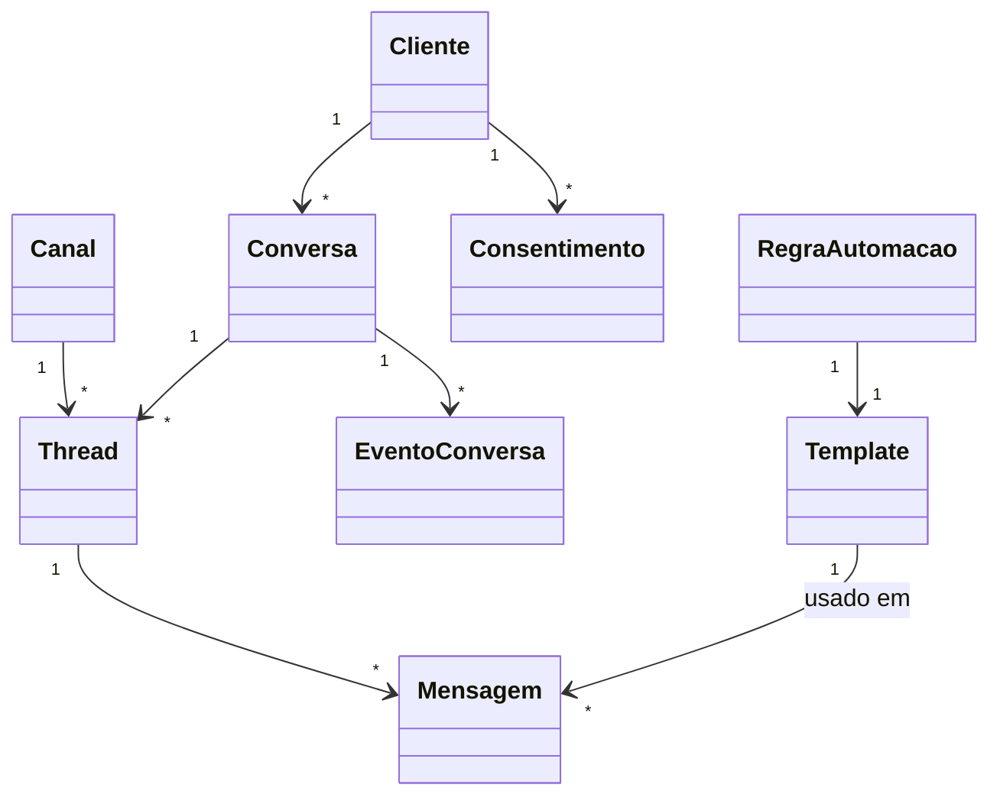

# Modelo de domínio — Módulo Comunicação Omnichannel

> Entidades específicas. Transversais em `docs/comum/modelo-de-dominio.md`.

---

## Entidades

### Canal
- **Atributos obrigatórios:** `id`, `tenant_id`, `tipo` (whatsapp/email/sms/chat), `nome`, `configuracao` (JSON — referencia conector), `status` (ativo/inativo).
- **Invariantes:** `INV-TENANT-001`; credenciais nunca no banco (KMS).
- **Ciclo de vida:** ativo → inativo (nunca deletado).

### Conversa
- **Atributos obrigatórios:** `id`, `tenant_id`, `cliente_id`, `status` (aberta/em_andamento/resolvida), `atendente_id`, `criada_em`, `atualizada_em`.
- **Invariantes:** uma conversa agrega threads cross-canal do mesmo cliente.

### Thread
- **Atributos obrigatórios:** `id`, `tenant_id`, `conversa_id`, `canal_id`, `external_id` (id no canal externo), `iniciada_em`.
- **Invariantes:** thread é por canal; conversa pode ter várias threads.

### Mensagem
- **Atributos obrigatórios:** `id`, `tenant_id`, `thread_id`, `direcao` (entrada/saida), `tipo` (texto/imagem/documento/audio/template), `conteudo`, `enviada_em`, `status` (enviada/entregue/lida/falha).
- **Atributos opcionais:** `anexos[]`, `template_id`, `variaveis_template`, `external_message_id`.
- **Invariantes:** mensagem é WORM após enviada (não pode ser editada); pode ser apagada por LGPD direito esquecimento (crypto-shredding).
- **Ciclo de vida:** criada → enviada → entregue → lida (estados dependem do canal).

### Template
- **Atributos obrigatórios:** `id`, `tenant_id`, `nome`, `versao`, `canal_tipo`, `corpo`, `variaveis[]`, `status` (rascunho/pendente/aprovado/reprovado/descontinuado), `external_template_id` (quando canal exige aprovação).
- **Invariantes:** template aprovado é imutável (cria nova versão).

### RespostaRapida
- **Atributos obrigatórios:** `id`, `tenant_id`, `atalho` (`/preco`), `corpo`, `variaveis[]`, `escopo` (pessoal/equipe/tenant).

### RegraAutomacao
- **Atributos obrigatórios:** `id`, `tenant_id`, `evento_gatilho` (`OS.Encerrada`, etc.), `condicao` (JSON), `template_id`, `canal_preferido`, `fallback_canais[]`, `status`.

### Consentimento
- **Atributos obrigatórios:** `id`, `tenant_id`, `cliente_id`, `canal_tipo`, `tipo` (opt_in/opt_out), `base_legal`, `texto_apresentado`, `texto_resposta_cliente`, `timestamp`, `referencia_mensagem_id`.
- **Invariantes:** WORM — registro de consentimento é imutável (`INV-*`). Crypto-shredding sob direito de esquecimento, mas o registro do esquecimento permanece.

### EventoConversa
- **Atributos obrigatórios:** `id`, `tenant_id`, `conversa_id`, `tipo` (Aberta/Atribuida/Convertida/Resolvida/Reabrita), `dados` (JSON), `timestamp`, `ator_id`.
- **Invariantes:** WORM.

### DistribuicaoRegra
- **Atributos obrigatórios:** `id`, `tenant_id`, `tipo` (round_robin/carteira/skill), `parametros` (JSON), `status`.

---

## Agregados (DDD)

| Agregado raiz | Entidades incluídas | Invariantes |
|---|---|---|
| Conversa | Conversa, Thread, Mensagem, EventoConversa | WORM em mensagem/evento |
| Template | Template | imutabilidade após aprovação |
| Consentimento | Consentimento | WORM |
| RegraAutomacao | RegraAutomacao | respeita opt-out |

---

## Value Objects

| VO | Definição | Imutável? |
|---|---|---|
| EnderecoContato | (canal_tipo, identificador — telefone/email/handle) | Sim |
| StatusEntrega | enum (enviada, entregue, lida, falha) | Sim |
| BaseLegal | enum LGPD (consentimento, contrato, legítimo interesse, etc.) | Sim |

---

## Eventos de domínio (publicados)

| Evento | Quando dispara | Payload | Quem consome |
|---|---|---|---|
| `Comunicacao.MensagemRecebida` | mensagem entrou por webhook | `{conversa_id, mensagem_id, canal, cliente_id}` | distribuição, regras |
| `Comunicacao.MensagemEnviada` | mensagem saiu | `{mensagem_id, status_inicial}` | auditoria |
| `Comunicacao.StatusMensagemAtualizado` | callback canal externo | `{mensagem_id, status}` | UI |
| `Comunicacao.ConsentimentoRegistrado` | opt-in/opt-out registrado | `{cliente_id, tipo, base_legal}` | LGPD, CRM |
| `Comunicacao.OptOutAplicado` | opt-out aplicado a futuros disparos | `{cliente_id, canal_tipo}` | regras de automação |
| `Comunicacao.ConvertidoEmChamado` | conversa virou chamado | `{conversa_id, chamado_id}` | Chamados |
| `Comunicacao.ConvertidoEmLead` | conversa virou lead | `{conversa_id, lead_id}` | CRM |
| `Comunicacao.TemplateRejeitado` | canal externo recusou template | `{template_id, motivo}` | gerente |

---

## Eventos consumidos (de outros módulos)

| Evento consumido | Ação |
|---|---|
| `OS.Encerrada` | dispara mensagem por regra (se configurada e opt-in válido) |
| `OS.Aberta` | idem |
| `Orcamento.Aprovado` / `Orcamento.Reprovado` | idem |
| `Chamado.Aberto` / `Chamado.Resolvido` | idem |
| `SLA.AlertaPreventivo` | notifica responsável (interno) — não cliente |
| `SLA.RelatorioEmitido` | envia PDF ao cliente |
| `Calibracao.CertificadoEmitido` | envia ao cliente |
| `Calibracao.VencendoEm30d` | lembrete (com opt-in) |

---

## Comandos (entradas no módulo)

| Comando | Origem | Pré-condição | Pós-condição |
|---|---|---|---|
| `receberMensagem` | webhook canal | thread existe ou criada | `Comunicacao.MensagemRecebida` |
| `enviarMensagem` | UI / regra | opt-in válido se promocional | `Comunicacao.MensagemEnviada` |
| `registrarConsentimento` | UI / fluxo de boas-vindas | base legal definida | `Comunicacao.ConsentimentoRegistrado` |
| `aplicarOptOut` | detecção texto / UI / API | thread aberta | `Comunicacao.OptOutAplicado` |
| `criarTemplate` | UI | usuário comercial | template em rascunho |
| `aprovarTemplate` | callback canal externo | submetido | template ativo |
| `converterEmChamado` | UI atendente | thread aberta | chamado criado + evento |
| `converterEmLead` | UI atendente | thread aberta | lead criado + evento |
| `atribuirConversa` | regra distribuição / manual | atendente ativo | EventoConversa `Atribuida` |

---

## Porta ACL utilizada

Este módulo consome **exclusivamente** a porta **`OmniChannelProvider`** (porta #10 em `docs/arquitetura/anti-corrosion-layer.md`). Nenhum SDK de canal externo (Twilio, Meta Cloud API, AWS SES, SMTP) é importado direto pelo código de domínio do módulo. Toda chamada para WhatsApp / Email / SMS / Web Chat passa pelo adapter injetado via DI.

**Métodos consumidos:**
- `enviar_mensagem(canal, destinatario, template, variaveis, tenant_id, idempotency_key)` — disparo outbound (manual ou via `RegraAutomacao`)
- `receber_webhook(canal, payload, tenant_id)` — inbound via webhook BSP (HMAC validado pela camada de infra antes de chegar no módulo)
- `consultar_status(message_id, canal)` — reconciliação de status quando webhook se perde
- `validar_template(canal, template)` — `aprovarTemplate`/`criarTemplate` chama antes de submeter à Meta

**Eventos da porta consumidos pelo domínio:** `Mensagem.Enviada`, `Mensagem.Entregue`, `Mensagem.Lida`, `Mensagem.Recebida`, `Mensagem.Falhou` — mapeados para os eventos de domínio `Comunicacao.*` desta lista acima.

**Implementações 1ª onda (MVP):** `WhatsAppCloudApiProvider` (Meta direto), `SmtpGenericProvider` (AWS SES BR), `TwilioSmsProvider`/`AwsSnsSmsProvider` (SMS), `WebChatInternalProvider` (chat embedded).

**DPA obrigatório por implementação:** Meta (WhatsApp), Twilio, AWS — cada provider trata dado pessoal e exige cláusulas LGPD antes de ir pra produção. Lista versionada em `docs/conformidade/comum/subprocessadores.md` (a criar).

### Detalhes por canal

- WhatsApp Business API — ver `docs/comum/integracoes-externas/whatsapp.md`.
- SMTP/IMAP — ver `docs/comum/integracoes-externas/email.md` (a criar quando aplicável).
- Provedor SMS — ver `docs/comum/integracoes-externas/sms.md` (a criar).
- Chat do portal — interno (web socket Django Channels), mesma interface `OmniChannelProvider`.

---

## Schema físico

Ver `../schema-banco.md` quando criado.

---

## Diagramas

---

## Como este modelo evolui

- Entidade nova → verificar fronteira em `governanca-modelo-comum.md`.
- Atributo novo → migration + bump CHANGELOG.
- Entidade descontinuada → ADR + janela.
