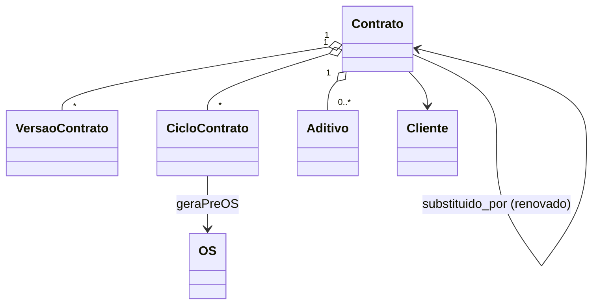

# Modelo de Domínio — Módulo Contratos

## Entidades

### Contrato (agregado raiz)
- **Obrigatórios:** `id`, `tenant_id`, `cliente_id` (FK), `numero` (sequencial por tenant), `versao_ativa_id`, `estado` (rascunho/vigente/suspenso/encerrado/renovado), `vigencia_inicio`, `vigencia_fim`, `periodicidade` (mensal/trimestral/semestral/anual/custom), `proxima_execucao` (data calculada), `criado_em`, `criado_por`, `responsavel_id`.
- **Opcionais:** `template_id`, `reajuste` (struct: tipo, indice, percentual_fixo?), `observacoes`, `aceite_lgpd` (struct), `pdf_assinado_url?`.
- **Invariantes:** INV-026 (preço não retroage), INV-TENANT-001.

### VersaoContrato (snapshot imutável)
- **Obrigatórios:** `id`, `contrato_id`, `numero_versao`, `snapshot` (jsonb com escopo + valor + condições + texto rodapé), `motivo_aditivo?`, `criado_em`, `criado_por`.
- **Imutável.** Aditivos criam novas versões.

### ItemContrato (parte do snapshot)
- **Atributos:** `equipamento_id` (FK módulo equipamentos), `servico_id` (FK catálogo), `periodicidade_individual?`, `valor_unitario`, `desconto`, `total`.
- **Regra:** itens podem ter periodicidade própria diferente do contrato (raro — Wave B).

### CicloContrato (execução)
- **Atributos:** `id`, `contrato_id`, `versao_id`, `data_prevista`, `data_pre_os_gerada`, `pre_os_id?` (FK OS), `confirmada_em?`, `confirmada_por?`, `status` (pendente/confirmada/skipped/falhou).
- **Imutável após confirmada.**

### Aditivo (Wave B)
- **Atributos:** `id`, `contrato_id`, `versao_anterior_id`, `versao_nova_id`, `motivo`, `aplica_a_partir_de`, `aprovado_em`, `aprovado_por`.

### AlertaVigencia
- **Atributos:** `id`, `contrato_id`, `dias_antes`, `disparado_em?`, `notificados[]`.

### Suspensao (Wave B)
- **Atributos:** `id`, `contrato_id`, `motivo`, `inicio`, `retomada_prevista`, `retomada_em?`.

### Encerramento
- **Atributos:** `id`, `contrato_id`, `motivo` (cliente_pediu/tenant_pediu/inadimplencia/fim_vigencia/aditivo_terminou_substituido), `iniciado_em`, `efetivo_em`, `prejuizo_concreto?` (Decimal — anti-fidelidade abusiva).

## Agregados

| Raiz | Inclui | Invariantes |
|---|---|---|
| Contrato | VersaoContrato, ItemContrato (via snapshot), CicloContrato, Aditivo, Suspensao, Encerramento | INV-026, INV-TENANT-001 |
| AlertaVigencia | (config standalone) | INV-TENANT-001 |

## Value Objects

| VO | Definição | Imutável |
|---|---|---|
| Periodicidade | `{tipo: enum, intervalo_dias?, dia_do_mes?}` | Sim |
| Reajuste | `{tipo: 'igpm'\|'ipca'\|'percentual_fixo', percentual?, ultima_aplicacao}` | Sim |
| Vigencia | `{inicio, fim}` (fim > inicio) | Sim |

## Máquina de estados — Contrato

```
rascunho → vigente (após aprovação cliente + LGPD aceite)
vigente → suspenso (motivo + retomada prevista)
suspenso → vigente (retomada)
vigente → encerrado (motivo: cliente_pediu/tenant_pediu/inadimplencia/fim_vigencia)
vigente → renovado (novo contrato criado a partir deste; este vai pra estado=renovado)
encerrado / renovado → terminal (somente leitura)
```

**Regras:**
- Estado `suspenso` NÃO gera pré-OS automática.
- Estado `vigente` com cliente bloqueado → pré-OS gerada com flag "bloqueada — revisar".
- Estado `renovado` aponta pra `contrato_substituto_id`.

## Eventos publicados

| Evento | Quando | Payload | Consumidores |
|---|---|---|---|
| `Contrato.Criado` | Cadastro salvo + LGPD aceite | `{contrato_id, cliente_id, valor, vigencia}` | financeiro (forecast MRR), crm |
| `Contrato.PreOSGerada` | Job noturno cria pré-OS | `{contrato_id, ciclo_id, pre_os_id, bloqueada}` | operação (bandeja), atendente UI |
| `Contrato.OSConfirmada` | Atendente confirma | `{ciclo_id, os_id}` | operação (vira OS formal) |
| `Contrato.VigenciaAVencer` | Alerta 90/60/30d | `{contrato_id, dias_restantes}` | crm (tarefa renovação), MAPA-DO-DONO |
| `Contrato.Renovado` | Renovação concluída | `{contrato_antigo_id, contrato_novo_id}` | financeiro (atualiza MRR) |
| `Contrato.Suspenso` | Suspensão ativada | `{contrato_id, motivo, retomada_prevista}` | financeiro (pausa cobrança) |
| `Contrato.Encerrado` | Encerramento confirmado | `{contrato_id, motivo, prejuizo_concreto}` | financeiro (encerra cobrança), crm (motivo de churn) |
| `Contrato.Aditivado` | Aditivo aprovado | `{contrato_id, versao_anterior_id, versao_nova_id, motivo}` | financeiro |

## Eventos consumidos

- `Cliente.Bloqueado` → marca todos contratos ativos do cliente com flag "cliente_bloqueado" (não suspende — apenas pré-OS futuras nascem com alerta).
- `Cliente.Desbloqueado` → remove flag.
- `OS.Concluida` (operação) → marca ciclo como executado + agenda próximo.
- `Fatura.Vencida` (financeiro) → considera bloqueio automático conforme régua tenant.

## Comandos

| Comando | Origem | Pré | Pós |
|---|---|---|---|
| `criarContrato` | UI | cliente ativo + escopo válido | rascunho |
| `ativarContrato` | UI cliente/interno | LGPD aceito | vigente + agenda primeiro ciclo |
| `suspenderContrato` | UI dono/vendedor | vigente | suspenso |
| `retomarContrato` | UI | suspenso | vigente |
| `encerrarContrato` | UI cliente OU dono | vigente OU suspenso | encerrado |
| `renovarContrato` | UI vendedor (wizard) | vigente próximo ao fim | renovado + novo contrato vigente |
| `aditivarContrato` | UI vendedor | vigente | nova versão + evento |
| `gerarPreOSdoCiclo` | job cron (system) | contrato vigente + data prevista chegou | CicloContrato + PreOS |
| `confirmarPreOS` | UI atendente | pré-OS pendente | OS formal + ciclo confirmado |

## Diagrama



## Schema físico

Tabelas `contratos`, `contratos_versoes`, `contratos_ciclos`, `contratos_aditivos`, `contratos_suspensoes`, `contratos_encerramentos`, `contratos_alertas`. RLS ativa (INV-TENANT-003).

## Como evolui

Estado novo → ADR + revisar máquina. Periodicidade nova → CHANGELOG.
