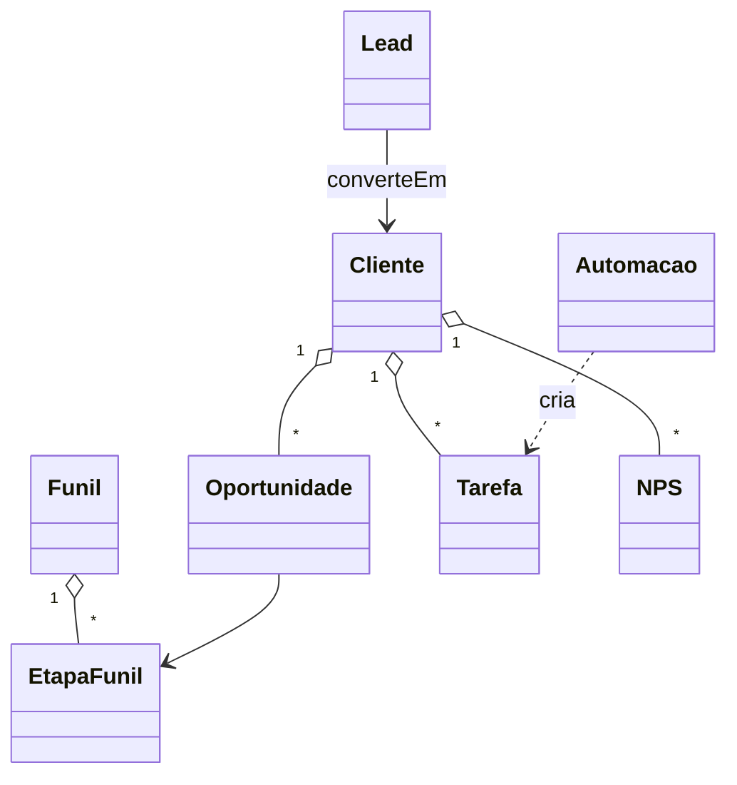

# Modelo de Domínio — Módulo CRM

## Entidades

### Lead (agregado raiz — antes de virar Cliente)
- **Obrigatórios:** `id`, `tenant_id`, `origem` (whatsapp/import/manual/formulario), `nome`, `criado_em`, `estado` (novo/em_qualificacao/convertido/descartado).
- **Opcionais:** `telefone`, `email`, `mensagem_inicial`, `vendedor_responsavel_id`.
- **Invariantes:** INV-TENANT-001.
- **Ciclo de vida:** novo → em_qualificacao → convertido (vira Cliente) | descartado (motivo).

### Oportunidade (agregado raiz)
- **Obrigatórios:** `id`, `tenant_id`, `titulo`, `cliente_id` (FK — ou lead_id se ainda não-convertido), `funil_id`, `etapa_id`, `valor_estimado`, `responsavel_id`, `criado_em`, `atualizado_em`.
- **Opcionais:** `probabilidade` (%), `data_prevista_fechamento`, `motivo_perda_id`, `descricao`.
- **Invariantes:** INV-TENANT-001; oportunidade NÃO existe sem cliente OU lead.

### Funil
- **Obrigatórios:** `id`, `tenant_id`, `nome`, `padrao` (bool — 1 padrão por tenant), `etapas[]`.

### EtapaFunil
- **Obrigatórios:** `id`, `funil_id`, `nome`, `ordem`, `tipo` (inicial/intermediaria/ganho/perda).

### Tarefa
- **Obrigatórios:** `id`, `tenant_id`, `tipo` (ligar/whatsapp/email/visita/outro), `titulo`, `responsavel_id`, `prazo`, `relacionado_cliente_id?`, `relacionado_oportunidade_id?`, `estado` (aberta/feita/cancelada), `criado_por` (user_id ou "automacao:{id}").
- **Origem:** manual OU automação.

### Automacao
- **Obrigatórios:** `id`, `tenant_id`, `nome`, `gatilho` (jsonb: tipo + parâmetros), `condicao` (jsonb), `acao` (jsonb), `ativa` (bool), `sandbox_ok` (bool — obrigatório true antes de ativar — JTBD-087), `ultima_execucao`, `proxima_execucao`.
- **Tipos de gatilho:** `evento` (ex: OS.Concluida, NPS.Detrator) ou `cron` (ex: diário 9h).
- **Tipos de ação:** criar_tarefa, enviar_whatsapp_template, mudar_etapa_oportunidade, atualizar_segmento_cliente.

### NPS
- **Obrigatórios:** `id`, `tenant_id`, `cliente_id`, `os_id` (FK), `nota` (0-10), `comentario`, `respondido_em`, `canal` (whatsapp/email/web).
- **Categoria computada:** detrator (0-6) / neutro (7-8) / promotor (9-10).

### LeadScore
- **Atributos:** `cliente_id`, `pontuacao` (0-100), `sinais_ativos` (jsonb), `calculado_em`.
- **Recalculado:** job hourly + evento (OS.Concluida, NPS, certificado vencendo).

### MotivoPerda
- **Atributos:** `id`, `tenant_id`, `nome`, `ativo`.

## Agregados

| Raiz | Inclui | Invariantes |
|---|---|---|
| Lead | (standalone até conversão) | INV-TENANT-001 |
| Oportunidade | (standalone — FK a cliente/lead) | INV-TENANT-001 |
| Funil | EtapaFunil | INV-TENANT-001 |
| Automacao | (standalone) | INV-TENANT-001 + sandbox_ok=true |
| NPS | (filho de Cliente + OS) | INV-TENANT-001 |

## Value Objects

| VO | Definição | Imutável |
|---|---|---|
| Sinal | `{tipo, peso, valor, observado_em}` | Sim |
| GatilhoAutomacao | `{tipo, parametros}` | Sim |
| AcaoAutomacao | `{tipo, parametros}` | Sim |

## Máquina de estados — Oportunidade

```
novo → em_contato → orcamento_enviado → negociacao → fechado_ganho | fechado_perdido
qualquer → arquivada (revisita futura)
```

Transição para `fechado_perdido` exige `motivo_perda_id`.

## Eventos publicados

| Evento | Quando | Payload | Consumidores |
|---|---|---|---|
| `Lead.Criado` | Caixa entrada recebe | `{lead_id, origem}` | crm UI (toast atendente) |
| `Lead.Convertido` | Conversão → cliente | `{lead_id, cliente_id, oportunidade_id}` | clientes (timeline) |
| `Oportunidade.MovidaEtapa` | Drag-and-drop ou auto | `{oportunidade_id, de, para}` | financeiro (forecast) |
| `Oportunidade.Ganha` | etapa=ganho | `{oportunidade_id, valor, cliente_id}` | financeiro, dono (MAPA) |
| `Oportunidade.Perdida` | etapa=perdido | `{oportunidade_id, motivo}` | dono (análise churn) |
| `NPS.Respondido` | Cliente responde | `{cliente_id, nota, categoria}` | clientes (timeline), automações (gatilho) |
| `Automacao.Executada` | Automação roda | `{automacao_id, clientes_afetados, em}` | auditoria, dono |
| `Tarefa.Criada` | Manual ou automação | `{tarefa_id, responsavel_id, prazo}` | UI vendedor |

## Eventos consumidos

- `Cliente.Criado` → cria oportunidade implícita em "novo" (config opcional).
- `OS.Concluida` (operação) → dispara NPS + recalcula lead score.
- `Certificado.VencendoEm30d` (operação) → dispara automação OP1 (recalibração proativa).
- `Orcamento.Aprovado` (orcamentos) → move oportunidade pra "ganho".
- `Orcamento.Recusado` → move pra "perdido" + motivo.
- `Fatura.Vencida` (financeiro) → atualiza sinal "parcela vencida" no lead score.

## Comandos

| Comando | Origem | Pré | Pós |
|---|---|---|---|
| `criarLead` | UI/WhatsApp webhook (Wave B) | tenant ativo | Lead.Criado |
| `converterLead` | UI atendente | lead aberto + dados mínimos | Lead.Convertido + Cliente + Oportunidade |
| `criarOportunidade` | UI vendedor | cliente existe | criada na etapa inicial |
| `moverEtapa` | UI/automação | oportunidade ativa | Oportunidade.MovidaEtapa |
| `criarAutomacao` | UI dono | gatilho+ação válidos | rascunho ativa=false |
| `executarSandbox` | UI dono | automação rascunho | lista preview + flag sandbox_ok |
| `ativarAutomacao` | UI dono | sandbox_ok=true | ativa=true |
| `responderNPS` | público (link) | OS concluída | NPS criado + evento |

## Diagrama



## Como evolui

Tipo de gatilho/ação novo → ADR (afeta motor de automações). Estado novo em Oportunidade → CHANGELOG.
