# Modelo de domínio — Módulo Marketplace

> Entidades específicas. Entidades transversais ficam em `docs/comum/modelo-de-dominio.md`.

---

## Entidades

### Vitrine
- **Atributos obrigatórios:** id, tenant_id, status (ativa/pausada), tema_visual, dominio_publico (subdomínio ou domínio próprio), idioma_default.
- **Atributos opcionais:** logo_url, cor_primaria, descricao_seo, redes_sociais.
- **Invariantes:** INV-TENANT-001 (cada vitrine pertence a 1 tenant).
- **Ciclo de vida:** criada ao habilitar marketplace; pode ser pausada (não exclui).

### ItemVitrine
- **Atributos obrigatórios:** id, tenant_id, vitrine_id, catalogo_item_id (FK para `catalogo` em `suporte-plataforma`), ativo, ordem, destaque (bool), exibe_preco (bool).
- **Atributos opcionais:** descricao_marketing, imagens_extras, faq, video_url.
- **Invariantes:** INV-TENANT-001; ItemVitrine NÃO duplica dados do catálogo — só estende com info de exibição.
- **Ciclo de vida:** criado ao publicar item do catálogo; desativado se item do catálogo for descontinuado.

### CarrinhoSolicitacao
- **Atributos obrigatórios:** id, tenant_id, vitrine_id, sessao_id (visitante anônimo) OU cliente_id (logado), criado_em, expira_em.
- **Atributos opcionais:** utm_source, utm_medium, utm_campaign, referrer.
- **Invariantes:** INV-TENANT-001; carrinho expira em 7 dias se não convertido.
- **Ciclo de vida:** criado ao adicionar primeiro item; finalizado ao enviar solicitação; expirado se inativo.

### ItemCarrinho
- **Atributos obrigatórios:** id, carrinho_id, item_vitrine_id, quantidade, preco_snapshot (preço visto no momento da adição, snapshot — INV-026).
- **Invariantes:** INV-026 (preço travado no snapshot da adição), INV-TENANT-001.

### SolicitacaoOrcamento
- **Atributos obrigatórios:** id, tenant_id, vitrine_id, carrinho_id, status (enviada/em_atendimento/convertida/descartada), dados_contato (nome, telefone, email, opcional CNPJ/CPF), termo_lgpd_aceito_em, criado_em.
- **Atributos opcionais:** observacoes_cliente, canal_preferido (whatsapp/email).
- **Invariantes:** INV-TENANT-001; termo LGPD obrigatório.
- **Ciclo de vida:** criada ao enviar carrinho; convertida quando vira lead + orçamento; descartada se spam.

### AreaCliente (sessão lógica)
- **Atributos obrigatórios:** cliente_id, ultimo_login_em, escopo_visao (lista de cliente_ids permitidos — usuário pode ter procuração de outro).
- **Invariantes:** INV-TENANT-001; cliente só vê dados dos próprios cliente_ids do escopo.

### TabelaPrecoMarketplace
- **Atributos obrigatórios:** id, tenant_id, tipo (publica/privada), atribuicoes (lista cliente_id ou segmento_id, se privada).
- **Invariantes:** INV-TENANT-001; ao alterar tabela, NÃO retroage a orçamentos/contratos emitidos (INV-026); cria nova versão.
- **Dependência:** módulo `precificacao` (definição de regras + versionamento).

### EventoConversao
- **Atributos obrigatórios:** id, tenant_id, vitrine_id, tipo (visualizacao/clique/add_carrinho/envio_solicitacao/aprovacao_orcamento/fechamento), timestamp, sessao_id_anonima, utm_*.
- **Atributos opcionais:** item_vitrine_id, valor_estimado.
- **Invariantes:** SEM PII (respeita RAT-04 analytics LGPD); INV-TENANT-001.

---

## Agregados (DDD)

| Agregado raiz | Entidades incluídas | Invariantes |
|---|---|---|
| Vitrine | ItemVitrine, TabelaPrecoMarketplace | INV-TENANT-001, INV-026 |
| CarrinhoSolicitacao | ItemCarrinho | INV-TENANT-001, INV-026 (snapshot de preço) |
| SolicitacaoOrcamento | — (referencia CarrinhoSolicitacao) | INV-TENANT-001 |

---

## Value Objects

| VO | Definição | Imutável? |
|---|---|---|
| DadosContato | nome + telefone + email + cnpj/cpf opcional | Sim |
| AtribuicaoTabela | tipo (cliente/segmento/contrato) + alvo_id | Sim |
| FonteUTM | source + medium + campaign + referrer | Sim |
| PrecoSnapshot | valor + moeda + versao_tabela + capturado_em | Sim — INV-026 |

---

## Eventos de domínio (publicados)

| Evento | Quando dispara | Payload | Quem consome |
|---|---|---|---|
| `Marketplace.SolicitacaoEnviada` | cliente envia carrinho | `{ solicitacao_id, carrinho_id, dados_contato, itens[] }` | `crm` (cria lead), `orcamentos` (cria rascunho) |
| `Marketplace.ClienteLogou` | login na área do cliente | `{ cliente_id, ts, ip, user_agent }` | `auditoria` |
| `Marketplace.AssinouRecorrente` | cliente assina serviço recorrente | `{ cliente_id, item_vitrine_id, periodicidade }` | `contratos` (cria contrato), `agenda` (gera OS recorrente) |
| `Marketplace.PagamentoConfirmado` | gateway confirma pagamento | `{ orcamento_id, valor, metodo, gateway_tx_id }` | `financeiro` (registra recebimento), `orcamentos` (marca pago) |
| `Marketplace.ConversaoRegistrada` | qualquer evento de funil | `{ tipo, sessao_id, item_id?, ts }` | `analytics` (dashboard) |

## Eventos consumidos

| Evento de outro módulo | Origem | Reação no marketplace |
|---|---|---|
| `Catalogo.ItemAtualizado` | `suporte-plataforma/catalogo` | atualiza descrição/preço base do ItemVitrine |
| `Precificacao.TabelaPublicada` | `precificacao` | recarrega preços exibidos (versão nova) |
| `Estoque.ItemEsgotado` | módulo `estoque` (futuro) | marca ItemVitrine como "indisponível temporariamente" |
| `Orcamentos.OrcamentoFechado` | `orcamentos` | registra evento `Marketplace.ConversaoRegistrada` (etapa "fechamento") |

---

## Comandos (entradas no módulo)

| Comando | Origem | Pré-condição | Pós-condição |
|---|---|---|---|
| `criarCarrinho` | UI pública | vitrine ativa | CarrinhoSolicitacao criado |
| `adicionarItemCarrinho` | UI pública | carrinho ativo + item ativo | ItemCarrinho criado com PrecoSnapshot |
| `enviarSolicitacao` | UI pública | carrinho com ≥1 item + dados contato + LGPD | SolicitacaoOrcamento criada + evento `SolicitacaoEnviada` |
| `assinarServicoRecorrente` | UI área do cliente | cliente autenticado + item recorrente | evento `AssinouRecorrente` |
| `iniciarPagamento` | UI área do cliente | orçamento aprovado + gateway configurado | redirect para gateway |
| `marcarDestaque` | UI gestor | gestor autorizado | ItemVitrine.destaque = true |

---

## Schema físico

Ver `../schema-banco.md` (a criar quando Foundation F-A começar) ou `../../../comum/schema-banco.md` para entidades comuns (Cliente, Tenant).

## Diagramas

```mermaid
classDiagram
    Vitrine "1" --> "*" ItemVitrine
    Vitrine "1" --> "*" CarrinhoSolicitacao
    CarrinhoSolicitacao "1" --> "*" ItemCarrinho
    CarrinhoSolicitacao "1" --> "0..1" SolicitacaoOrcamento
    ItemVitrine "*" --> "1" CatalogoItem : referencia
    ItemCarrinho "*" --> "1" ItemVitrine
    ItemCarrinho --> PrecoSnapshot : VO
```

## Como este modelo evolui

- Entidade nova → verificar fronteira comum/módulo.
- Atributo novo → migration + bump CHANGELOG.
- Entidade descontinuada → ADR + janela de migração.
