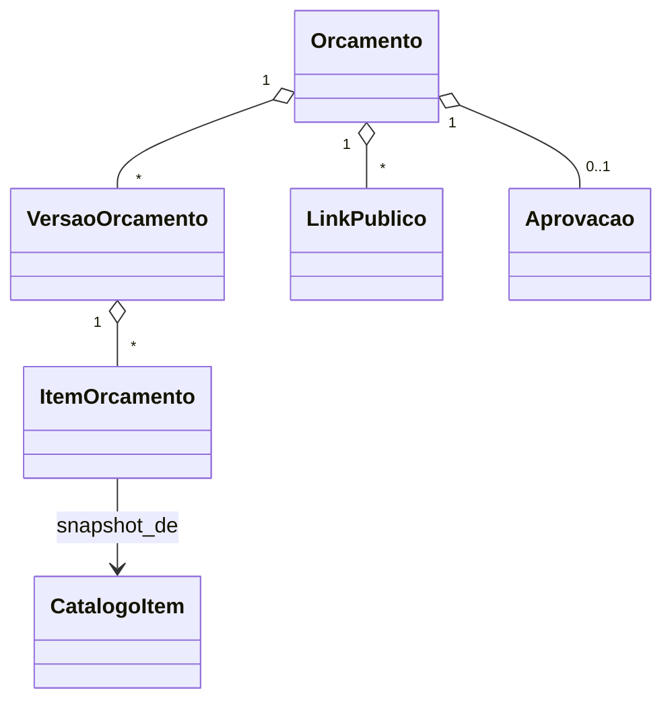

# Modelo de Domínio — Módulo Orçamentos

## Entidades

### Orcamento (agregado raiz)
- **Obrigatórios:** `id`, `tenant_id`, `cliente_id` (FK), `numero` (sequencial por tenant), `criado_em`, `criado_por`, `estado`, `validade_ate`, `total_bruto`, `total_descontos`, `total_impostos`, `total_liquido`, `versao_ativa_id`.
- **Opcionais:** `template_id`, `condicoes_pagamento`, `observacoes`, `comissao_prevista`, `responsavel_id`.
- **Invariantes:** INV-026 (preço da versão aprovada é snapshot — não retroage), INV-TENANT-001.

### VersaoOrcamento
- **Obrigatórios:** `id`, `orcamento_id`, `numero_versao` (1, 2, 3...), `snapshot` (jsonb com itens + condições + totais), `criado_em`, `criado_por`.
- **Imutável após criada.** Edição cria nova versão (Wave B).

### ItemOrcamento
- **Obrigatórios:** `id`, `versao_id`, `catalogo_item_id` (FK), `descricao_snapshot`, `quantidade`, `preco_unitario_snapshot`, `desconto_valor`, `total`.
- **Regra:** preço unitário e descrição são **snapshot** do catálogo no momento — não vinculam.

### LinkPublico
- **Obrigatórios:** `id`, `orcamento_id`, `token` (random URL-safe), `expira_em`, `revogado_em`.
- **Regra:** 1 link ativo por orçamento; revoga ao gerar novo.

### EventoLeitura (Wave B)
- **Atributos:** `link_id`, `lido_em`, `ip_hash`, `user_agent`.

### Template
- **Obrigatórios:** `id`, `tenant_id`, `nome`, `tipo` (calibração/manutenção/instalação/custom), `itens_default` (jsonb), `condicoes_default`.

### Aprovacao
- **Obrigatórios:** `id`, `orcamento_id`, `versao_id`, `aprovado_em`, `aprovado_por` (cliente_id ou usuario_id se interno), `canal` (link_publico/manual/whatsapp), `ip_hash`, `lgpd_aceite`.

## Agregados

| Raiz | Inclui | Invariantes |
|---|---|---|
| Orcamento | VersaoOrcamento, ItemOrcamento, LinkPublico, Aprovacao | INV-026, INV-TENANT-001 |
| Template | (standalone) | INV-TENANT-001 |

## Value Objects

| VO | Definição | Imutável |
|---|---|---|
| Dinheiro | `{valor: Decimal(12,2), moeda: BRL}` | Sim |
| Desconto | `{tipo: 'percentual'|'valor', valor: Decimal}` | Sim |
| CondicoesPagamento | `{prazo_dias, forma, parcelas, texto_livre}` | Sim |

## Máquina de estados — Orcamento

```
rascunho → enviado (cliente recebe link)
enviado → lido (Wave B — tracking dispara)
enviado | lido → aprovado (cliente clica aprovar OU vendedor marca manual)
enviado | lido → recusado (cliente recusa explicitamente)
enviado | lido → expirado (validade vencida sem ação)
rascunho → cancelado (vendedor desiste antes de enviar)
aprovado → convertido (OS rascunho criada)
```

**Transições proibidas:**
- aprovado → rascunho (precisa nova versão ou novo orçamento)
- convertido → qualquer outro (terminal)

## Eventos publicados

| Evento | Quando | Payload | Consumidores |
|---|---|---|---|
| `Orcamento.Enviado` | POST /enviar | `{orcamento_id, cliente_id, canal, valor_total}` | crm (timeline + tarefa follow-up) |
| `Orcamento.Lido` | tracking dispara | `{orcamento_id, lido_em}` | crm (alerta vendedor) |
| `Orcamento.Aprovado` | aprovação do cliente | `{orcamento_id, versao_id, aprovado_em, valor}` | **operação (cria OS rascunho)**, financeiro, crm |
| `Orcamento.Recusado` | cliente recusa | `{orcamento_id, motivo?}` | crm (motivo de perda) |
| `Orcamento.Expirado` | job noturno | `{orcamento_id}` | crm |
| `Orcamento.Convertido` | OS rascunho criada | `{orcamento_id, os_id}` | crm |

## Comandos

| Comando | Origem | Pré-condição | Pós-condição |
|---|---|---|---|
| `criarOrcamento` | UI/API | cliente ativo + não bloqueado | rascunho + comissão prevista calculada |
| `adicionarItem` | UI | catálogo item ativo | total recalculado |
| `enviarOrcamento` | UI | rascunho com ≥1 item | estado=enviado + link gerado + evento |
| `aprovar` | UI cliente / interno | estado in [enviado, lido] + dentro da validade | estado=aprovado + evento |
| `recusar` | UI cliente / interno | estado in [enviado, lido] | estado=recusado |
| `gerarNovaVersao` | UI vendedor (Wave B) | estado in [enviado, lido] | nova versão + revoga link antigo |

## Schema físico

Tabelas `orcamentos`, `orcamentos_versoes`, `orcamentos_itens`, `orcamentos_links`, `orcamentos_aprovacoes`, `orcamentos_templates`. RLS ativa (INV-TENANT-003). Detalhe pós ADR-0001.

## Diagrama



## Como evolui

Estado novo → atualizar máquina + ADR se quebra invariante.
