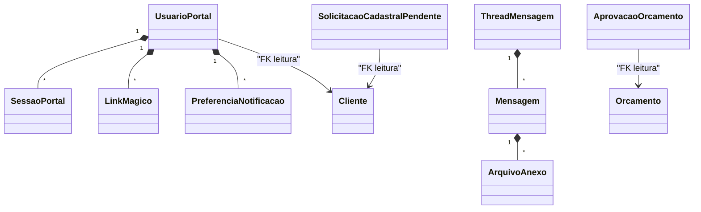

# Modelo de domínio — Módulo Portal do Cliente

> Entidades **próprias** do Portal. Entidades operacionais (OS, Orçamento, Fatura, Certificado, Cliente) são **leitura** do banco operacional do tenant — não duplicar.
>
> **Fronteira com `marketplace`:** Portal é dono da autenticação (UsuarioPortal/SessaoPortal/LinkMagico) e da visão consolidada 360° do cliente. Marketplace é vitrine + carrinho; após login redireciona pra cá. Solicitações originadas no marketplace chegam por evento (`Marketplace.SolicitacaoEnviada`) e ficam visíveis na entidade-índice `SolicitacaoMarketplaceRecebida` (leitura — referencia `SolicitacaoOrcamento` do marketplace por id, não duplica payload).

---

## Entidades próprias

### UsuarioPortal
- **Atributos obrigatórios:** `id`, `tenant_id`, `cliente_id` (FK pra Cadastro de Clientes), `login` (CPF/CNPJ ou e-mail), `senha_hash`, `papel_portal` (`cliente_portal_admin` / `cliente_portal_tecnico` / `cliente_portal_basico`), `ativo`, `criado_em`
- **Atributos opcionais:** `ultimo_login`, `bloqueado_ate`, `tentativas_falhas`
- **Invariantes:** `INV-TENANT-001..004`; login único por tenant; senha hash obrigatório (bcrypt/argon2); RBAC herdada do papel_portal.
- **Ciclo de vida:** criado pelo atendente; ativado por primeiro login; bloqueio temporário após N tentativas falhas; soft-delete preservando histórico.

### SessaoPortal
- **Atributos obrigatórios:** `id`, `usuario_portal_id`, `tenant_id`, `iniciada_em`, `ip`, `user_agent`, `expira_em`
- **Atributos opcionais:** `geolocalizacao_aproximada`, `encerrada_em`
- **Invariantes:** expira em tempo curto (8h default); rotação de token; `SEC-*`.

### LinkMagico
- **Atributos obrigatórios:** `id`, `tenant_id`, `usuario_portal_id`, `token` (UUID), `criado_em`, `expira_em` (≤ 15 min), `usado` (bool)
- **Invariantes:** uso ÚNICO (one-shot); expira rápido; `SEC-*`.

### PreferenciaNotificacao
- **Atributos obrigatórios:** `id`, `usuario_portal_id`, `tenant_id`, `evento` (orçamento_recebido / os_mudou_status / fatura_vencendo / certificado_vencendo), `canal` (email/whatsapp/nenhum), `opt_in_lgpd` (bool)
- **Invariantes:** WhatsApp exige opt_in_lgpd = true (LGPD).

### ThreadMensagem
- **Atributos obrigatórios:** `id`, `tenant_id`, `cliente_id`, `entidade_tipo` (OS/orçamento/fatura/outro), `entidade_id`, `assunto`, `aberta_em`, `status` (aberta/respondida/encerrada)
- **Atributos opcionais:** `urgente` (bool), `atendente_atribuido_id`

### Mensagem
- **Atributos obrigatórios:** `id`, `thread_id`, `autor_tipo` (cliente/atendente), `autor_id`, `corpo`, `enviada_em`
- **Atributos opcionais:** `anexos` (lista FKs pra ArquivoAnexo)

### ArquivoAnexo
- **Atributos obrigatórios:** `id`, `tenant_id`, `nome_original`, `tamanho_bytes`, `mime_type`, `storage_url`, `enviado_em`, `enviado_por_tipo`, `enviado_por_id`
- **Atributos opcionais:** `scan_antivirus_resultado` (limpo/suspeito/falha)
- **Invariantes:** whitelist de mime types; tamanho ≤ 25MB; URL assinada e temporária.

### SolicitacaoCadastralPendente
- **Atributos obrigatórios:** `id`, `tenant_id`, `usuario_portal_id`, `campo_alvo`, `valor_atual`, `valor_solicitado`, `status` (pendente/aprovada/rejeitada), `solicitada_em`, `analisada_em`, `analisada_por`
- **Invariantes:** campo_alvo restrito a campos sensíveis (CNPJ/IE/razão social).

### AprovacaoOrcamento (registro WORM)
- **Atributos obrigatórios:** `id`, `tenant_id`, `orcamento_id`, `usuario_portal_id`, `acao` (aprovado/rejeitado/revisao), `motivo` (se rejeitado/revisao), `ip`, `user_agent`, `geolocalizacao_aproximada` (se opt-in), `ts`, `aceite_termos` (bool)
- **Invariantes:** imutável (WORM); aceite_termos = true obrigatório; `INV-001` (audit trail).

### SolicitacaoMarketplaceRecebida (índice de leitura — handoff do marketplace)
- **Atributos obrigatórios:** `id`, `tenant_id`, `cliente_id`, `solicitacao_marketplace_id` (FK leitura para `SolicitacaoOrcamento` do módulo `marketplace`), `recebida_em`, `itens_resumo` (snapshot mínimo: contagem + descrição curta), `orcamento_id` (FK opcional — preenchida quando a solicitação for convertida em orçamento), `status_ultimo_conhecido`.
- **Atributos opcionais:** `utm_source`, `carrinho_id` (rastreamento).
- **Invariantes:** `INV-TENANT-001..004`; idempotência por `event_id` da publicação (`Marketplace.SolicitacaoEnviada`); NÃO duplica payload mutável do marketplace — só índice + snapshot de exibição.
- **Ciclo de vida:** criada pelo handler de `Marketplace.SolicitacaoEnviada`; `orcamento_id` preenchido quando handler de `Orcamento.Enviado` (do módulo `orcamentos`) bater referência cruzada.

---

## Entidades de leitura (referência cruzada — não duplicar)

| Entidade | Origem (módulo) | Como o Portal usa |
|---|---|---|
| Cliente | comercial/clientes | leitura — define quem é o `cliente_id` do UsuarioPortal |
| OrdemServico | operacao/os | leitura filtrada por cliente_id |
| Orcamento | comercial/orcamentos | leitura filtrada + escrita de aprovação via evento |
| Fatura | financeiro/cobrancas | leitura filtrada |
| Certificado | metrologia/calibracao | leitura filtrada |
| Equipamento | metrologia/equipamentos (ou operacao) | leitura filtrada |

---

## Agregados (DDD)

| Agregado raiz | Entidades incluídas | Invariantes |
|---|---|---|
| UsuarioPortal | UsuarioPortal + SessaoPortal[] + LinkMagico[] + PreferenciaNotificacao[] | login único por tenant; RBAC |
| ThreadMensagem | ThreadMensagem + Mensagem[] + ArquivoAnexo[] | thread vinculada a entidade válida |
| AprovacaoOrcamento | AprovacaoOrcamento (sozinho — WORM) | imutável pós-criação |

---

## Value Objects

| VO | Definição | Imutável? |
|---|---|---|
| Credencial | { login, senha_hash } | Sim |
| Token | { valor, criado_em, expira_em } | Sim |
| EnderecoIP | { ipv4_ou_ipv6 } | Sim |
| AceiteLGPD | { evento, ts, ip, texto_termo_versionado } | Sim (WORM) |

---

## Eventos de domínio (publicados)

| Evento | Quando dispara | Payload | Quem consome |
|---|---|---|---|
| `Portal.UsuarioRegistrado` | criação de UsuarioPortal | { tenant_id, cliente_id, usuario_portal_id } | Auditoria, Notificações (boas-vindas) |
| `Portal.LoginRealizado` | login bem-sucedido | { tenant_id, usuario_portal_id, ip, ts } | Auditoria |
| `Portal.LoginBloqueado` | conta bloqueada por tentativas | { tenant_id, usuario_portal_id, ip, ts } | Segurança, Atendente |
| `Comercial.OrcamentoAprovadoPeloCliente` | cliente aprova via portal | { tenant_id, orcamento_id, usuario_portal_id, ip, ts, aceite_termos } | Operação (cria OS), Financeiro, Auditoria WORM |
| `Comercial.OrcamentoRejeitadoPeloCliente` | rejeição via portal | { tenant_id, orcamento_id, motivo, usuario_portal_id, ip, ts } | Comercial, Auditoria |
| `Portal.MensagemCriada` | cliente envia mensagem | { tenant_id, thread_id, mensagem_id, urgente } | Chamados, Notificações ao atendente |
| `Portal.SolicitacaoCadastralCriada` | cliente pede mudança sensível | { tenant_id, solicitacao_id, campo_alvo } | Atendente (fila) |
| `Portal.SegundaViaGerada` | 2ª via de boleto baixada | { tenant_id, fatura_id, ts } | Financeiro, Auditoria |
| `Portal.CertificadoBaixado` | cliente baixa certificado | { tenant_id, certificado_id, ts } | Auditoria (ISO 17025) |

## Eventos consumidos

| Evento de origem | Origem | Uso aqui |
|---|---|---|
| `Comercial.OrcamentoEnviado` | Comercial | torna orçamento visível no portal + notifica |
| `Operacao.OSStatusMudou` | Operação | atualiza timeline + notifica conforme preferência |
| `Financeiro.FaturaEmitida` | Financeiro | exibe + notifica |
| `Financeiro.FaturaVencendo` | Financeiro | notifica |
| `Metrologia.CertificadoEmitido` | Metrologia | exibe + notifica |
| `Metrologia.CalibracaoVencendo` | Metrologia | notifica recalibração |
| `Marketplace.SolicitacaoEnviada` | Marketplace | cria `SolicitacaoMarketplaceRecebida` (índice 360°) + exibe no dashboard do cliente (US-POR-012) |
| `Marketplace.ClienteLogou` | Marketplace | reaproveita `SessaoPortal` existente (autenticação única) + emite ack pro marketplace fazer o redirect |

---

## Comandos (entradas no módulo)

| Comando | Origem | Pré-condição | Pós-condição |
|---|---|---|---|
| `registrarUsuarioPortal` | UI atendente / API | cliente cadastrado | UsuarioPortal criado + e-mail boas-vindas |
| `loginComSenha` | UI cliente | credenciais válidas + não bloqueado | Sessão criada |
| `loginComLinkMagico` | UI cliente | token válido + não usado + não expirado | Sessão criada + link marcado usado |
| `aprovarOrcamento` | UI cliente | orçamento aguardando aprovação + cliente correto | Evento WORM + transição estado |
| `rejeitarOrcamento` | UI cliente | idem | Evento WORM |
| `enviarMensagem` | UI cliente / atendente | thread aberta | Mensagem persistida + notificação |
| `solicitarMudancaCadastral` | UI cliente | campo sensível | SolicitacaoCadastralPendente |
| `aprovarSolicitacaoCadastral` | UI atendente | solicitação pendente | atualiza Cliente + evento auditoria |
| `gerar2aVia` | UI cliente | fatura em aberto | URL temporária retornada + evento |
| `baixarCertificado` | UI cliente | certificado visível ao cliente | URL temporária + evento auditoria |
| `atualizarPreferenciaNotificacao` | UI cliente | usuário logado | preferência salva (com opt_in_lgpd se WhatsApp) |

---

## Schema físico

Ver `../schema-banco.md` (a criar). Tabelas-mãe:
- `portal_usuario`, `portal_sessao`, `portal_link_magico`
- `portal_preferencia_notificacao`
- `portal_thread_mensagem`, `portal_mensagem`, `portal_arquivo_anexo`
- `portal_solicitacao_cadastral_pendente`
- `portal_aprovacao_orcamento` (WORM — append-only)
- `portal_solicitacao_marketplace_recebida` (índice — handoff via `Marketplace.SolicitacaoEnviada`)

Todas com `tenant_id NOT NULL` + RLS ativo (`INV-TENANT-001..004`).

## Diagramas

## Como este modelo evolui

- Entidade nova → fronteira em `governanca-modelo-comum.md`.
- Atributo novo → migration + bump CHANGELOG.
- Entidade deprecada → ADR + janela.
