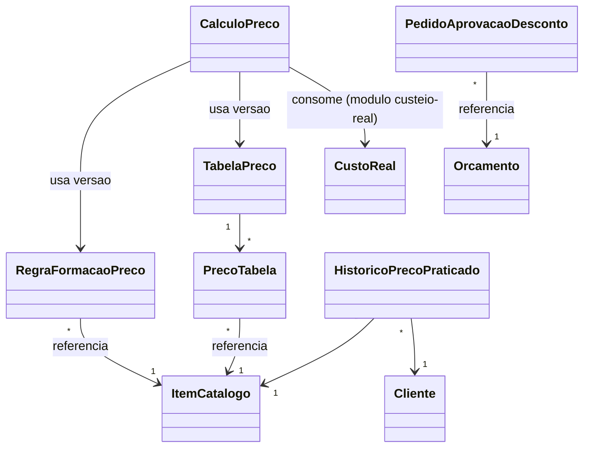

# Modelo de domínio — Módulo Precificação

> Entidades específicas. Entidades transversais ficam em `docs/comum/modelo-de-dominio.md`.

---

## Entidades

### RegraFormacaoPreco
- **Atributos obrigatórios:** id, tenant_id, item_catalogo_id (FK), modo (cost_plus / margem_alvo / fixo), versao, publicada_em, publicada_por_usuario_id, ativa (bool).
- **Atributos opcionais:** markup_percentual, margem_alvo_percentual, preco_fixo_valor, margem_piso_percentual, observacoes.
- **Invariantes:** INV-TENANT-001; INV-026 (regra publicada não muda — nova versão é criada); apenas 1 versão ativa por item por momento.
- **Ciclo de vida:** criada como rascunho; publicada (vira nova versão imutável); arquivada quando substituída.

### TabelaPreco
- **Atributos obrigatórios:** id, tenant_id, nome, tipo (padrao / regiao / segmento / contrato), criterio_aplicacao (JSON: ex `{ regiao: "SP" }`, `{ contrato_id: "xxx" }`), versao, publicada_em, ativa.
- **Atributos opcionais:** descricao, validade_de, validade_ate.
- **Invariantes:** INV-TENANT-001; INV-026 (versão publicada é imutável); precedência clara para resolver conflito (contrato > segmento > regiao > padrão).
- **Ciclo de vida:** rascunho → publicada (nova versão) → arquivada.

### PrecoTabela
- **Atributos obrigatórios:** id, tabela_preco_id, item_catalogo_id, preco_sugerido, preco_minimo, desconto_max_padrao_percentual, versao.
- **Invariantes:** INV-TENANT-001; INV-026.

### FaixaAprovacaoDesconto
- **Atributos obrigatórios:** id, tenant_id, escopo (global / item / categoria / cliente / vendedor), de_percentual, ate_percentual, aprovador_papel (role), ativa.
- **Invariantes:** INV-TENANT-001; faixas não podem sobrepor no mesmo escopo.

### CalculoPreco — TRANSIENTE / snapshot do consumidor

> **emenda P8 precificacao 2026-06-13:** `CalculoPreco` NÃO é tabela desta frente.
> O motor `calcular_precos` (`src/domain/precificacao/transicoes.py`) é função pura
> determinística que retorna `CalculoPrecoResultado` frozen **sem persistir nada**
> (D-PRC-9 da spec v2 / INV-026). É o CONSUMIDOR (frente `orcamentos` #5, ou `os`
> via US-OS-015) quem carimba o snapshot autossuficiente como parte do seu próprio
> agregado. Este modelo de domínio estava divergente: o agregado `CalculoPreco`
> listado aqui era artefato pré-spec-v2 (2026-05-17) e foi superado pela decisão
> D-PRC-9 confirmada em 2026-06-12 pelo orquestrador.
>
> **O que existe em código:** `CalculoPrecoResultado` (frozen dataclass —
> `src/domain/precificacao/value_objects.py`) é o resultado transiente da cesta;
> carrega refs probatórias (`motor_versao`, `faixas_versao`, `imposto_ref`,
> `parametros_versao`, eco das entradas) pra replay/carimbo pelo consumidor.
> Não há model Django `CalculoPreco` nesta frente.

- **Invariantes:** INV-026 (motor não persiste — verificado por `TestINV_026_MOTOR_NAO_PERSISTE` em `tests/regressao/test_inv_prc_classes_nomeadas.py`).
- **Ciclo de vida:** `CalculoPrecoResultado` é retornado pela porta de aplicação `calcular_precos`; o consumidor decide se persiste (e como).

### PedidoAprovacaoDesconto
- **Atributos obrigatórios:** id, tenant_id, orcamento_id, item_orcamento_id (opcional, se for por item), desconto_solicitado_percentual, margem_resultante_simulada, solicitado_por_usuario_id, faixa_aplicada_id, status (pendente / aprovado / negado / cancelado), criado_em.
- **Atributos opcionais:** aprovador_usuario_id, decidido_em, justificativa.
- **Invariantes:** INV-TENANT-001; status segue máquina de estado (pendente → aprovado/negado/cancelado).

### HistoricoPrecoPraticado
- **Atributos obrigatórios:** id, tenant_id, item_catalogo_id, cliente_id, orcamento_id, preco_final_aplicado, desconto_concedido_percentual, margem_realizada, fechado_em.
- **Invariantes:** WORM — só insert, nunca update/delete; INV-TENANT-001.
- **Ciclo de vida:** inserido quando orçamento é fechado.

### ParametrosTenant (singleton por tenant)
- **Atributos obrigatórios:** tenant_id, custo_por_km_default, taxa_juros_parcelamento_default, regime_fiscal_default, margem_piso_default.
- **Invariantes:** INV-TENANT-001.

---

## Agregados (DDD)

| Agregado raiz | Entidades incluídas | Invariantes |
|---|---|---|
| RegraFormacaoPreco | — | INV-026, INV-TENANT-001 |
| TabelaPreco | PrecoTabela | INV-026, INV-TENANT-001 |
| PedidoAprovacaoDesconto | — | INV-TENANT-001 |
| CalculoPreco | — (referencia RegraFormacaoPreco, TabelaPreco, custo_real) | INV-026, INV-TENANT-001 |

---

## Value Objects

| VO | Definição | Imutável? |
|---|---|---|
| CompoNcaoCusto | { custo_direto, custo_deslocamento, custo_terceirizado } | Sim |
| SimulacaoFiscal | { aliquota_percentual, regime, calculada_em } | Sim |
| SimulacaoComissao | { vendedor_id, percentual, valor_estimado } | Sim |
| MargemCalculada | { bruta_percentual, liquida_percentual, valor_absoluto } | Sim |
| FaixaPercentual | { de, ate } (validação: de < ate; sem sobreposição com outras faixas no mesmo escopo) | Sim |

---

## Eventos de domínio (publicados)

| Evento | Quando dispara | Payload | Quem consome |
|---|---|---|---|
| `Precificacao.RegraPublicada` | nova versão de regra publicada | `{ regra_id, item_id, versao }` | `orcamentos`, `marketplace`, `contratos` |
| `Precificacao.TabelaPublicada` | nova versão de tabela publicada | `{ tabela_id, versao, criterio }` | `orcamentos`, `marketplace`, `contratos` |
| `Precificacao.AprovacaoSolicitada` | pedido de aprovação criado | `{ pedido_id, orcamento_id, desconto, aprovador_papel }` | `notificacoes` |
| `Precificacao.AprovacaoDecidida` | aprovador decide | `{ pedido_id, status, decidido_por, justificativa }` | `orcamentos`, `notificacoes` |
| `Precificacao.OrcamentoAbaixoMargemMinima` | salvo orçamento com margem < piso | `{ orcamento_id, margem, piso }` | `notificacoes`, `analytics` |
| `Precificacao.PrecoMinimoVioladoTentativa` | tentativa bloqueada | `{ orcamento_id, item_id, preco_solicitado, preco_minimo }` | `analytics` (story-telling de receita salva) |

## Eventos consumidos

| Evento de outro módulo | Origem | Reação |
|---|---|---|
| `CusteioReal.CustoAtualizado` | módulo `custeio-real` | invalida cache de cálculo; novas RegraFormacaoPreco usam novo custo (não retroage) |
| `Catalogo.ItemAtualizado` | `suporte-plataforma/catalogo` | revisa se há RegraFormacaoPreco ativa pro item |
| `Orcamentos.OrcamentoFechado` | `orcamentos` | insere registro em HistoricoPrecoPraticado |
| `Fiscal.RegimeAlterado` | porta `fiscal` (ADR-0008) | invalida cache de simulação fiscal do cliente |

---

## Comandos (entradas no módulo)

| Comando | Origem | Pré-condição | Pós-condição |
|---|---|---|---|
| `publicarRegraPreco` | UI gestor | rascunho válido | nova versão imutável + evento `RegraPublicada` |
| `publicarTabela` | UI gestor | rascunho válido | nova versão imutável + evento `TabelaPublicada` |
| `calcularPreco` | API (consumido por `orcamentos`, `marketplace`) | item + cliente | CalculoPreco snapshot + retorno do preço |
| `solicitarAprovacaoDesconto` | API (consumido por `orcamentos`) | desconto fora da faixa livre | PedidoAprovacaoDesconto pendente + evento |
| `aprovarDesconto` / `negarDesconto` | UI aprovador | pedido pendente | status atualizado + evento |
| `configurarFaixaAprovacao` | UI gestor | faixas sem sobreposição | FaixaAprovacaoDesconto criada/atualizada |
| `definirParametrosTenant` | UI gestor | papel autorizado | ParametrosTenant atualizado |

---

## Dependências externas

- **Módulo `custeio-real`** (em `dominios/financeiro/modulos/custeio-real/`) — fornece custo direto e custo realizado. Bloqueador para US-PRC-001, US-PRC-002, US-PRC-007.
- **Porta `fiscal`** (ADR-0008) — fornece alíquota efetiva para simulação fiscal.
- **Módulo `comissoes`** (a definir em domínio `rh` ou `financeiro`) — fornece percentual de comissão por vendedor.

## Schema físico

Ver `../schema-banco.md` (a criar) ou `../../../comum/schema-banco.md` para entidades comuns.

## Diagramas

## Como este modelo evolui

- Entidade nova → verificar fronteira comum/módulo.
- Atributo novo → migration + bump CHANGELOG.
- Entidade descontinuada → ADR + janela de migração.
