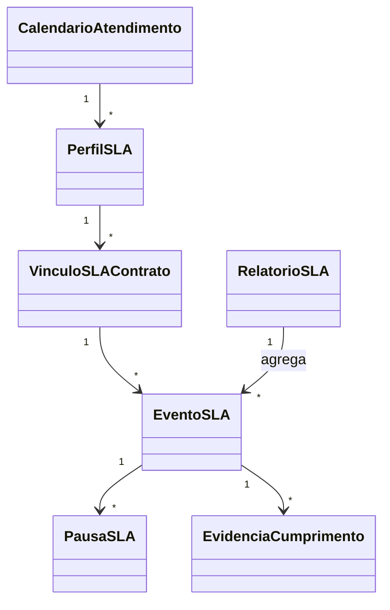

# Modelo de domínio — Módulo SLA Contratual

> Entidades específicas do SLA contratual. Entidades transversais em `docs/comum/modelo-de-dominio.md`.

---

## Entidades

### PerfilSLA
- **Atributos obrigatórios:** `id`, `tenant_id`, `nome`, `versao`, `tempo_resposta_min`, `tempo_solucao_min`, `calendario_id`, `regra_penalidade` (JSON), `regra_bonificacao` (JSON), `status` (ativo/rascunho/descontinuado).
- **Atributos opcionais:** `descricao`, `criticidade_alvo`, `tipo_servico_alvo`.
- **Invariantes:** `INV-TENANT-001`; perfil vinculado a contrato ativo é imutável quanto a regras críticas (cria nova versão).
- **Ciclo de vida:** rascunho → ativo → descontinuado (nunca deletado).

### VinculoSLAContrato
- **Atributos obrigatórios:** `id`, `tenant_id`, `contrato_id`, `perfil_sla_id`, `perfil_sla_versao`, `vigencia_inicio`, `vigencia_fim`.
- **Atributos opcionais:** `overrides` (JSON — exceções específicas do contrato).
- **Invariantes:** vínculo congelado por versão; mudança no perfil não retroage.
- **Relacionamento:** referência simples a `Contrato` (módulo `contratos/`).

### EventoSLA
- **Atributos obrigatórios:** `id`, `tenant_id`, `vinculo_id`, `referencia_tipo` (chamado/OS), `referencia_id`, `tipo_evento` (Aberto/Cronometrando/Pausado/Despausado/Cumprido/Estourou), `timestamp`, `dados` (JSON).
- **Invariantes:** WORM — eventos são imutáveis após gravados (`SEC-*`).
- **Ciclo de vida:** criado e nunca modificado.

### PausaSLA
- **Atributos obrigatórios:** `id`, `tenant_id`, `evento_inicio_id`, `motivo_codigo`, `motivo_descricao`, `iniciado_em`, `iniciado_por`.
- **Atributos opcionais:** `encerrado_em`, `encerrado_por`, `anexos[]`.
- **Invariantes:** lista de motivos é controlada pelo perfil; despausar exige ação humana.
- **Ciclo de vida:** aberta → encerrada (imutável após encerrada).

### CalendarioAtendimento
- **Atributos obrigatórios:** `id`, `tenant_id`, `nome`, `tipo` (8x5 / 24x7 / customizado), `fusos`, `horarios_semana` (JSON), `feriados[]`.
- **Ciclo de vida:** mutável; mudanças não retroagem a eventos passados.

### EvidenciaCumprimento
- **Atributos obrigatórios:** `id`, `tenant_id`, `evento_sla_id`, `tipo` (foto/log/assinatura/anexo), `referencia_arquivo`, `criado_em`.
- **Invariantes:** imutável após criada; WORM em B2.

### RelatorioSLA
- **Atributos obrigatórios:** `id`, `tenant_id`, `cliente_id`, `periodo_inicio`, `periodo_fim`, `gerado_em`, `hash_pdf`, `referencia_arquivo`.
- **Invariantes:** imutável após emitido (`INV-*` WORM). Hash garante anti-adulteração.

---

## Agregados (DDD)

| Agregado raiz | Entidades incluídas | Invariantes |
|---|---|---|
| PerfilSLA | PerfilSLA, CalendarioAtendimento (referência) | imutabilidade após vinculação |
| VinculoSLAContrato | VinculoSLAContrato | congelamento por versão |
| MedicaoSLA (transacional) | EventoSLA, PausaSLA, EvidenciaCumprimento | WORM nos eventos |
| RelatorioSLA | RelatorioSLA | imutabilidade pós-emissão |

---

## Value Objects

| VO | Definição | Imutável? |
|---|---|---|
| JanelaTempo | par (inicio, fim) com fuso | Sim |
| RegraPenalidade | estrutura tipada (percentual_por_unidade, teto, piso) | Sim |
| RegraBonificacao | idem | Sim |

---

## Eventos de domínio (publicados)

| Evento | Quando dispara | Payload | Quem consome |
|---|---|---|---|
| `SLA.Cronometrando` | abertura de chamado/OS vinculado | `{vinculo_id, referencia, deadline_TR, deadline_TS}` | UI atendimento |
| `SLA.Pausado` | pausa registrada | `{vinculo_id, motivo, iniciado_em}` | UI, auditoria |
| `SLA.Despausado` | pausa encerrada | `{vinculo_id, encerrado_em}` | UI |
| `SLA.AlertaPreventivo` | atingiu 80%/90% | `{vinculo_id, nivel, responsavel}` | Comunicação Omnichannel, escalonamento |
| `SLA.Cumprido` | resolução dentro do prazo | `{vinculo_id, TR_real, TS_real}` | Financeiro (bonificação), relatórios |
| `SLA.Estourou` | tempo > limite | `{vinculo_id, atraso}` | Financeiro (penalidade), diretoria |
| `SLA.PenalidadeCalculada` | fechamento de ciclo | `{cliente_id, periodo, valor, justificativa}` | Financeiro |
| `SLA.BonificacaoCalculada` | fechamento de ciclo | idem | Financeiro |
| `SLA.RelatorioEmitido` | relatório PDF gerado | `{relatorio_id, cliente_id, periodo, hash}` | Comunicação Omnichannel, auditoria |

---

## Comandos (entradas no módulo)

| Comando | Origem | Pré-condição | Pós-condição |
|---|---|---|---|
| `criarPerfilSLA` | UI | usuário comercial | perfil em rascunho |
| `ativarPerfilSLA` | UI | perfil em rascunho válido | perfil ativo |
| `vincularSLAContrato` | UI / API | perfil ativo + contrato ativo | vínculo criado |
| `iniciarCronometroSLA` | módulo Chamados/OS | abertura de chamado/OS | EventoSLA `Cronometrando` |
| `pausarSLA` | UI atendente | cronômetro ativo + motivo válido | EventoSLA `Pausado` + PausaSLA |
| `despausarSLA` | UI atendente | pausa aberta | EventoSLA `Despausado` |
| `registrarCumprimento` | módulo Chamados/OS | resolução do incidente | EventoSLA `Cumprido` |
| `gerarRelatorioSLA` | UI / agendador | período fechado | RelatorioSLA + `SLA.RelatorioEmitido` |

---

## Schema físico

Ver `../schema-banco.md` do módulo quando criado, OU `../../../comum/schema-banco.md` para entidades transversais.

---

## Diagramas

---

## Como este modelo evolui

- Entidade nova → verificar fronteira em `governanca-modelo-comum.md`.
- Atributo novo → migration + bump CHANGELOG.
- Entidade descontinuada → ADR + janela de migração.
