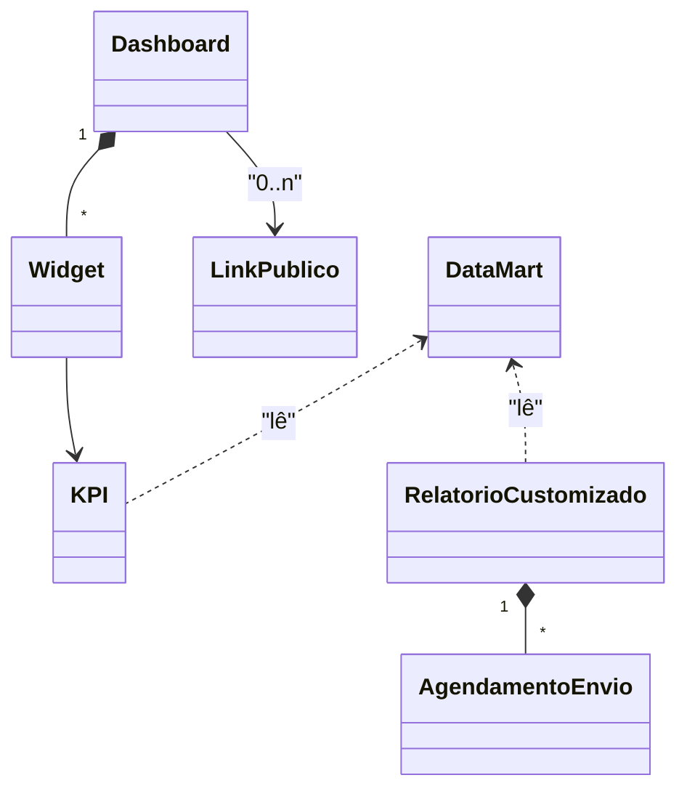

# Modelo de domínio — Módulo BI

> Entidades específicas. Transversais ficam em `docs/comum/`. Hook valida não-duplicação.

---

## Entidades

### KPI (Indicador)
- **Atributos obrigatórios:** `id`, `tenant_id`, `codigo`, `nome`, `descricao`, `formula` (referência à definição), `unidade`, `categoria` (financeiro/comercial/operacional/...), `target`, `dono` (papel responsável)
- **Atributos opcionais:** `target_minimo`, `target_maximo`, `tooltip_traduzido_roldao`
- **Invariantes:** `INV-TENANT-001` (sempre filtrado por tenant); definição única por código por tenant.
- **Ciclo de vida:** criado por admin; mutável (versionado em CHANGELOG); deprecação por ADR.

### Dashboard
- **Atributos obrigatórios:** `id`, `tenant_id`, `nome`, `area` (executivo/financeiro/comercial/...), `dono_papel` (RBAC), `layout` (posições dos widgets)
- **Atributos opcionais:** `descricao`, `compartilhado_com` (lista de papéis/usuários)
- **Invariantes:** `INV-TENANT-001..004`.
- **Ciclo de vida:** criado pelo analista ou padrão do sistema; editável; soft-delete preservando histórico.

### Widget (item de dashboard)
- **Atributos obrigatórios:** `id`, `dashboard_id`, `tipo` (card/gráfico-linha/barra/tabela/funil), `kpi_id` (ou query custom), `filtros`, `posicao`
- **Invariantes:** widget herda RBAC do KPI/query subjacente.

### RelatorioCustomizado
- **Atributos obrigatórios:** `id`, `tenant_id`, `autor_id`, `nome`, `definicao` (métricas + filtros + agrupamentos em JSON), `criado_em`
- **Atributos opcionais:** `compartilhado_com`, `descricao`
- **Invariantes:** `INV-TENANT-001..004`; definição valida contra catálogo de métricas permitidas por papel.
- **Ciclo de vida:** criado, executado N vezes, editado, eventualmente arquivado.

### Agendamento de envio
- **Atributos obrigatórios:** `id`, `tenant_id`, `relatorio_id` (ou `dashboard_id`), `cron_expressao`, `destinatarios` (lista de e-mails), `formato` (PDF/CSV/XLSX), `ativo`
- **Atributos opcionais:** `proximo_disparo`, `ultimo_disparo`, `historico_falhas`
- **Invariantes:** destinatário externo (não-usuário do tenant) registrado com flag `risco_lgpd_aceito = true`.

### LinkPublico
- **Atributos obrigatórios:** `id`, `tenant_id`, `dashboard_id`, `token` (UUID v4), `criado_em`, `expira_em`, `escopo_dados` (agregado / cliente_especifico_id)
- **Atributos opcionais:** `senha_hash`, `cliente_alvo_id`, `acessos_count`
- **Invariantes:** `INV-TENANT-001..004` (nenhum acesso pelo link cruza tenant); link expirado retorna 410 sem vazar dado.

### DataMart (materialização)
- **Atributos obrigatórios:** `id`, `tenant_id` (ou compartilhado dependendo do mart), `nome`, `query_definicao`, `ultima_atualizacao`, `defasagem_atual_segundos`
- **Ciclo de vida:** atualizado por job procrastinate; reconstruído sob demanda.

---

## Agregados (DDD)

| Agregado raiz | Entidades incluídas | Invariantes |
|---|---|---|
| Dashboard | Dashboard + Widget[] | RBAC consistente; soma de RBAC dos widgets ⊆ RBAC do dono do dashboard |
| RelatorioCustomizado | RelatorioCustomizado + AgendamentoEnvio[] | definição válida contra catálogo |
| LinkPublico | LinkPublico (sem filhos) | expiração + escopo OBRIGATÓRIOS |

---

## Value Objects

| VO | Definição | Imutável? |
|---|---|---|
| Periodo | { inicio, fim, granularidade (dia/semana/mês) } | Sim |
| Filtro | { campo, operador, valor } | Sim |
| Agrupamento | { campo, ordem } | Sim |
| TargetKPI | { valor, direcao (maior_melhor/menor_melhor), unidade } | Sim |

---

## Eventos de domínio (publicados)

| Evento | Quando dispara | Payload | Quem consome |
|---|---|---|---|
| `BI.RelatorioGerado` | quando job produz arquivo de relatório agendado | { tenant_id, relatorio_id, formato, url_storage, gerado_em } | Notificações (envio), Auditoria |
| `BI.LinkPublicoAcessado` | a cada acesso ao link público | { tenant_id, link_id, ip_hash, user_agent_hash, ts } | Auditoria, Segurança |
| `BI.DataMartAtualizado` | quando job de materialização conclui | { tenant_id, mart, defasagem_segundos } | Observabilidade |
| `BI.AlertaKPI` | KPI cruzou limite configurado | { tenant_id, kpi_codigo, valor, threshold } | Notificações, Dashboard executivo |

## Eventos consumidos (de outros módulos)

| Evento de origem | Origem | Uso aqui |
|---|---|---|
| `Financeiro.LancamentoCriado` | Financeiro | atualiza data mart financeiro / fluxo caixa projetado |
| `OS.Concluida` | Operação | atualiza produtividade técnica + SLA |
| `Comercial.OrcamentoAprovado` | Comercial | atualiza funil + receita prevista |
| `Estoque.MovimentacaoRegistrada` | Suprimentos | atualiza indicadores de estoque |
| `Calibracao.CertificadoEmitido` | Metrologia | atualiza indicadores de laboratório |

---

## Comandos (entradas no módulo)

| Comando | Origem | Pré-condição | Pós-condição |
|---|---|---|---|
| `criarDashboard` | UI (analista/admin) | papel autorizado | Dashboard criado |
| `executarRelatorio` | UI ou job | definição válida + RBAC | resultado retornado / arquivo gerado |
| `criarAgendamento` | UI (analista) | relatório existente + cron válido | Agendamento ativo |
| `gerarLinkPublico` | UI (analista/admin) | dashboard existente + escopo definido + expiração | LinkPublico criado |
| `revogarLinkPublico` | UI (admin) | link existente | link expira imediatamente |
| `atualizarDataMart` | job procrastinate | mart definido | materialização atualizada |

---

## Schema físico

Ver `../schema-banco.md` deste módulo (a criar). Tabelas-mãe (resumo):
- `bi_kpi`
- `bi_dashboard`, `bi_dashboard_widget`
- `bi_relatorio_customizado`
- `bi_agendamento_envio`
- `bi_link_publico`
- `bi_data_mart_<area>` (uma por área)

Todas com `tenant_id NOT NULL` + RLS ativo (`INV-TENANT-001..004`).

## Diagramas

## Como este modelo evolui

- Entidade nova → adicionar + verificar fronteira (`governanca-modelo-comum.md`).
- Atributo novo → migration + bump CHANGELOG.
- Entidade descontinuada → ADR + janela de migração.
