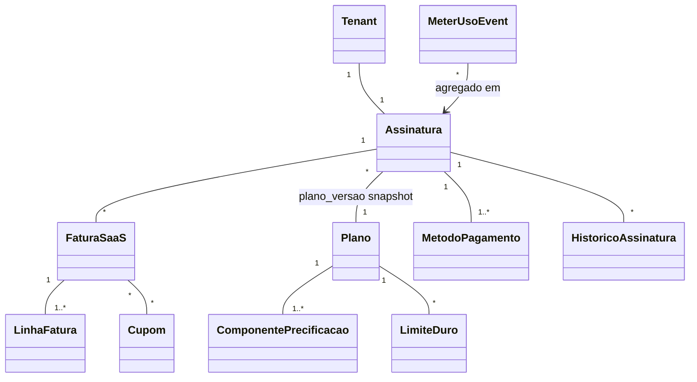
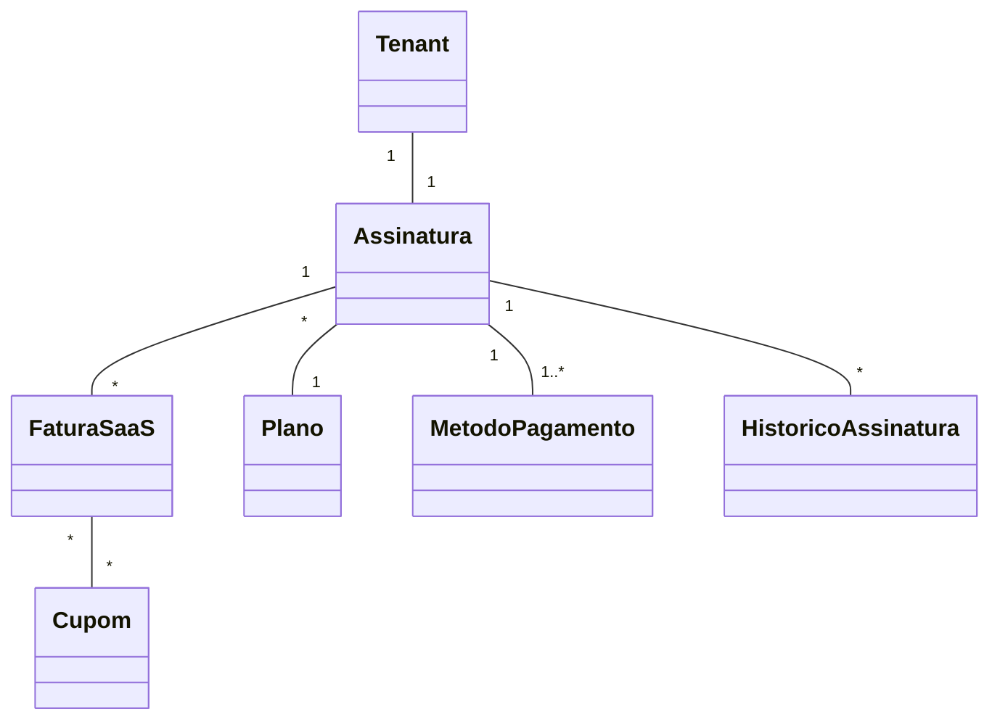

# Modelo de domínio — Módulo Billing SaaS (v2 — pricing composicional)

> Entidades específicas do módulo de assinaturas. Tenant é entidade transversal (`docs/comum/modelo-de-dominio.md`).
>
> **v2 (17/05/2026 madrugada):** modelo de pricing **composicional** introduzido pela ADR-0013 — `Plano` agora é raiz de agregado com lista de `ComponentePrecificacao` (7 tipos). Cobre cenários: preço por bundle de módulos, faixas de usuários, adicional por usuário, add-ons avulsos, cobrança por uso variável, descontos automáticos. Versionamento automático (preço não retroage — INV-026). Modelo v1 (`preco_mensal` direto no Plano) substituído.

---

## Entidades

### Plano (raiz de agregado de pricing)
- **Atributos obrigatórios:** `id`, `codigo` (slug — ex: `starter`, `pro`, `enterprise`), `versao` (semver — ex: `pro@v3`, gerada automaticamente em cada edição), `nome`, `moeda` (BRL/USD/etc), `ativo` (bool), `duracao_trial_dias` (0 = sem trial), `ciclos_aceitos` (lista: `[mensal, anual, avulso]`).
- **Atributos opcionais:** `descricao`, `ordem_exibicao`, `deprecado_em` (datetime — plano fica oculto no checkout mas continua válido pras assinaturas existentes).
- **Invariantes:**
  - `INV-038` — plano em uso por assinatura **não pode ser excluído**, apenas deprecado.
  - `INV-026` — toda alteração em qualquer `ComponentePrecificacao` do plano gera **nova versão automaticamente**. Assinaturas existentes mantêm `plano_versao` original (snapshot). Preço nunca retroage.
  - Constraint `UNIQUE (codigo, versao)` — pode haver várias versões do mesmo código.
  - Constraint `UNIQUE (codigo) WHERE deprecado_em IS NULL` — só uma versão ativa por código em dado momento.
  - Plano tem **pelo menos 1 `ComponenteBase`** (mensalidade fixa) OU **pelo menos 1 `ComponenteFaixaUsuarios`** (preço só por seat) — não pode ter plano sem preço base.
- **Ciclo de vida:** rascunho → ativa → (edição → nova versão; versão anterior fica ainda válida pras assinaturas que a referenciam) → deprecada (não aparece no checkout, assinaturas continuam vigentes).

### ComponentePrecificacao (entidade abstrata — 7 implementações concretas)

Cada plano tem **uma lista ordenada** de componentes. Fatura é calculada agregando todos os componentes aplicáveis ao tenant no ciclo. Atributos comuns:
- `id`, `plano_id`, `tipo` (enum dos 7 abaixo), `ordem` (int — ordem de cálculo importa pra descontos), `ativo` (bool — permite "desligar" componente sem deletar pra histórico).

#### 1. ComponenteBase (mensalidade fixa)
- **Atributos:** `preco_mensal: Money` (obrigatório), `preco_anual: Money` (opcional — se ausente, anual = `preco_mensal × 12`).
- **Cálculo na fatura:** `preco_mensal` se ciclo=mensal; `preco_anual / 12` se ciclo=anual (cobrado anualmente em parcela única).
- **Exemplo:** R$ 350/mês.

#### 2. ComponenteFaixaUsuarios (preço escalonado por seat)
- **Atributos:** `faixas: list[FaixaPreco]` (≥1 obrigatório), `tipo_contagem: enum` (`usuarios_ativos` / `usuarios_cadastrados` / `usuarios_logados_30d`).
- **`FaixaPreco`:** `{de: int, ate: int | null, preco_por_usuario: Money}` — `ate=null` significa "sem teto".
- **Cálculo na fatura:** para cada usuário do tenant, identifica em qual faixa cai, soma `preco_por_usuario`. Faixas devem ser **contíguas e não-sobrepostas**.
- **Exemplo:** `[{1-5: R$0}, {6-15: R$35}, {16-null: R$25}]` — 8 usuários custam 5×R$0 + 3×R$35 = R$ 105.
- **Invariante:** faixas validadas no save (sem gap, sem sobreposição, primeira começa em 1).

#### 3. ComponenteAdicionalUsuario (overage per-seat após N inclusos)
- **Atributos:** `quantidade_inclusa: int`, `preco_por_usuario_extra: Money`, `tipo_contagem: enum`.
- **Cálculo na fatura:** `max(0, usuarios - quantidade_inclusa) × preco_por_usuario_extra`.
- **Exemplo:** inclui 3, cada extra = R$ 25. Tenant com 7 usuários paga 4 × R$ 25 = R$ 100.
- **Diferença vs ComponenteFaixaUsuarios:** este é "linear simples"; faixa é "escalonado por degrau". Use o adicional pra planos simples; faixa pra planos com desconto progressivo.

#### 4. ComponenteBundleModulos (quais módulos vêm no plano)
- **Atributos:** `modulos: list[str]` — lista de slugs (ex: `["os", "calibracao", "certificados", "fiscal"]`).
- **Cálculo na fatura:** R$ 0 (bundle é "o que vem incluso", não cobra). Disparador de feature flag: assinatura com esse plano ativa as features correspondentes em `tenant_features` (ADR-0006).
- **Exemplo:** Plano Pro tem bundle `[os, calibracao, certificados, fiscal, contas-receber]`.
- **Invariante:** módulos listados devem existir no catálogo de features (`docs/comum/feature-flags-catalogo.md`). Hook valida.

#### 5. ComponenteAddon (módulo opcional avulso)
- **Atributos:** `modulo: str`, `preco_mensal: Money`, `preco_anual: Money | null`, `opcional_no_checkout: bool`.
- **Cálculo na fatura:** apenas se `Assinatura.addons_ativos` inclui esse módulo. Cobra `preco_mensal` (ou anual).
- **Exemplo:** Plano Starter pode contratar addon `marketplace` por R$ 150/mês.
- **Diferença vs ComponenteBundleModulos:** bundle é "vem dentro do plano"; addon é "opcional, cobra extra".
- **Eventos:** `BillingSaas.AddonContratado` (ao ativar) / `BillingSaas.AddonCancelado` (ao desativar — efetivo próximo ciclo).

#### 6. ComponenteUsoVariavel (cobrança por uso — metered billing)
- **Atributos:** `recurso: str` (ex: `nfse_emitidas`, `whatsapp_enviados`, `ocr_processados`, `armazenamento_gb`), `unidade_inclusa: int`, `preco_por_unidade_extra: Money`, `ciclo_reset: enum` (`mensal` / `anual` / `nunca`).
- **Cálculo na fatura:** `max(0, uso_medido_no_ciclo - unidade_inclusa) × preco_por_unidade_extra`.
- **Medição:** consome `MeterUsoEvent` publicado em outbox quando o recurso é consumido (módulo `fiscal/` publica ao emitir NFS-e; `omnichannel` ao enviar WhatsApp; etc).
- **Exemplo:** inclui 100 NFS-e/mês, cada extra = R$ 0,80. Tenant que emite 130 paga 30 × R$ 0,80 = R$ 24.
- **Invariante:** `recurso` deve estar no catálogo de recursos mensuráveis (`docs/dominios/financeiro/modulos/billing-saas/recursos-mensuraveis.md` — a criar). Hook valida.

#### 7. ComponenteDesconto (desconto automático)
- **Atributos:** `aplicavel_se: enum` (`ciclo_anual` / `volume_acima_de_N_usuarios` / `cupom_X` / `periodo_promocional` / `regra_customizada`), `parametro: dict` (ex: `{volume_acima_de: 50}` ou `{cupom_codigo: "BLACKFRIDAY"}`), `desconto_percentual: Decimal | null` (0-100), `desconto_valor_fixo: Money | null`, `aplicar_em: enum` (`subtotal` / `base` / `usuarios` / `addons` — sobre qual parte do cálculo aplica).
- **Cálculo na fatura:** após somar componentes 1-6, aplica desconto se condição for verdadeira.
- **Exemplo:** "se ciclo=anual, desconto 15% sobre subtotal" OU "se usuários > 50, desconto 10% sobre usuários".
- **Implementação:** usa porta `RuleEngineProvider` (ACL #14) — regra é versionada junto com o plano.

### LimiteDuro (hard cap — bloqueia, não cobra)
- **Atributos:** `id`, `plano_id`, `recurso: str`, `valor_maximo: int`, `acao_ao_estourar: enum` (`bloquear_imediato` / `bloquear_proximo_ciclo` / `apenas_alerta`), `mensagem_cliente: str` (texto exibido quando bloqueia).
- **Cálculo:** não entra na fatura. É consultado pelo `AuthorizationProvider.can()` (ADR-0012): tenant tenta upload de PDF acima de `storage_gb=50` → `can()` retorna `denied, reason=limite_duro_estourado`.
- **Exemplo:** Plano Starter tem `storage_gb=10` com `acao=bloquear_imediato`; tenant não consegue passar.
- **Diferença vs ComponenteUsoVariavel:** uso variável **cobra** o excesso; limite duro **bloqueia** o excesso. Roldão decide qual aplicar por recurso.
- **Eventos:** `BillingSaas.LimiteDuroAtingido` ao chegar em 80% e 100%.

### Assinatura (atualizada — carrega snapshot do plano)
- **Atributos obrigatórios:** `id`, `tenant_id` (`INV-TENANT-001`), `plano_id`, `plano_versao` (snapshot — ex: `pro@v3`), `plano_snapshot` (JSONB — cópia completa dos componentes na hora da contratação), `status` (`trial`/`ativa`/`suspensa`/`cancelada`/`trial_expirado`), `data_inicio`, `proximo_vencimento`, `ciclo` (`mensal`/`anual`), `metodo_pagamento_id`.
- **Atributos opcionais:** `trial_termina_em`, `cancelada_em`, `motivo_cancelamento`, `addons_ativos` (lista de slugs — ex: `["marketplace"]`).
- **Invariantes:**
  - Uma única assinatura `ativa` ou `trial` por tenant (`UNIQUE (tenant_id) WHERE status IN ('ativa', 'trial')`).
  - `plano_snapshot` imutável — mudança no plano original não afeta assinatura existente até migração explícita.
  - Mudanças de status registradas em `HistoricoAssinatura` (append-only).
  - Migração de versão de plano (`pro@v1 → pro@v2`) só por comando explícito (`migrar_assinatura_pra_versao`) — registra histórico, notifica tenant.
- **Ciclo de vida:** criada na contratação → trial (se aplicável) → ativa → (suspensa↔ativa por inadimplência) → cancelada (terminal).

### Fatura SaaS (atualizada — com breakdown)
- **Atributos obrigatórios:** `id`, `tenant_id`, `assinatura_id`, `numero` (sequencial por tenant), `data_emissao`, `data_vencimento`, `valor_bruto: Money`, `descontos_total: Money`, `valor_liquido: Money`, `status` (`aberta`/`paga`/`falhou`/`estornada`), `tentativas_cobranca` (int), `plano_versao` (ref ao snapshot da assinatura).
- **Atributos opcionais:** `pago_em`, `gateway_transacao_id`, `nfse_id`, `nfse_authorization_code`, `nfse_pdf_url`, `nfse_status`, `nfse_rejection_reason`.
- **Filhos:** `linhas: list[LinhaFatura]` (≥1 obrigatório — fatura sem linhas é inválida).
- **Invariantes:** `numero` sequencial por tenant (INV-028); fatura paga é imutável (correção via estorno + nova fatura); emissão NFS-e idempotente (INV-026).
- **Ciclo de vida:** gerada por job → tentativa cobrança → paga (dispara NFS-e via `FiscalProvider`) OU falhou (retentativas D+1/D+3/D+7) OU estornada.

### LinhaFatura (breakdown da fatura)
- **Atributos:** `id`, `fatura_id`, `ordem`, `componente_origem` (string — ex: `"ComponenteBase"`, `"ComponenteFaixaUsuarios#2"`, `"ComponenteUsoVariavel:nfse_emitidas"`), `descricao` (string legível pro cliente — ex: `"Mensalidade base"`, `"3 usuários adicionais (6º ao 8º)"`, `"20 NFS-e além das 100 inclusas"`), `quantidade: Decimal`, `unidade: str` (ex: `"mês"`, `"usuários"`, `"NFS-e"`), `preco_unitario: Money`, `subtotal: Money`, `eh_desconto: bool` (default False).
- **Invariantes:** `subtotal = quantidade × preco_unitario` (validação no save); `valor_bruto da fatura = sum(linhas.subtotal where not eh_desconto)`; `descontos_total = sum(linhas.subtotal where eh_desconto)`.
- **Renderização no PDF:** tabela mostra todas as linhas; cliente entende de onde vem cada R$.

### MeterUsoEvent (medição de uso pra ComponenteUsoVariavel)
- **Atributos:** `id`, `tenant_id`, `recurso` (`nfse_emitidas`, `whatsapp_enviados`, etc), `quantidade` (Decimal — geralmente 1, mas pode ser fracionário ex: 0.5 GB), `medido_em` (datetime), `referencia_externa` (ex: `nfse_id`, `whatsapp_message_id` — pra idempotência e auditoria), `processado_em_fatura_id` (FK — null se ainda não fechou ciclo).
- **Invariantes:** append-only (WORM); `(tenant_id, recurso, referencia_externa)` único — idempotência forte (evento duplicado não cobra duas vezes).
- **Ciclo de vida:** publicado por módulo que consome recurso (fiscal, omnichannel, gestão-documental) → consumido no fechamento de ciclo pelo job `agregar_uso_variavel` → grava `processado_em_fatura_id` (não move/apaga — WORM).

### Cupom (mantido v1, sem mudança)
- **Atributos obrigatórios:** `id`, `codigo`, `tipo` (`percentual`/`valor_fixo`), `valor`, `validade_inicio`, `validade_fim`, `usos_max`, `usos_atuais`, `recorrencia` (`unica`/`N_ciclos`).
- **Atributos opcionais:** `planos_aplicaveis` (lista), `descricao`.
- **Invariantes:** `codigo` único globalmente; cupom expirado/esgotado não aplicável.
- **Nota:** pode virar `ComponenteDesconto` com `aplicavel_se=cupom_X` futuramente.

### MetodoPagamento (mantido v1)
- **Atributos obrigatórios:** `id`, `tenant_id`, `tipo` (`cartao`/`boleto`/`pix`), `gateway`, `gateway_token` (tokenizado — NUNCA PAN/CVV — `SEC-PCI-001`), `ativo`.
- **Atributos opcionais:** `bandeira`, `ultimos_4`, `nome_titular`, `vencimento_mes`, `vencimento_ano`.
- **Invariantes:** `SEC-PCI-001` — proibido armazenar dados completos de cartão; apenas token do gateway.

### HistoricoAssinatura (mantido v1, expandido com novos eventos)
- **Atributos:** `id`, `assinatura_id`, `evento` (criação, upgrade, downgrade, suspensão, reativação, cancelamento, **addon_contratado**, **addon_cancelado**, **plano_migrado_versao**), `de_plano_versao`, `para_plano_versao`, `de_status`, `para_status`, `quando`, `quem` (user_id ou `system`), `motivo`, `dados_adicionais` (JSONB — ex: `{addon: marketplace}`).
- **Invariantes:** imutável (append-only WORM).

---

## Agregados (DDD)

| Agregado raiz | Entidades incluídas | Invariantes |
|---|---|---|
| **Plano** | Plano, ComponentePrecificacao [N], LimiteDuro [N] | Versionamento automático; INV-038 (não deletável se em uso); pelo menos 1 ComponenteBase ou FaixaUsuarios |
| **Assinatura** | Assinatura, HistoricoAssinatura, MetodoPagamento (ref) | Uma ativa por tenant; histórico imutável; plano_snapshot imutável |
| **Fatura SaaS** | Fatura SaaS, LinhaFatura [N], aplicações de cupom | Número sequencial por tenant; paga é imutável; `valor_bruto = soma(linhas)` |
| **Cupom** | Cupom + usos | Unicidade global; controle de usos atomicamente |
| **Medição** | MeterUsoEvent [N] | Append-only; idempotência por `(tenant_id, recurso, referencia_externa)` |

---

## Value Objects

| VO | Definição | Imutável? |
|---|---|---|
| Dinheiro (Money) | `{valor: Decimal, moeda: str}` | Sim |
| Ciclo | `mensal` / `anual` / `avulso` | Sim |
| StatusAssinatura | enum (trial/ativa/suspensa/cancelada/trial_expirado) | Sim |
| FaixaBloqueio | enum (normal/warning/read_only/suspensa) — derivada de dias em atraso | Sim |
| **FaixaPreco** | `{de: int, ate: int | null, preco_por_usuario: Money}` (dentro de ComponenteFaixaUsuarios) | Sim |
| **TipoComponente** | enum (base, faixa_usuarios, adicional_usuario, bundle, addon, uso_variavel, desconto) | Sim |
| **TipoContagemUsuarios** | enum (usuarios_ativos, usuarios_cadastrados, usuarios_logados_30d) | Sim |

---

## Eventos de domínio (publicados)

| Evento | Quando dispara | Payload | Quem consome |
|---|---|---|---|
| `BillingSaas.AssinaturaCriada` | nova assinatura | `{tenant_id, assinatura_id, plano_codigo, plano_versao, status}` | Auth (provisiona acesso), módulos (liberam features via bundle) |
| `BillingSaas.FaturaPaga` | cobrança confirmada | `{tenant_id, fatura_id, valor, pago_em, ciclo, breakdown: list[LinhaFatura]}` | Fiscal (dispara NFS-e), Contabilidade, `relatorios-financeiros/` (MRR/ARR por componente — ADR-0011) |
| `BillingSaas.NFSeEmitida` | NFS-e autorizada (US-BIL-008) | `{tenant_id, fatura_id, nfse_id, authorization_code, pdf_url}` | Notificações, Contabilidade, WORM audit |
| `BillingSaas.NFSeFalhou` | NFS-e rejeitada | `{tenant_id, fatura_id, rejection_reason}` | Operador comercial (P1) |
| `BillingSaas.CobrancaFalhou` | gateway recusou | `{tenant_id, fatura_id, motivo, tentativa_n}` | Notificações |
| `BillingSaas.TenantSuspenso` | bloqueio D+15 | `{tenant_id, motivo}` | Auth (corta acesso), módulos (read-only) |
| `BillingSaas.TenantReativado` | pagamento regulariza | `{tenant_id}` | Auth, módulos |
| `BillingSaas.PlanoMudou` | upgrade/downgrade | `{tenant_id, de_plano_versao, para_plano_versao, efetivo_em}` | Auth (ajusta limites), módulos |
| `BillingSaas.TrialExpirando` | D-7/D-3/D-1 | `{tenant_id, dias_restantes}` | Notificações |
| **`BillingSaas.PlanoCriado`** | operador comercial publica plano novo | `{plano_id, codigo, versao, componentes_resumo}` | Auditor de Segurança valida; catálogo público atualiza |
| **`BillingSaas.PlanoVersionado`** | operador edita plano → nova versão | `{plano_id, codigo, versao_anterior, versao_nova, mudancas}` | Histórico; notificação interna |
| **`BillingSaas.ComponentePrecoMudou`** | componente específico foi editado | `{plano_id, componente_id, tipo, antes, depois}` | Telemetria pricing; auditor produto |
| **`BillingSaas.AddonContratado`** | tenant ativou addon | `{tenant_id, modulo, preco_aplicado, efetivo_em}` | Auth provisiona; módulo liberado |
| **`BillingSaas.AddonCancelado`** | tenant desativou addon | `{tenant_id, modulo, efetivo_em}` | Auth revoga (próximo ciclo) |
| **`BillingSaas.LimiteDuroAtingido`** | tenant chegou em 80% ou 100% do hard cap | `{tenant_id, recurso, valor_atual, valor_maximo, percentual}` | Notifica tenant; bloqueia conforme `acao_ao_estourar` |
| **`BillingSaas.UsoMedido`** | uso de recurso variável agregado em 80% do incluso | `{tenant_id, recurso, uso_atual, unidade_inclusa, projetado_overage}` | Notifica tenant ("você está perto do limite") |

---

## Comandos (entradas no módulo)

| Comando | Origem | Pré-condição | Pós-condição |
|---|---|---|---|
| `contratarPlano` | UI tenant | tenant criado, plano ativo | assinatura criada com `plano_snapshot`, evento emitido |
| `mudarPlano` | UI tenant ou operador | assinatura ativa | upgrade imediato OU downgrade agendado; novo `plano_snapshot` |
| `cancelarAssinatura` | UI tenant | assinatura ativa | status=cancelada |
| `aplicarCupom` | UI tenant | cupom válido | desconto agendado |
| **`contratarAddon`** | UI tenant | assinatura ativa + addon disponível pro plano | addon ativo, módulo liberado, próxima fatura inclui |
| **`cancelarAddon`** | UI tenant | addon ativo | efetivo no próximo ciclo |
| **`migrarVersaoPlano`** | operador comercial | assinatura ativa em versão antiga | snapshot atualizado pra nova versão, notifica tenant |
| `gerarFatura` | job cron | assinatura ativa com vencimento hoje | fatura criada **com breakdown completo**, cobrança iniciada |
| `processarWebhookGateway` | gateway externo | assinatura HMAC válida | atualiza status fatura |
| `forcarReativacao` | operador comercial | tenant suspenso | status=ativa |
| **`criarPlano`** | operador comercial | wizard preenchido + simulação validada | plano publicado, evento `PlanoCriado` |
| **`editarPlano`** | operador comercial | plano existente | nova versão criada automaticamente, evento `PlanoVersionado` |
| **`medirUso`** | módulos (fiscal, omnichannel, gestão-documental) | recurso consumido | MeterUsoEvent gravado |

---

## Cálculo da Fatura — algoritmo passo a passo

> Detalhamento operacional em `calculadora-fatura.md` (a criar). Resumo:

```
def calcular_fatura(assinatura, ciclo, periodo_de, periodo_ate) -> FaturaSaaS:
    snapshot = assinatura.plano_snapshot
    fatura = FaturaSaaS.nova(assinatura)
    
    for componente in snapshot.componentes (ordenados):
        match componente.tipo:
            case "base":
                fatura.add_linha(
                    componente_origem=componente.id,
                    descricao="Mensalidade base",
                    quantidade=1,
                    preco_unitario=componente.preco(ciclo),
                )
            case "faixa_usuarios":
                usuarios = contar_usuarios(assinatura.tenant_id, componente.tipo_contagem)
                for faixa in componente.faixas:
                    qtd_na_faixa = min(faixa.ate or float('inf'), usuarios) - (faixa.de - 1)
                    if qtd_na_faixa > 0:
                        fatura.add_linha(
                            descricao=f"{qtd_na_faixa} usuários (faixa {faixa.de}-{faixa.ate or '+'})",
                            quantidade=qtd_na_faixa,
                            preco_unitario=faixa.preco_por_usuario,
                        )
            case "adicional_usuario":
                # similar mas linear
            case "bundle_modulos":
                # não cobra, mas registra "Inclui: módulos X, Y, Z"
            case "addon":
                if componente.modulo in assinatura.addons_ativos:
                    fatura.add_linha(...)
            case "uso_variavel":
                uso = agregar_meter_uso_events(assinatura.tenant_id, componente.recurso, periodo)
                excesso = max(0, uso - componente.unidade_inclusa)
                if excesso > 0:
                    fatura.add_linha(
                        descricao=f"{excesso} {componente.recurso} além das {componente.unidade_inclusa} inclusas",
                        quantidade=excesso,
                        preco_unitario=componente.preco_por_unidade_extra,
                    )
            case "desconto":
                if RuleEngineProvider.evaluate(componente.aplicavel_se, contexto):
                    valor = componente.calcular_desconto(fatura.subtotal_parcial)
                    fatura.add_linha(
                        descricao=componente.descricao_legivel(),
                        subtotal=-valor,
                        eh_desconto=True,
                    )
    
    fatura.consolidar()  # calcula valor_bruto, descontos_total, valor_liquido
    return fatura
```

---

## Porta ACL utilizada

Este módulo consome:
1. **`PaymentGatewayProvider`** (#11) — toda interação com gateways de pagamento
2. **`FiscalProvider`** (#1) — emissão de NFS-e da fatura paga
3. **`RuleEngineProvider`** (#14, ADR-0013 + ACL v3) — avaliação de regras de `ComponenteDesconto`
4. **`AuthorizationProvider`** (#12, ADR-0012) — consulta plano contratado pra bloquear ação fora do bundle/addon ou acima do limite duro
5. **`EmailTemplateProvider`** (#18) — fatura PDF, lembretes de cobrança, alertas de limite

---

## Schema físico

Ver `../schema-banco.md` deste módulo (a criar quando ADR-0001 fechar).

## Diagramas



## Como este modelo evolui

- Entidade nova → adicionar + verificar fronteira comum/módulo.
- **Componente novo (tipo 8)** → ADR obrigatório (ADR-0013 reabre); 7 tipos atuais cobrem 95% dos cenários.
- Atributo novo em Plano → migration + versionamento automático (assinaturas existentes mantêm snapshot).
- Recurso mensurável novo (ex: `ocr_processados`) → entrar em `recursos-mensuraveis.md` + hook valida.
- Status novo de assinatura → ADR explicando transições válidas.

---

## Agregados (DDD)

| Agregado raiz | Entidades incluídas | Invariantes |
|---|---|---|
| Assinatura | Assinatura, HistoricoAssinatura, MetodoPagamento (ref) | uma ativa por tenant; histórico imutável |
| Fatura SaaS | Fatura SaaS, aplicações de cupom | número sequencial por tenant; paga é imutável |
| Plano | Plano + versões | versionamento; descontinuação preserva contratos vigentes |
| Cupom | Cupom + usos | unicidade global; controle de usos atomicamente |

---

## Value Objects

| VO | Definição | Imutável? |
|---|---|---|
| Dinheiro | `{valor, moeda}` | Sim |
| Ciclo | `mensal` ou `anual` | Sim |
| StatusAssinatura | enum (trial/ativa/suspensa/cancelada/trial_expirado) | Sim |
| FaixaBloqueio | enum (normal/warning/read_only/suspensa) — derivada de dias em atraso | Sim |

---

## Eventos de domínio (publicados)

| Evento | Quando dispara | Payload | Quem consome |
|---|---|---|---|
| `BillingSaas.AssinaturaCriada` | nova assinatura | `{tenant_id, assinatura_id, plano_codigo, status}` | Auth (provisiona acesso), módulos (liberam features) |
| `BillingSaas.FaturaPaga` | cobrança confirmada (recorrência mensal/anual ou avulsa) | `{tenant_id, fatura_id, valor, pago_em, ciclo: mensal\|anual\|avulso}` | Fiscal (dispara `BillingSaas.NFSeEmitida`), Contabilidade, `relatorios-financeiros/` (projeção MRR) — **substitui evento legado `Assinatura.Recorrencia.Faturada`** (alias aceito em Wave A, removido em V2) |
| `BillingSaas.NFSeEmitida` | NFS-e da assinatura SaaS autorizada (US-BIL-008) | `{tenant_id, fatura_id, nfse_id, authorization_code, pdf_url, emitida_em, provider}` | Notificações (email PDF ao tenant), Contabilidade, WORM audit |
| `BillingSaas.NFSeFalhou` | NFS-e rejeitada pela prefeitura ou provider | `{tenant_id, fatura_id, rejection_reason, provider, tentativa_n}` | Operador comercial Aferê (P1), Notificações |
| `BillingSaas.CobrancaFalhou` | gateway recusou | `{tenant_id, fatura_id, motivo, tentativa_n}` | Notificações (email tenant) |
| `BillingSaas.TenantSuspenso` | bloqueio D+15 | `{tenant_id, motivo}` | Auth (corta acesso), todos módulos (entram read-only/blocked) |
| `BillingSaas.TenantReativado` | pagamento regulariza | `{tenant_id}` | Auth, módulos |
| `BillingSaas.PlanoMudou` | upgrade/downgrade | `{tenant_id, de_plano, para_plano, efetivo_em}` | Auth (ajusta limites), módulos (liberam/restringem) |
| `BillingSaas.TrialExpirando` | D-7/D-3/D-1 | `{tenant_id, dias_restantes}` | Notificações (email) |

---

## Comandos (entradas no módulo)

| Comando | Origem | Pré-condição | Pós-condição |
|---|---|---|---|
| `contratarPlano` | UI tenant | tenant criado, plano ativo | assinatura criada, evento emitido |
| `mudarPlano` | UI tenant ou operador | assinatura ativa | upgrade imediato OU downgrade agendado |
| `cancelarAssinatura` | UI tenant | assinatura ativa | status=cancelada, dados preservados conforme retenção |
| `aplicarCupom` | UI tenant | cupom válido e na janela | desconto agendado pra próxima fatura |
| `gerarFatura` | job cron | assinatura ativa com vencimento hoje | fatura criada, cobrança iniciada |
| `processarWebhookGateway` | gateway externo | assinatura HMAC válida | atualiza status fatura |
| `forcarReativacao` | operador comercial | tenant suspenso | status=ativa (com trilha em histórico) |

---

## Porta ACL utilizada

Este módulo consome **exclusivamente** a porta **`PaymentGatewayProvider`** (porta #11 em `docs/arquitetura/anti-corrosion-layer.md`) para toda interação com gateways externos de pagamento. Nenhum SDK de gateway (Stripe, PagSeguro/PagBank, Mercado Pago) é importado direto pelo código de domínio do módulo.

**Métodos consumidos:**
- `criar_cobranca(valor, metodo, cliente, tenant_id, idempotency_key, descricao)` — `gerarFatura` chama na geração da cobrança
- `tokenizar_cartao(dados_cartao_client_side, tenant_id)` — recebe **apenas o token** já gerado client-side (Stripe Elements / Checkout Transparente); backend nunca toca PAN/CVV
- `receber_webhook(payload, tenant_id)` — `processarWebhookGateway` despacha eventos do gateway
- `consultar_status(payment_id)` — reconciliação quando webhook se perde
- `reembolsar(payment_id, valor, motivo)` — estorno total/parcial gera nova `Fatura SaaS` estornada

**Eventos da porta consumidos pelo domínio:** `Pagamento.Confirmado` → `BillingSaas.FaturaPaga`; `Pagamento.Falhou` → `BillingSaas.CobrancaFalhou`; `Pagamento.Reembolsado` → status `Fatura.estornada`; `Cartao.Tokenizado` → auditoria + persistência do `MetodoPagamento` (apenas token).

**Implementações por onda:** `StripeProvider` (1ª — MVP-1), `PagSeguroProvider`/`PagBankProvider` (2ª — BR), `MercadoPagoProvider` (3ª — alta penetração BR).

**Compliance PCI-DSS (reforça `SEC-PCI-001` em `MetodoPagamento`):**
- Dados completos de cartão (PAN, CVV) **NUNCA** trafegam pelo backend Aferê. Tokenização é **client-side** via SDK do gateway.
- `MetodoPagamento` armazena somente: `gateway`, `gateway_token`, `ultimos_4`, `bandeira`, `vencimento_mes/ano`.
- Esta arquitetura mantém Aferê em escopo PCI-DSS **SAQ-A** (não SAQ-D).

Para emissão de NFS-e da própria assinatura (após `BillingSaas.FaturaPaga`) o módulo também consome a porta `FiscalProvider` (porta #1).

---

## Schema físico

Ver `../schema-banco.md` deste módulo (a criar quando ADR-0001 fechar).

## Diagramas



## Como este modelo evolui

- Entidade nova → adicionar + verificar fronteira comum/módulo.
- Atributo novo em Assinatura → migration + versionamento (assinaturas existentes mantêm forma anterior).
- Status novo → ADR explicando transições válidas.
