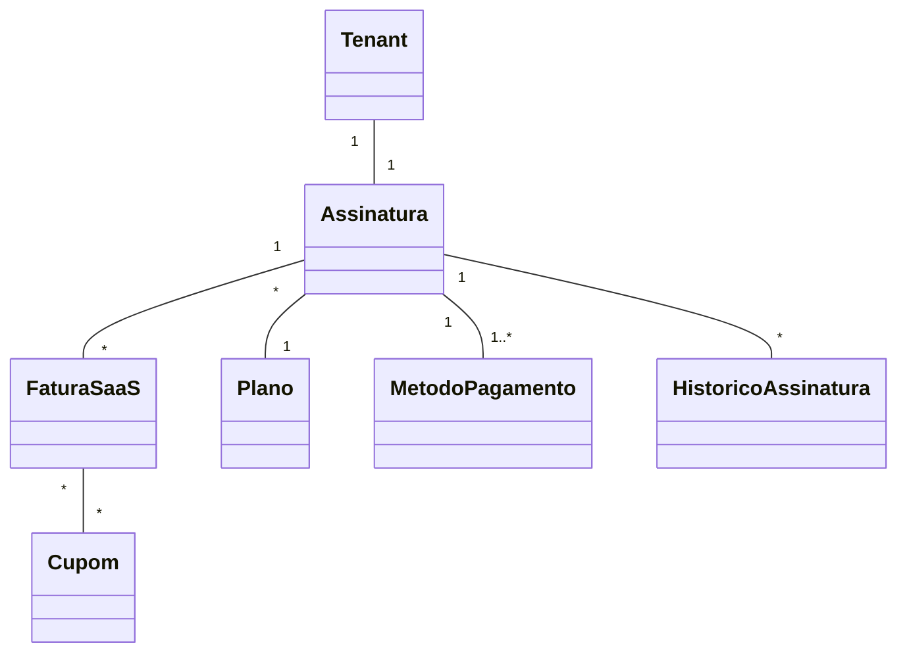

# Modelo de domínio — Módulo Billing SaaS

> Entidades específicas do módulo de assinaturas. Tenant é entidade transversal (`docs/comum/modelo-de-dominio.md`).

---

## Entidades

### Plano
- **Atributos obrigatórios:** `id`, `codigo` (A/B/C/D), `nome`, `preco_mensal`, `preco_anual`, `moeda`, `ativo`, `limite_usuarios`, `modulos_liberados` (lista), `duracao_trial_dias` (0 = sem trial).
- **Atributos opcionais:** `descricao`, `limite_volume` (ex: nº OS/mês), `ordem_exibicao`.
- **Invariantes:** `INV-NNN` — código único; mudança em plano ativo cria nova versão (planos versionados; assinaturas mantêm versão contratada).
- **Ciclo de vida:** criada por operador comercial → ativa → descontinuada (não pode ser deletada se existe assinatura vinculada).

### Assinatura
- **Atributos obrigatórios:** `id`, `tenant_id` (`INV-TENANT-001`), `plano_id`, `plano_versao`, `status` (`trial`/`ativa`/`suspensa`/`cancelada`/`trial_expirado`), `data_inicio`, `proximo_vencimento`, `ciclo` (`mensal`/`anual`), `metodo_pagamento_id`.
- **Atributos opcionais:** `trial_termina_em`, `cancelada_em`, `motivo_cancelamento`.
- **Invariantes:** uma única assinatura ATIVA por tenant; mudanças de status registradas em histórico.
- **Ciclo de vida:** criada na contratação → trial (se aplicável) → ativa → (suspensa↔ativa por inadimplência) → cancelada (terminal).

### Fatura SaaS
- **Atributos obrigatórios:** `id`, `tenant_id`, `assinatura_id`, `numero`, `data_emissao`, `data_vencimento`, `valor`, `status` (`aberta`/`paga`/`falhou`/`estornada`), `tentativas_cobranca`.
- **Atributos opcionais:** `cupons_aplicados`, `desconto_total`, `valor_liquido`, `pago_em`, `gateway_transacao_id`.
- **Invariantes:** `numero` sequencial por tenant; fatura paga é imutável (correção via estorno + nova fatura).
- **Ciclo de vida:** gerada por job → tentativa cobrança → paga OU falhou (retentativas D+1, D+3, D+7) OU estornada.

### Cupom
- **Atributos obrigatórios:** `id`, `codigo`, `tipo` (`percentual`/`valor_fixo`), `valor`, `validade_inicio`, `validade_fim`, `usos_max`, `usos_atuais`, `recorrencia` (`unica`/`N_ciclos`).
- **Atributos opcionais:** `planos_aplicaveis` (lista), `descricao`.
- **Invariantes:** `codigo` único globalmente; cupom expirado/esgotado não aplicável.

### MetodoPagamento
- **Atributos obrigatórios:** `id`, `tenant_id`, `tipo` (`cartao`/`boleto`/`pix`), `gateway`, `gateway_token` (tokenizado — NUNCA PAN/CVV — `SEC-NNN`), `ativo`.
- **Atributos opcionais:** `bandeira`, `ultimos_4`, `nome_titular`, `vencimento_mes`, `vencimento_ano`.
- **Invariantes:** `SEC-NNN` — proibido armazenar dados completos de cartão; apenas token do gateway.

### HistoricoAssinatura
- **Atributos:** `id`, `assinatura_id`, `evento` (criação, upgrade, downgrade, suspensão, reativação, cancelamento), `de_plano`, `para_plano`, `de_status`, `para_status`, `quando`, `quem` (user_id ou `system`), `motivo`.
- **Invariantes:** imutável (append-only WORM); toda mudança em Assinatura gera linha aqui.

---

## Agregados (DDD)

| Agregado raiz | Entidades incluídas | Invariantes |
|---|---|---|
| Assinatura | Assinatura, HistoricoAssinatura, MetodoPagamento (ref) | uma ativa por tenant; histórico imutável |
| Fatura SaaS | Fatura SaaS, aplicações de cupom | número sequencial por tenant; paga é imutável |
| Plano | Plano + versões | versionamento; descontinuação preserva contratos vigentes |
| Cupom | Cupom + usos | unicidade global; controle de usos atomicamente |

---

## Value Objects

| VO | Definição | Imutável? |
|---|---|---|
| Dinheiro | `{valor, moeda}` | Sim |
| Ciclo | `mensal` ou `anual` | Sim |
| StatusAssinatura | enum (trial/ativa/suspensa/cancelada/trial_expirado) | Sim |
| FaixaBloqueio | enum (normal/warning/read_only/suspensa) — derivada de dias em atraso | Sim |

---

## Eventos de domínio (publicados)

| Evento | Quando dispara | Payload | Quem consome |
|---|---|---|---|
| `BillingSaas.AssinaturaCriada` | nova assinatura | `{tenant_id, assinatura_id, plano_codigo, status}` | Auth (provisiona acesso), módulos (liberam features) |
| `BillingSaas.FaturaPaga` | cobrança confirmada | `{tenant_id, fatura_id, valor, pago_em}` | Fiscal (NFS-e a si próprio), Contabilidade |
| `BillingSaas.CobrancaFalhou` | gateway recusou | `{tenant_id, fatura_id, motivo, tentativa_n}` | Notificações (email tenant) |
| `BillingSaas.TenantSuspenso` | bloqueio D+15 | `{tenant_id, motivo}` | Auth (corta acesso), todos módulos (entram read-only/blocked) |
| `BillingSaas.TenantReativado` | pagamento regulariza | `{tenant_id}` | Auth, módulos |
| `BillingSaas.PlanoMudou` | upgrade/downgrade | `{tenant_id, de_plano, para_plano, efetivo_em}` | Auth (ajusta limites), módulos (liberam/restringem) |
| `BillingSaas.TrialExpirando` | D-7/D-3/D-1 | `{tenant_id, dias_restantes}` | Notificações (email) |

---

## Comandos (entradas no módulo)

| Comando | Origem | Pré-condição | Pós-condição |
|---|---|---|---|
| `contratarPlano` | UI tenant | tenant criado, plano ativo | assinatura criada, evento emitido |
| `mudarPlano` | UI tenant ou operador | assinatura ativa | upgrade imediato OU downgrade agendado |
| `cancelarAssinatura` | UI tenant | assinatura ativa | status=cancelada, dados preservados conforme retenção |
| `aplicarCupom` | UI tenant | cupom válido e na janela | desconto agendado pra próxima fatura |
| `gerarFatura` | job cron | assinatura ativa com vencimento hoje | fatura criada, cobrança iniciada |
| `processarWebhookGateway` | gateway externo | assinatura HMAC válida | atualiza status fatura |
| `forcarReativacao` | operador comercial | tenant suspenso | status=ativa (com trilha em histórico) |

---

## Schema físico

Ver `../schema-banco.md` deste módulo (a criar quando ADR-0001 fechar).

## Diagramas

## Como este modelo evolui

- Entidade nova → adicionar + verificar fronteira comum/módulo.
- Atributo novo em Assinatura → migration + versionamento (assinaturas existentes mantêm forma anterior).
- Status novo → ADR explicando transições válidas.
