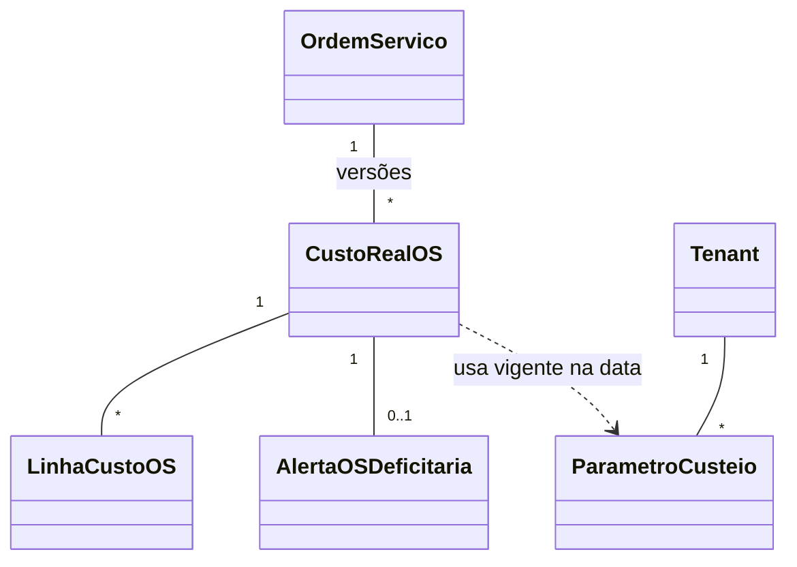

# Modelo de domínio — Módulo Custeio Real

> Entidades específicas. OS, Cliente, Vendedor, Técnico, Serviço, Peça são entidades transversais (`docs/comum/modelo-de-dominio.md`); aqui referenciamos por id.

---

## Entidades

### CustoRealOS
- **Atributos obrigatórios:** `id`, `tenant_id` (`INV-TENANT-001`), `os_id`, `apurado_em`, `versao` (para reapurações), `receita_os`, `custo_total`, `margem_real`, `margem_pct`, `eh_deficitaria` (bool), `linhas_custo` (lista).
- **Atributos opcionais:** `observacao_apuracao`.
- **Invariantes:** apuração atômica (custo real ou completo ou ausente); reapuração cria nova versão (não sobrescreve).
- **Ciclo de vida:** criada quando evento `Operacao.OSEncerrada` chega + todos insumos disponíveis → versionada em correções → nunca deletada.

### LinhaCustoOS
- **Atributos obrigatórios:** `id`, `custo_real_os_id`, `categoria` (`mao_obra`/`deslocamento`/`hospedagem`/`alimentacao`/`pedagio`/`pecas`/`retrabalho`/`garantia`/`comissao`), `valor_previsto`, `valor_realizado`, `variacao_pct`.
- **Atributos opcionais:** `origem_id` (id da entidade fonte: saída de estoque, lançamento caixa técnico, comissão, etc.), `descricao`.
- **Invariantes:** soma de linhas = `custo_total` do CustoRealOS.

### ParametroCusteio
- **Atributos obrigatórios:** `id`, `tenant_id`, `chave` (`hora_base_padrao`, `custo_km_padrao`, `threshold_alerta_pct`, ...), `valor`, `vigente_desde`, `vigente_ate` (null = vigente).
- **Atributos opcionais:** `escopo_tipo` (`global`/`tecnico`/`servico`), `escopo_id`.
- **Invariantes:** parâmetro é versionado; apuração usa parâmetro vigente NA DATA da OS, não atual.

### AlertaOSDeficitaria
- **Atributos:** `id`, `tenant_id`, `custo_real_os_id`, `criado_em`, `status` (`aberto`/`em_revisao`/`tratado`/`ignorado`), `tratado_por`, `tratado_em`, `nota_tratamento`.
- **Invariantes:** um alerta por (CustoRealOS, versão).

### AgregadoMargem
- **Atributos:** `id`, `tenant_id`, `dimensao` (`cliente`/`vendedor`/`tecnico`/`servico`), `dimensao_id`, `periodo_inicio`, `periodo_fim`, `receita`, `custo_total`, `margem`, `margem_pct`, `count_os`, `count_deficitarias`.
- **Invariantes:** recalculado por job; idempotente; nunca fonte primária (sempre derivado de CustoRealOS).
- **Ciclo de vida:** materializado por job noturno + atualizado incrementalmente em novas apurações.

---

## Agregados (DDD)

| Agregado raiz | Entidades incluídas | Invariantes |
|---|---|---|
| CustoRealOS | CustoRealOS + LinhaCustoOS | apuração atômica; versionamento; soma das linhas = total |
| ParametroCusteio | ParametroCusteio (versões) | apuração usa versão vigente na data da OS |
| AlertaOSDeficitaria | Alerta + transições de status | um alerta por versão de apuração |

---

## Value Objects

| VO | Definição | Imutável? |
|---|---|---|
| Dinheiro | `{valor, moeda}` | Sim |
| CategoriaCusto | enum (mao_obra, deslocamento, ...) | Sim |
| StatusAlerta | enum (aberto/em_revisao/tratado/ignorado) | Sim |
| Dimensao | enum (cliente/vendedor/tecnico/servico) | Sim |

---

## Eventos de domínio (publicados)

| Evento | Quando dispara | Payload | Quem consome |
|---|---|---|---|
| `CusteioReal.CustoApurado` | nova apuração concluída | `{tenant_id, os_id, custo_real_os_id, custo_total, margem, eh_deficitaria}` | dashboards, notificações |
| `CusteioReal.AlertaDeficitarioCriado` | margem < threshold | `{tenant_id, alerta_id, os_id, margem_pct}` | notificações (push gestor) |
| `CusteioReal.CustoReapurado` | reapuração (versão nova) | `{tenant_id, os_id, custo_real_os_id, versao_anterior, versao_nova}` | auditoria, dashboards |

---

## Eventos consumidos (entradas)

| Evento | Origem | Ação |
|---|---|---|
| `Operacao.OSEncerrada` | módulo OS | inicia apuração |
| `Operacao.OSReaberta` | módulo OS | marca apuração como obsoleta; aguarda nova execução |
| `Estoque.SaidaPeca` | módulo estoque | linha de custo `pecas` |
| `CaixaTecnico.DespesaAprovada` | caixa técnico | linhas `deslocamento`/`hospedagem`/`alimentacao`/`pedagio` |
| `Comissoes.ComissaoCalculada` | módulo comissões | linha `comissao` |

---

## Comandos (entradas)

| Comando | Origem | Pré-condição | Pós-condição |
|---|---|---|---|
| `apurarCustoOS` | job (consumindo evento) | OS encerrada + insumos prontos | CustoRealOS criado + evento emitido |
| `reapurarCustoOS` | manual ou job (após correção) | OS já apurada + insumo mudou | nova versão de CustoRealOS |
| `tratarAlerta` | UI gestor | alerta aberto | status = tratado, nota registrada |
| `configurarParametro` | UI admin | papel autorizado | nova versão de ParametroCusteio (versionada por data) |

---

## Schema físico

Ver `../schema-banco.md` deste módulo (a criar pós ADR-0001).

## Diagramas

## Como este modelo evolui

- Categoria de custo nova → ADR + atualizar enum + integração com módulo fonte.
- Dimensão de agregação nova → adicionar em `Dimensao` + materializar.
- Mudança em fórmula de margem → ADR + opção de recalcular histórico.
