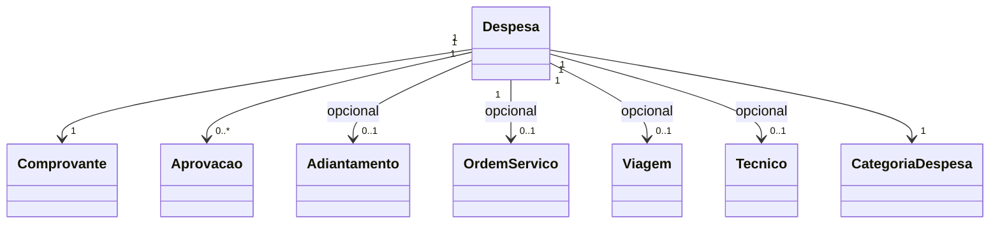

# Modelo de domínio — Módulo Despesas

> Entidades específicas. Transversais em `docs/comum/modelo-de-dominio.md`.

---

## Entidades

### Despesa

- **Atributos obrigatórios:** `id`, `tenant_id`, `colaborador_id`, `data`, `valor`, `categoria_id`, `descricao`, `comprovante_id`, `status`, `criada_em`.
- **Atributos opcionais:** `os_id`, `viagem_id`, `tecnico_id`, `centro_custo_id`, `adiantamento_id`, `aprovador_id`, `decidida_em`, `motivo_rejeicao`.
- **Invariantes:** `INV-MULTI-TENANT-001`, `INV-DSP-001` (sem comprovante não envia para aprovação), `INV-DSP-002` (status segue máquina de estados).
- **Ciclo de vida:** `rascunho` → `pendente_aprovacao` → `aprovada` | `rejeitada` → `reembolsada` (se aprovada e gerou conta a pagar) ou `compensada` (se aprovada e abateu adiantamento).

### Comprovante

- **Atributos obrigatórios:** `id`, `tenant_id`, `arquivo_uri`, `arquivo_hash_sha256`, `tipo` (foto/pdf/xml), `tamanho_bytes`, `enviado_em`.
- **Imutável** após gravação (`INV-WORM-001`).
- **Ciclo de vida:** criado no upload, nunca alterado; soft-delete só após retenção legal (`retencao-matriz.md`).

### CategoriaDespesa

- **Atributos:** `id`, `tenant_id`, `nome`, `codigo`, `eh_campo` (boolean — usado em vínculo OS obrigatório), `ativo`.
- Configurável por tenant; padrão sugerido: combustível, alimentação, hospedagem, peça, terceiros, outros.

### Aprovacao

- **Atributos:** `id`, `tenant_id`, `despesa_id`, `nivel`, `aprovador_id`, `decisao` (aprovada/rejeitada), `motivo`, `decidida_em`.
- N aprovações por despesa quando alçada exige múltiplos níveis.

---

## Agregados (DDD)

| Agregado raiz | Entidades incluídas | Invariantes |
|---|---|---|
| Despesa | Despesa, Aprovacao | `INV-DSP-001`, `INV-DSP-002`, `INV-AUDIT-001` |
| Comprovante | Comprovante | `INV-WORM-001` |

---

## Value Objects

| VO | Definição | Imutável? |
|---|---|---|
| Dinheiro | (valor decimal, moeda) | Sim |
| Periodo | (inicio, fim) | Sim |

---

## Eventos de domínio (publicados)

| Evento | Quando dispara | Payload | Quem consome |
|---|---|---|---|
| `Despesa.Criada` | Despesa enviada para aprovação | `{despesa_id, tenant_id, valor, colaborador_id}` | Notificações, Auditoria |
| `Despesa.Aprovada` | Última aprovação concluída | `{despesa_id, tenant_id, valor, adiantamento_id?}` | `contas-pagar/`, `caixa-tecnico/`, `relatorios-financeiros/` |
| `Despesa.Rejeitada` | Aprovador rejeita com motivo | `{despesa_id, tenant_id, motivo}` | Notificações |
| `Despesa.Reembolsada` | `contas-pagar/` liquida o reembolso | `{despesa_id, tenant_id, pagamento_id}` | `relatorios-financeiros/` |
| `Despesa.Compensada` | Saldo do adiantamento abatido | `{despesa_id, tenant_id, adiantamento_id, valor}` | `caixa-tecnico/`, `relatorios-financeiros/` |

---

## Comandos

| Comando | Origem | Pré-condição | Pós-condição |
|---|---|---|---|
| `criarDespesa` | UI / app mobile | comprovante anexado, categoria válida | Despesa em `pendente_aprovacao` |
| `aprovarDespesa` | UI gestor | aprovador dentro da alçada | Aprovação registrada; despesa muda de estado |
| `rejeitarDespesa` | UI gestor | motivo obrigatório | Status `rejeitada` |
| `gerarReembolso` | UI financeiro | despesa aprovada sem adiantamento | Cria conta a pagar |
| `compensarComAdiantamento` | UI financeiro / regra automática | adiantamento existe e tem saldo | Abate saldo no caixa do técnico |

---

## Schema físico

Tabelas sugeridas (Postgres): `despesas`, `comprovantes`, `categorias_despesa`, `aprovacoes_despesa`. RLS por `tenant_id` (ADR-0002).

## Diagrama

## Como este modelo evolui

- Entidade nova → verificar fronteira em `governanca-modelo-comum.md`.
- Atributo novo → migration + bump CHANGELOG.
- Entidade descontinuada → ADR + janela de migração.
