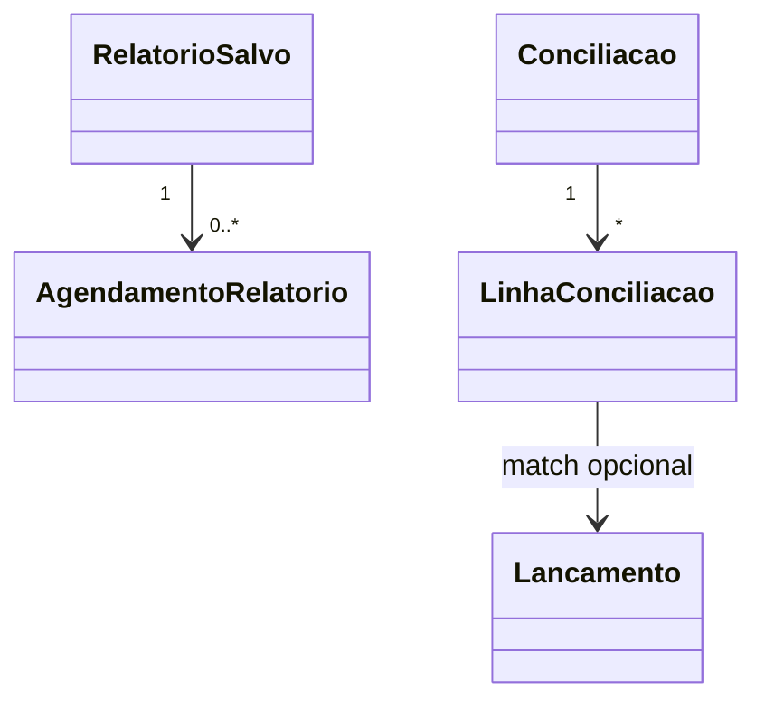

# Modelo de domínio — Módulo Relatórios Financeiros

> Este módulo é **majoritariamente read-model** (CQRS lado de leitura). Não possui entidades de negócio novas — possui visões agregadas, configurações de relatório e artefatos de conciliação.

---

## Entidades

### RelatorioSalvo

- **Atributos obrigatórios:** `id`, `tenant_id`, `usuario_id`, `tipo` (dre|fluxo_realizado|fluxo_projetado|aging|cc|receitas|despesas|resultado_dimensao|conciliacao), `filtros_json`, `criado_em`.
- **Atributos opcionais:** `nome`, `compartilhado_com` (lista de papéis), `agendamento_cron`.
- **Invariantes:** `INV-MULTI-TENANT-001`.
- **Ciclo de vida:** criado quando usuário "salva esta visão"; mutável até deletado pelo dono.

### Conciliacao

- **Atributos obrigatórios:** `id`, `tenant_id`, `conta_bancaria_id`, `arquivo_origem_uri`, `arquivo_hash`, `periodo_inicio`, `periodo_fim`, `status` (em_andamento|conciliada|com_divergencias), `criada_em`.
- **Invariantes:** `INV-WORM-001` no arquivo de origem.

### LinhaConciliacao

- **Atributos:** `id`, `tenant_id`, `conciliacao_id`, `data`, `valor`, `descricao_banco`, `status` (conciliada|divergente|nao_encontrada), `lancamento_id_match`, `confirmada_por`, `confirmada_em`.
- N por `Conciliacao`.

### AgendamentoRelatorio

- **Atributos:** `id`, `tenant_id`, `relatorio_salvo_id`, `cron_expr`, `destinatarios_emails`, `formato` (pdf|xlsx|csv), `proximo_disparo`.

---

## Read models / views agregadas (não-entidades — pré-cálculo)

> Não são entidades de domínio (sem invariante de negócio); são objetos de banco para performance.

| View | Origem | Granularidade | Refresh |
|---|---|---|---|
| `vw_dre_mensal` | `contas-receber`, `contas-pagar`, `despesas`, `custeio-real` | tenant × mês × categoria | incremental por evento + nightly full |
| `vw_fluxo_realizado_dia` | liquidações de `contas-receber`/`contas-pagar`/`despesas` | tenant × dia | streaming |
| `vw_fluxo_projetado` | títulos em aberto + recorrências `billing-saas` | tenant × dia futuro | sob demanda + cache 1 h |
| `vw_aging_receber` | `contas-receber` em aberto | tenant × faixa | sob demanda |
| `vw_aging_pagar` | `contas-pagar` + `despesas` em aberto | tenant × faixa | sob demanda |
| `vw_centro_custo` | `despesas` + `custeio-real` | tenant × centro × mês | nightly |
| `vw_resultado_dimensao` | receita - `custeio-real` por dimensão | tenant × (cliente\|tecnico\|vendedor\|servico) | nightly |

---

## Agregados (DDD)

| Agregado raiz | Entidades incluídas | Invariantes |
|---|---|---|
| Conciliacao | Conciliacao, LinhaConciliacao | `INV-RFN-002` (linha conciliada não muda sem nova entrada de auditoria), `INV-WORM-001` |
| RelatorioSalvo | RelatorioSalvo, AgendamentoRelatorio | `INV-MULTI-TENANT-001` |

---

## Value Objects

| VO | Definição | Imutável? |
|---|---|---|
| FaixaAging | (limite_inferior, limite_superior, rotulo) | Sim |
| Periodo | (inicio, fim) | Sim |
| Dinheiro | (valor, moeda) | Sim |

---

## Eventos de domínio (consumidos)

> Este módulo praticamente **só consome**. Não publica eventos de negócio — publica apenas operacionais.

| Evento | Origem | Uso |
|---|---|---|
| `Receber.Lancado` / `Receber.Liquidado` / `Receber.Cancelado` | `contas-receber/` | atualiza views |
| `Pagar.Lancado` / `Pagar.Liquidado` / `Pagar.Cancelado` | `contas-pagar/` | atualiza views |
| `Despesa.Aprovada` / `Despesa.Reembolsada` / `Despesa.Compensada` | `despesas/` | atualiza views |
| `Comissao.Apurada` | `comissoes/` | resultado por vendedor/técnico |
| `CustoReal.Atualizado` | `custeio-real/` | base de lucro bruto |
| `Assinatura.Recorrencia.Faturada` | `billing-saas/` | projeção |

## Eventos publicados

| Evento | Quando dispara | Payload | Consumido por |
|---|---|---|---|
| `Conciliacao.Concluida` | usuário/sistema fecha conciliação | `{conciliacao_id, divergencias_count}` | Auditoria, Notificações |
| `RelatorioAgendado.Disparado` | cron executa | `{relatorio_id, formato, destinatarios}` | Notificações |

---

## Comandos

| Comando | Origem | Pré-condição | Pós-condição |
|---|---|---|---|
| `salvarVisaoRelatorio` | UI | filtros válidos | `RelatorioSalvo` criado |
| `agendarRelatorio` | UI | relatório salvo + cron válido | `AgendamentoRelatorio` criado |
| `importarExtratoBancario` | UI | conta bancária existe + arquivo válido | `Conciliacao` em `em_andamento` |
| `confirmarLinhaConciliacao` | UI | linha em `divergente`/`nao_encontrada` | linha vira `conciliada` com matching manual |

---

## Schema físico

Tabelas Postgres: `relatorios_salvos`, `agendamentos_relatorio`, `conciliacoes`, `linhas_conciliacao`. Materialized views nomeadas `vw_*` (sufixo `_mat` quando materialized). RLS por `tenant_id` (ADR-0002).

## Diagrama

## Como este modelo evolui

- View nova → migration + bump CHANGELOG + plano de refresh.
- Mudança em view → ADR se afetar drill-down (pode quebrar `INV-RFN-001`).
- Entidade nova → verificar fronteira em `governanca-modelo-comum.md`.
