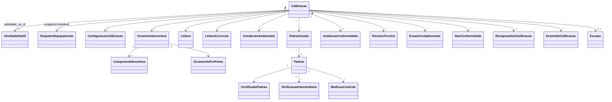

# Modelo de domínio — Calibração

> Entidades específicas. Transversais (Tenant, Usuario, Cliente, Instrumento, Anexo) ficam em `docs/comum/modelo-de-dominio.md`. Entidades de emissão (Certificado, Assinatura, Template, Etiqueta) em `../certificados/modelo-de-dominio.md`.
>
> **Revisado em 2026-05-23 (auditoria 10 lentes — TEMA-A.4, B.1, B.2, B.3, C.1, C.5, C.12, E.3, E.4, E.5, E.6, E.7):**
> - `Calibracao.ordem_servico_id` → `Calibracao.atividade_os_id` (FK tipada em `AtividadeDaOS`, não em OS). Decorre da ADR-0023.
> - `Calibracao.snapshot_equipamento_json` adicionado (cl. 7.4 + TEMA-E.4 — equipamento muda de cliente mid-calibração ⇒ certificado com dados errados sem snapshot).
> - `PadraoUsado.snapshot_capturado_at` adicionado + lock pós-revisão (TEMA-B.1 — snapshot retroativo bloqueado — INV-CAL-RT-COMP-001).
> - Nova entidade `NaoConformidade` com ciclo CAPA fechado (TEMA-B.2).
> - Nova entidade `LeituraCorrecao` (cl. 7.5 rasura digital — TEMA-B.3).
> - Nova entidade `RecepcaoItemCalibracao` (cl. 7.4 — TEMA-B.4).
> - Nova entidade `EventoDeCalibracao` (audit WORM paralelo ao `EventoDeOS` — TEMA-C.5).
> - `OrcamentoIncerteza.componentes_json` → relação 1:N `ComponenteIncerteza` + 1:N `OrcamentoPorPonto` (TEMA-B.5 — NIT-DICLA-030 rev. 15 item 7).
> - Nova entidade `MedicaoControle` (cl. 7.7.1 — TEMA-B.6).
> - Todos os eventos carregam `correlation_id`/`causation_id` e IDs PII em `*_hash` (TEMA-E.5+C.12).
> - Eventos payloads expandidos com `atividade_os_id` + `os_id` (TEMA-E.7).
> - Comandos `trocarRevisorOuConferente`, `marcarNaoConformidade`, `resolverNaoConformidade` adicionados.

---

## Entidades

### Calibracao (raiz de agregado)

- **Atributos obrigatórios:** `id`, `tenant_id`, `numero_interno`, **`atividade_os_id`** (FK `AtividadeDaOS`, nullable — recepção avulsa permitida), `cliente_id`, `instrumento_id` (FK Equipamento), **`snapshot_equipamento_json`** (jsonb imutável capturado em `recepcionarInstrumento` — TEMA-E.4 + cl. 7.4: nome, tag, NS, fabricante, modelo, `perfil_tenant_snapshot`), `tipo_acreditacao` (RBC, NAO_RBC), `escopo_id` (FK Escopo, nullable se NAO_RBC), `configuracao_id` (FK), `status` (RECEPCIONADA, CONFIGURADA, EM_EXECUCAO, EM_REVISAO_1, AGUARDANDO_2A_CONFERENCIA, APROVADA, REJEITADA, CANCELADA, **NAO_CONFORME**, **PENDENTE_RESOLUCAO_NC**), `executor_id` (FK Usuario), `revisor_id` (FK Usuario, nullable), `conferente_id` (FK Usuario, nullable), `decisao` (APROVADO, REPROVADO, CONDICIONAL, NA), `versao_motor_calculo`, `correlation_id`, `criado_em`.
- **Atributos opcionais:** `observacoes_gerais` (validado anti-PII via INV-CAL-TXT-001, ≤500 chars), `condicoes_ambientais_id` (FK), `motivo_cancelamento_hash` (HMAC tenant).
- **Invariantes:** `INV-002` (CMC), `INV-003` (rastreabilidade), `INV-CAL-VERSAO-001` (versão motor), `INV-CAL-CONF-001` (2ª conferência — promovida 2026-05-23 onda 7A), `INV-CAL-RT-001` (RT habilitado por grandeza), `INV-CAL-RT-COMP-001` (snapshot retroativo bloqueado), `INV-CAL-WORM-001` (WORM), `INV-CAL-TXT-001`, `INV-CAL-AUD-001`, `INV-TENANT-001`, `INV-OS-ATIV-002` (herança tenant via `atividade_os_id`).
- **Ciclo de vida:** estados imutáveis após APROVADA; reprocessar = nova Calibracao com `causation_id` apontando pra anterior.

### ConfiguracaoCalibracao

- **Atributos obrigatórios:** `id`, `tenant_id`, `calibracao_id`, `grandeza`, `faixa_min`, `faixa_max`, `unidade`, `metodo` (referência a norma/NIT-DICLA), `pontos_calibracao` (array de valores), `repeticoes_por_ponto`, `regra_decisao` (ACEITACAO_SIMPLES, BANDA_GUARDA_30, RISCO_COMPARTILHADO — Wave A pode ter override por cliente sob ADR-0024 TEMA-F.1).
- **Invariantes:** pontos dentro da faixa; INV-002 (CMC se RBC).

### PadraoUsado

- **Atributos obrigatórios:** `id`, `tenant_id`, `calibracao_id`, `padrao_id` (FK Padrao), `snapshot_padrao_json` (jsonb imutável: cert externo, validade, classe, valor convencional), **`snapshot_capturado_at`** (timestamp UTC — momento em que snapshot foi tirado), **`snapshot_lock`** (boolean — true quando `calibracao.status >= EM_REVISAO_1`).
- **Invariantes:** **INV-CAL-RT-COMP-001** (snapshot só pode ser feito enquanto `calibracao.status IN (RECEPCIONADA, CONFIGURADA)`; após `EM_REVISAO_1` snapshot lock=true e qualquer tentativa de INSERT em PadraoUsado é bloqueada — TEMA-B.1); INV-003.

### Leitura (cl. 7.5 — imutável)

- **Atributos obrigatórios:** `id`, `tenant_id`, `calibracao_id`, `ponto_calibracao`, `numero_repeticao`, `valor_lido`, `unidade`, `origem` (MANUAL, INTEGRACAO_SERIAL, INTEGRACAO_USB), `timestamp`, `executor_id_hash` (HMAC tenant — TEMA-C.12).
- **Invariantes:** imutável após criação (INV-CAL-WORM-001). Correções pré-aprovação via `LeituraCorrecao` (TEMA-B.3 — rasura digital).

### LeituraCorrecao (cl. 7.5 — rasura digital — NOVO)

> Adicionado em 2026-05-23 — TEMA-B.3 da auditoria. Cl. 7.5 ISO 17025 exige que correções de registro técnico sejam rastreáveis: valor original preservado + valor corrigido + razão + corretor.

- **Atributos obrigatórios:** `id`, `tenant_id`, `leitura_id` (FK), `valor_original` (preservado — não muta a leitura original), `valor_corrigido`, `razao_correcao` (≥30 chars, anti-PII via INV-CAL-TXT-001), `corretor_id_hash` (HMAC tenant), `corrigido_em` (timestamp UTC), `correlation_id`.
- **Invariantes:** imutável após INSERT; apenas `calibracao.status IN (CONFIGURADA, EM_EXECUCAO)` permite correção — após `EM_REVISAO_1` correção exige reabertura formal da calibração (CAPA).

### CondicoesAmbientais

- **Atributos obrigatórios:** `id`, `tenant_id`, `calibracao_id`, `temperatura_c`, `umidade_relativa`, `pressao_hpa`, `medido_em`.
- **Invariantes:** imutável.

### OrcamentoIncerteza (TEMA-B.5 — orçamento ponto-a-ponto)

> Revisado em 2026-05-23 — `componentes_json` blob substituído por relação 1:N. NIT-DICLA-030 rev. 15 item 7 exige orçamento por ponto quando incerteza varia ao longo da faixa.

- **Atributos obrigatórios:** `id`, `tenant_id`, `calibracao_id`, `u_combinada` (consolidada — para retrocompatibilidade quando incerteza é constante na faixa), `grau_liberdade_efetivo`, `k`, `U_expandida`, `nivel_confianca`, `versao_motor_calculo`, `calculado_em`, `correlation_id`.
- **Relação 1:N com `ComponenteIncerteza`** (substitui `componentes_json` JSONB).
- **Relação 1:N com `OrcamentoPorPonto`** (incerteza por ponto de calibração).
- **Invariantes:** `INV-004` (GUM), `INV-CAL-VERSAO-001` (versão motor registrada).

### ComponenteIncerteza (NOVO — TEMA-B.5)

- **Atributos obrigatórios:** `id`, `tenant_id`, `orcamento_id` (FK), `nome`, `tipo` (A ou B), `distribuicao` (NORMAL, RETANGULAR, TRIANGULAR, ...), `divisor`, `contribuicao`, `grau_liberdade`, `correlacao_matriz_indice` (nullable — link pra matriz de covariância opcional).

### OrcamentoPorPonto (NOVO — TEMA-B.5)

- **Atributos obrigatórios:** `id`, `tenant_id`, `orcamento_id` (FK), `ponto_calibracao`, `u_combinada_ponto`, `U_expandida_ponto`, `k_ponto`, `grau_liberdade_efetivo_ponto`.
- **Invariantes:** `INV-004` por ponto.

### AvaliacaoConformidade

- **Atributos obrigatórios:** `id`, `tenant_id`, `calibracao_id`, `especificacao_cliente`, `regra_decisao`, `resultado` (CONFORME, NAO_CONFORME, ZONA_INCERTEZA), `decisao_manual_se_zona` (≤500 chars, anti-PII via INV-CAL-TXT-001), `decidido_por_hash` (HMAC tenant), `decidido_em`.
- **Invariantes:** `INV-CAL-DEC-001` (regra decisão ISO 7.8.6 + ADR-0024).

### RevisaoTecnica

- **Atributos obrigatórios:** `id`, `tenant_id`, `calibracao_id`, `etapa` (REVISAO_1, CONFERENCIA_2), `revisor_id_hash` (HMAC tenant em payload publicado; UUID interno preservado), `resultado` (APROVADO, REJEITADO, SOLICITA_CORRECAO), `nota` (≤500 chars, anti-PII via INV-CAL-TXT-001), `revisado_em`, `correlation_id`.
- **Invariantes:** `INV-CAL-CONF-001`, `INV-CAL-RT-001`, INV-CAL-WORM-001, INV-CER-COMP-001 (vigência RT na data de execução — não da revisão). Etapa CONFERENCIA_2 só após REVISAO_1 APROVADA.

### NaoConformidade (ciclo CAPA fechado — NOVO TEMA-B.2)

> Adicionado em 2026-05-23 — INV-012 só bloqueava emissão; faltava ciclo CAPA cl. 7.10 + 8.7 que CGCRE exige em toda supervisão.

- **Atributos obrigatórios:** `id`, `tenant_id`, `calibracao_id`, `atividade_os_id` (FK — pode ser disparada por `Atividade.NaoConforme`), `status` (CONTIDA, ACAO_CORRETIVA_DEFINIDA, ACAO_EXECUTADA, EFICACIA_VERIFICADA, FECHADA, REABERTA), `descricao` (≥30 chars, anti-PII), `causa_raiz` (≥30 chars, anti-PII — preenchida no estado ACAO_CORRETIVA_DEFINIDA), `acao_corretiva` (≥30 chars, anti-PII), `prazo_acao`, `responsavel_acao_id_hash`, `eficacia_verificada_por_id_hash`, `eficacia_verificada_em`, `eficacia_resultado` (EFICAZ, INEFICAZ — se INEFICAZ vira REABERTA), `correlation_id`, `criada_em`.
- **Invariantes:** ciclo de estados FECHADO (não pode pular etapas); só FECHADA libera certificado (INV-012 estendido); REABERTA permite nova ação corretiva.
- **Eventos:** `NaoConformidade.Aberta`, `NaoConformidade.CausaRaizDefinida`, `NaoConformidade.AcaoExecutada`, `NaoConformidade.Fechada`, `NaoConformidade.Reaberta`.

### RecepcaoItemCalibracao (cl. 7.4 — NOVO TEMA-B.4)

> Adicionado em 2026-05-23 — Marco 2 cobriu equipamento mas não recepção do item *do cliente* para calibração com avaliação de aptidão.

- **Atributos obrigatórios:** `id`, `tenant_id`, `calibracao_id`, `condicao_recebida` (NORMAL, COM_AVARIA, INADEQUADO_PARA_CALIBRACAO), `fotos_anexo_ids` (array — EXIF strip obrigatório via INV-OS-GEO-001 + INV-EQP-ANOM-001 padrão), `aptidao` (APTO, INAPTO, CONDICIONAL), `motivo_inaptidao_hash` (HMAC tenant — quando INAPTO), `decisao_cliente_se_inapto` (PROSSEGUE_COM_RESSALVA, RECUSA, DEVOLVE), `aceite_cliente_id` (FK `AceiteAtividade` quando exige confirmação cliente), `recepcionado_por_id_hash`, `recepcionado_em`, `correlation_id`.
- **Invariantes:** INV-EQP-ANOM-001/002 (texto anti-PII), Lei 14.063 (aceite cliente versionado quando inapto).

### EventoDeCalibracao (audit WORM — NOVO TEMA-C.5)

> Adicionado em 2026-05-23 — paralelo ao `EventoDeOS`. Sem entidade WORM dedicada, "quem aprovou em DD/MM" dependia de log Axiom volátil = assimetria forense crítica vs OS.

- **Atributos obrigatórios:** `id`, `tenant_id`, `calibracao_id`, `evento_tipo`, `payload` (jsonb sanitizado por `sanitizar_payload_evento_calibracao()` — INV-CAL-AUD-001), `at`, `ator_id_hash` (HMAC tenant), `ip_hash` (HMAC tenant), `correlation_id`, `causation_id`.
- **Append-only:** trigger PG bloqueia UPDATE/DELETE; tabela `# audit-immutability` declarada.
- **Sanitização na escrita:** payload passa por sanitização ANTES do INSERT — proíbe `cliente_id`/`executor_id`/`revisor_id`/`conferente_id` UUID cru; `instrumento` cru (só `numero_serie_hash` + `fabricante` + `modelo`); textos livres anti-PII.
- **Retenção:** 25 anos (RAT-08 + matriz retenção — vinculado a certificado ou calibração).
- **Invariantes:** RAT-08, INV-001, INV-AUTHZ-002, INV-CAL-AUD-001, ISO 17025 cl. 7.5.

### MedicaoControle (cl. 7.7.1 gráfico de controle — NOVO TEMA-B.6)

> Adicionado em 2026-05-23 — falta ferramenta interna de gráfico de controle (X-R/CUSUM) sobre padrão de referência ao longo do tempo.

- **Atributos obrigatórios:** `id`, `tenant_id`, `padrao_id`, `valor_medido`, `desvio_observado`, `limite_warn_2sigma`, `limite_fail_3sigma`, `status` (NORMAL, WARN, FAIL), `medido_em`, `executor_id_hash`.
- **Alerta automático:** WARN (|desvio| ≥ 2σ) notifica RT; FAIL (|desvio| ≥ 3σ) abre `NaoConformidade` automaticamente + bloqueia uso do padrão.

### Padrao

- **Atributos obrigatórios:** `id`, `tenant_id`, `descricao`, `tipo` (PESO, BALANCA, TERMOMETRO, MICROMETRO — sem acento em enum, fix B-2 LLM-correctness), `fabricante`, `modelo`, `numero_serie`, `valor_nominal`, `unidade`, `classe` (E1, E2, F1, F2, M1, M2, M3 — quando aplicável), `localizacao_fisica` (≤200 chars, anti-PII via INV-EQP-LOC-001 estendido — MÉDIO-1 LGPD), `status` (DISPONIVEL, EM_CALIBRACAO_EXTERNA, INDISPONIVEL_VENCIDO, INDISPONIVEL_NC).
- **Invariantes:** `INV-CAL-RAST-001` (rastreabilidade padrão), INV-TENANT-001, INV-EQP-LOC-001 (estendido a Padrao).

### CertificadoPadrao

- **Atributos obrigatórios:** `id`, `tenant_id`, `padrao_id`, `numero_externo`, `lab_emissor`, `data_emissao`, `data_validade`, `valor_convencional`, `incerteza`, `anexo_pdf_id`.
- **Invariantes:** vigência respeitada (INV-CAL-RAST-001).

### VerificacaoIntermediaria

- **Atributos obrigatórios:** `id`, `tenant_id`, `padrao_id`, `data_prevista`, `data_executada`, `resultado` (≤500 chars, anti-PII via INV-CAL-TXT-001), `desvio_observado`, `criterio_aceitacao`, `status_apos` (APROVADO, REPROVADO), `executado_por_id_hash`.
- **Invariantes:** `INV-CAL-VI-001` (verificação intermediária periódica — renomeado de INV-009 que conflita com MFA CDE).

### EnsaioComplementar

- **Atributos obrigatórios:** `id`, `tenant_id`, `calibracao_id`, `tipo` (LINEARIDADE, REPETIBILIDADE, EXCENTRICIDADE), `dados_json`, `resultado_calculado_json`.

### ParticipacaoProficiencia

- **Atributos obrigatórios:** `id`, `tenant_id`, `provedor`, `rodada`, `grandeza`, `faixa`, `data_participacao`, `escore_z`, `status` (PENDENTE, PASSED, QUESTIONABLE, UNACCEPTABLE), `relatorio_anexo_id`.
- **Invariantes:** `INV-CAL-WORM-001`. ISO 17025 7.7.2.

### Escopo

- **Atributos obrigatórios:** `id`, `tenant_id`, `documento_regulatorio_id` (FK Licencas), `versao`, `grandeza`, `faixa_min`, `faixa_max`, `unidade`, `cmc`, `metodo`, `vigente_a_partir`.
- **Invariantes:** `INV-002`. Vinculado à acreditação (módulo Licenças).

---

## RLS e isolamento multi-tenant (INV-TENANT-003 + INV-AUTHZ-003)

> Adicionado em 2026-05-23 — TEMA-C.1 da auditoria 10 lentes. Todas as tabelas com `tenant_id` carregam policy RLS na MESMA migration (hook `migration-rls-check.sh` valida).

Policy padrão para todas as 17 tabelas (`calibracao`, `configuracao_calibracao`, `padrao_usado`, `leitura`, `leitura_correcao`, `condicoes_ambientais`, `orcamento_incerteza`, `componente_incerteza`, `orcamento_por_ponto`, `avaliacao_conformidade`, `revisao_tecnica`, `nao_conformidade`, `recepcao_item_calibracao`, `evento_de_calibracao`, `medicao_controle`, `padrao`, `certificado_padrao`, `verificacao_intermediaria`, `ensaio_complementar`, `participacao_proficiencia`, `escopo`):

```
USING (tenant_id::text = ANY(string_to_array(current_setting('app.tenant_ids'), ',')))
```

- Role `app_user`: `NOBYPASSRLS` + `NOSUPERUSER` (INV-TENANT-004 preservado).
- `evento_de_calibracao` e `leitura` ganham trigger PG BLOCK UPDATE/DELETE (append-only).
- `nao_conformidade` permite UPDATE apenas pra transição de estado válida (`status` → próximo no ciclo CAPA); demais campos imutáveis pós-INSERT.
- `padrao_usado.snapshot_padrao_json` imutável após `calibracao.status >= EM_REVISAO_1` (INV-CAL-RT-COMP-001 — trigger PG `padrao_usado_snapshot_lock_trg`).

---

## Agregados (DDD)

| Agregado raiz | Entidades incluídas | Invariantes |
|---|---|---|
| Calibracao | ConfiguracaoCalibracao, PadraoUsado[], Leitura[], LeituraCorrecao[], CondicoesAmbientais, OrcamentoIncerteza, ComponenteIncerteza[], OrcamentoPorPonto[], AvaliacaoConformidade, RevisaoTecnica[], EnsaioComplementar[], NaoConformidade[], RecepcaoItemCalibracao, EventoDeCalibracao[] | INV-002..007, 019, 022, TENANT-001, CAL-TXT-001, CAL-AUD-001, CAL-RT-COMP-001 |
| Padrao | CertificadoPadrao[], VerificacaoIntermediaria[], MedicaoControle[] | INV-CAL-RAST-001, INV-CAL-VI-001, INV-CAL-WORM-001 |
| ParticipacaoProficiencia | — | INV-CAL-WORM-001 |
| Escopo | — | INV-002 |

---

## Value Objects

| VO | Definição | Imutável? |
|---|---|---|
| IntervaloFaixa | min + max + unidade | Sim |
| Incerteza | u_combinada + k + U_expandida + nivel_confianca | Sim |
| ResultadoMedicao | valor + incerteza + unidade | Sim |
| SnapshotEquipamento | jsonb {nome, tag, ns, fabricante, modelo, perfil_tenant_snapshot} capturado em recepção | Sim |

---

## Eventos de domínio (publicados — v10 catálogo)

Todos os eventos carregam `correlation_id` (herdado de `AtividadeDaOS` ou raiz própria em recepção avulsa) + `causation_id` + IDs PII em `*_hash` HMAC-tenant.

| Evento | Quando dispara | Payload (campos chave) | Quem consome |
|---|---|---|---|
| `Calibracao.Recepcionada` | Status → RECEPCIONADA | `{tenant_id, calibracao_id, atividade_os_id?, os_id?, instrumento: {numero_serie_hash, fabricante, modelo}, cliente_id_hash, correlation_id, causation_id}` | Notificacao, CRM (timeline cliente) |
| `Calibracao.Configurada` | Status → CONFIGURADA | `{tenant_id, calibracao_id, grandeza, faixa, correlation_id}` | — |
| `Calibracao.LeiturasFinalizadas` | Última leitura registrada | `{tenant_id, calibracao_id, correlation_id}` | Cálculo (worker incerteza) |
| `Calibracao.IncertezaCalculada` | Orçamento concluído | `{tenant_id, calibracao_id, U_expandida, k, correlation_id}` | Revisao |
| `Calibracao.RevisadaPrimeira` | RevisaoTecnica REVISAO_1 APROVADO | `{tenant_id, calibracao_id, revisor_id_hash, correlation_id}` | Conferencia2 |
| `Calibracao.SegundaConferenciaAprovada` | CONFERENCIA_2 APROVADO | `{tenant_id, calibracao_id, conferente_id_hash, correlation_id}` | Certificados |
| `Calibracao.Aprovada` | Status final | `{tenant_id, calibracao_id, atividade_os_id, os_id, decisao, correlation_id}` | Certificados, Cliente (notificação), Auditoria |
| `Calibracao.Rejeitada` | Status REJEITADA | `{tenant_id, calibracao_id, motivo_hash, correlation_id}` | OS (consumer `Atividade.NaoConforme`), NaoConformidade |
| `NaoConformidade.Aberta` (NOVO) | NC criada | `{tenant_id, calibracao_id, nc_id, descricao_hash, correlation_id}` | Qualidade (CAPA), CRM, Certificados (bloqueia emissão) |
| `NaoConformidade.CausaRaizDefinida` (NOVO) | status → ACAO_CORRETIVA_DEFINIDA | `{tenant_id, nc_id, causa_raiz_hash, correlation_id}` | Qualidade |
| `NaoConformidade.AcaoExecutada` (NOVO) | status → ACAO_EXECUTADA | `{tenant_id, nc_id, acao_corretiva_hash, responsavel_id_hash, correlation_id}` | Qualidade |
| `NaoConformidade.Fechada` (NOVO) | status → FECHADA | `{tenant_id, nc_id, eficacia_verificada_por_id_hash, eficacia_resultado, correlation_id}` | Certificados (libera emissão), OS (consumer `Atividade.NCResolvida`), Qualidade |
| `NaoConformidade.Reaberta` (NOVO) | status FECHADA → REABERTA (eficácia INEFICAZ) | `{tenant_id, nc_id, motivo_hash, correlation_id}` | Qualidade, Certificados (re-bloqueia) |
| `Padroes.CertificadoVencendo` | Cert externo a 30 dias do vencimento | `{tenant_id, padrao_id, data_validade, correlation_id}` | RT, Qualidade |
| `Padroes.VerificacaoIntermediariaReprovada` | VI reprovada | `{tenant_id, padrao_id, desvio_observado, correlation_id}` | RT, Qualidade, NaoConformidade (auto-abre) |
| `Padroes.MedicaoControleAlertaWARN` (NOVO) | |desvio| ≥ 2σ | `{tenant_id, padrao_id, desvio, correlation_id}` | RT |
| `Padroes.MedicaoControleAlertaFAIL` (NOVO) | |desvio| ≥ 3σ | `{tenant_id, padrao_id, desvio, correlation_id}` | RT, NaoConformidade (auto-abre), bloqueia padrão |
| `Proficiencia.EscoreInsatisfatorio` | |z|≥3 | `{tenant_id, participacao_id, escore_z, correlation_id}` | RT, Qualidade, NaoConformidade |

**Eventos consumidos:**

- `Atividade.Iniciada` (filter `tipo=calibracao`) — gatilho de `recepcionarInstrumento` automático quando atividade vem de OS.
- `Colaborador.Desligado` — INV-INT-002: invalida sessão do RT + bloqueia emissões pendentes do signatário.
- `Equipamento.Transferido` — TEMA-E.4: atualiza `cliente_id` em calibrações futuras MAS não invalida calibrações em andamento (snapshot_equipamento_json preserva).

---

## Comandos (entradas)

| Comando | Origem | Pré-condição | Pós-condição |
|---|---|---|---|
| `recepcionarInstrumento` | UI recepção (P-OP-03) OU consumer `Atividade.Iniciada` | Atividade de OS tipo=calibracao OU recepção avulsa; equipamento existe | Calibracao RECEPCIONADA + `snapshot_equipamento_json` capturado + `RecepcaoItemCalibracao` criada + evento `Calibracao.Recepcionada` |
| `configurarCalibracao` | UI metrologista | CMC se RBC | Status CONFIGURADA |
| `registrarLeitura` | UI ou integração | Status EM_EXECUCAO ou CONFIGURADA | Leitura persistida |
| `corrigirLeitura` (NOVO) | UI metrologista | Status IN (CONFIGURADA, EM_EXECUCAO) + razão_correcao ≥30 anti-PII | LeituraCorrecao criada (não muta Leitura original — rasura digital) |
| `calcularIncerteza` | Automático ou manual | Leituras + padrões + condições | OrcamentoIncerteza + ComponenteIncerteza[] + OrcamentoPorPonto[] |
| `avaliarConformidade` | Automático | Incerteza calculada + especificação | AvaliacaoConformidade |
| `executarRevisao1` | UI RT | Status pronto pra revisão | RevisaoTecnica REVISAO_1 |
| `executar2aConferencia` | UI RT | REVISAO_1 APROVADO + INV-CER-COMP-001 valida (competência RT na data executada_em) | RevisaoTecnica CONFERENCIA_2 + Calibracao APROVADA |
| `trocarRevisorOuConferente` (NOVO — TEMA-D.5) | UI admin | Status IN (EM_REVISAO_1, AGUARDANDO_2A_CONFERENCIA) + motivo_obrigatorio + novo RT com competência | RT atualizado + evento `RTSubstituido` |
| `marcarNaoConformidade` (NOVO — TEMA-B.2) | UI RT/metrologista | Status IN (EM_EXECUCAO, EM_REVISAO_1) + descricao ≥30 anti-PII | NaoConformidade aberta (status CONTIDA) + evento `NaoConformidade.Aberta` |
| `definirCausaRaiz` (NOVO) | UI Qualidade | NC em CONTIDA + causa_raiz ≥30 anti-PII | NC vira ACAO_CORRETIVA_DEFINIDA |
| `executarAcaoCorretiva` (NOVO) | UI Qualidade | NC em ACAO_CORRETIVA_DEFINIDA | NC vira ACAO_EXECUTADA |
| `verificarEficacia` (NOVO) | UI RT | NC em ACAO_EXECUTADA | NC vira FECHADA (EFICAZ) ou REABERTA (INEFICAZ) |
| `cancelarCalibracao` | UI admin | Motivo (≥30 anti-PII) | Status CANCELADA |
| `cadastrarPadrao` | UI RT | RBAC | Padrao DISPONIVEL |
| `registrarCalibracaoExternaPadrao` | UI RT | Padrão existe | CertificadoPadrao + Padrao DISPONIVEL com nova validade |
| `executarVerificacaoIntermediaria` | UI RT | Padrão + critério | VerificacaoIntermediaria |
| `registrarMedicaoControle` (NOVO — TEMA-B.6) | UI RT ou job automático | Padrão DISPONIVEL | MedicaoControle persistida + alerta WARN/FAIL se aplicável |
| `cadastrarEscopo` | UI admin | Acreditação vinculada (módulo Licenças) | Escopo vigente |

---

## Schema físico

Ver `../schema-banco.md` quando consolidar (ainda a criar — TEMA-MED-5 drift-docs). Entidades comuns em `../../../comum/schema-banco.md`.

## Diagramas



## Como este modelo evolui

- Entidade nova → fronteira em `governanca-modelo-comum.md`.
- Atributo novo → migration + CHANGELOG + RLS policy na MESMA migration (INV-TENANT-003).
- Deprecada → ADR + janela.
