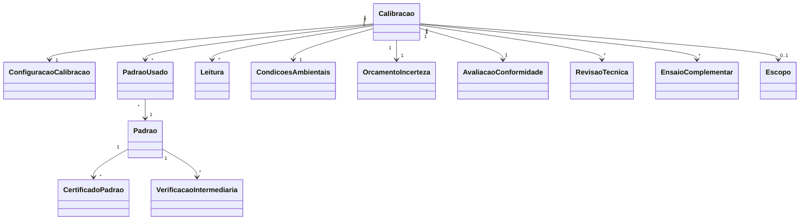

# Modelo de domínio — Calibração

> Entidades específicas. Transversais (Tenant, Usuario, Cliente, Instrumento, Anexo) ficam em `docs/comum/modelo-de-dominio.md`. Entidades de emissão (Certificado, Assinatura, Template, Etiqueta) em `../certificados/modelo-de-dominio.md`.

---

## Entidades

### Calibracao (raiz de agregado)
- **Atributos obrigatórios:** `id`, `tenant_id`, `numero_interno`, `ordem_servico_id` (FK, nullable), `cliente_id`, `instrumento_id`, `tipo_acreditacao` (RBC, NAO_RBC), `escopo_id` (FK Escopo, nullable se NAO_RBC), `configuracao_id` (FK), `status` (RECEPCIONADA, CONFIGURADA, EM_EXECUCAO, EM_REVISAO_1, AGUARDANDO_2A_CONFERENCIA, APROVADA, REJEITADA, CANCELADA), `executor_id` (FK Usuario), `revisor_id` (FK Usuario, nullable), `conferente_id` (FK Usuario, nullable), `decisao` (APROVADO, REPROVADO, CONDICIONAL, NA), `versao_motor_calculo`, `criado_em`.
- **Atributos opcionais:** `observacoes_gerais`, `condicoes_ambientais_id` (FK).
- **Invariantes:** `INV-002` (CMC), `INV-003` (rastreabilidade), `INV-005` (versão motor), `INV-007` (2ª conferência), `INV-019` (RT habilitado), `INV-022` (WORM), `INV-TENANT-001`.
- **Ciclo de vida:** estados imutáveis após APROVADA; reprocessar = nova Calibracao.

### ConfiguracaoCalibracao
- **Atributos obrigatórios:** `id`, `tenant_id`, `calibracao_id`, `grandeza`, `faixa_min`, `faixa_max`, `unidade`, `metodo` (referência a norma/NIT-DICLA), `pontos_calibracao` (array de valores), `repeticoes_por_ponto`, `regra_decisao` (ACEITACAO_SIMPLES, BANDA_GUARDA_30, RISCO_COMPARTILHADO).
- **Invariantes:** pontos dentro da faixa; INV-002 (CMC se RBC).

### PadraoUsado
- **Atributos obrigatórios:** `id`, `tenant_id`, `calibracao_id`, `padrao_id` (FK Padrao), `snapshot_padrao_json` (cert externo, validade, classe, valor convencional).
- **Invariantes:** snapshot imutável; vigência válida no momento da seleção (INV-003).

### Leitura
- **Atributos obrigatórios:** `id`, `tenant_id`, `calibracao_id`, `ponto_calibracao`, `numero_repeticao`, `valor_lido`, `unidade`, `origem` (MANUAL, INTEGRACAO_SERIAL, INTEGRACAO_USB), `timestamp`, `executor_id`.
- **Invariantes:** imutável após criação (INV-022).

### CondicoesAmbientais
- **Atributos obrigatórios:** `id`, `tenant_id`, `calibracao_id`, `temperatura_c`, `umidade_relativa`, `pressao_hpa`, `medido_em`.
- **Invariantes:** imutável.

### OrcamentoIncerteza
- **Atributos obrigatórios:** `id`, `tenant_id`, `calibracao_id`, `componentes_json` (array: nome, tipo A/B, distribuição, divisor, contribuição, grau liberdade), `u_combinada`, `grau_liberdade_efetivo`, `k`, `U_expandida`, `nivel_confianca`, `versao_motor_calculo`, `calculado_em`.
- **Invariantes:** `INV-004` (GUM), `INV-005` (versão registrada).

### AvaliacaoConformidade
- **Atributos obrigatórios:** `id`, `tenant_id`, `calibracao_id`, `especificacao_cliente`, `regra_decisao`, `resultado` (CONFORME, NAO_CONFORME, ZONA_INCERTEZA), `decisao_manual_se_zona`, `decidido_por`, `decidido_em`.
- **Invariantes:** `INV-006` + ISO 17025 7.8.6.

### RevisaoTecnica
- **Atributos obrigatórios:** `id`, `tenant_id`, `calibracao_id`, `etapa` (REVISAO_1, CONFERENCIA_2), `revisor_id`, `resultado` (APROVADO, REJEITADO, SOLICITA_CORRECAO), `nota`, `revisado_em`.
- **Invariantes:** `INV-007`, `INV-019`, INV-022. Etapa CONFERENCIA_2 só após REVISAO_1 APROVADA.

### Padrao
- **Atributos obrigatórios:** `id`, `tenant_id`, `descricao`, `tipo` (PESO, BALANCA, TERMOMETRO, MICRÔMETRO, etc.), `fabricante`, `modelo`, `numero_serie`, `valor_nominal`, `unidade`, `classe` (E1, E2, F1, F2, M1, M2, M3 — quando aplicável), `localizacao_fisica`, `status` (DISPONIVEL, EM_CALIBRACAO_EXTERNA, INDISPONIVEL_VENCIDO, INDISPONIVEL_NC).
- **Invariantes:** `INV-008`, INV-TENANT-001.

### CertificadoPadrao
- **Atributos obrigatórios:** `id`, `tenant_id`, `padrao_id`, `numero_externo`, `lab_emissor`, `data_emissao`, `data_validade`, `valor_convencional`, `incerteza`, `anexo_pdf_id`.
- **Invariantes:** vigência respeitada (INV-008).

### VerificacaoIntermediaria
- **Atributos obrigatórios:** `id`, `tenant_id`, `padrao_id`, `data_prevista`, `data_executada`, `resultado`, `desvio_observado`, `criterio_aceitacao`, `status_apos` (APROVADO, REPROVADO), `executado_por`.
- **Invariantes:** `INV-009`.

### EnsaioComplementar
- **Atributos obrigatórios:** `id`, `tenant_id`, `calibracao_id`, `tipo` (LINEARIDADE, REPETIBILIDADE, EXCENTRICIDADE), `dados_json`, `resultado_calculado_json`.

### ParticipacaoProficiencia
- **Atributos obrigatórios:** `id`, `tenant_id`, `provedor`, `rodada`, `grandeza`, `faixa`, `data_participacao`, `escore_z`, `status` (PENDENTE, PASSED, QUESTIONABLE, UNACCEPTABLE), `relatorio_anexo_id`.
- **Invariantes:** `INV-022`. ISO 17025 7.7.2.

### Escopo
- **Atributos obrigatórios:** `id`, `tenant_id`, `documento_regulatorio_id` (FK Licencas), `versao`, `grandeza`, `faixa_min`, `faixa_max`, `unidade`, `cmc`, `metodo`, `vigente_a_partir`.
- **Invariantes:** `INV-002`. Vinculado à acreditação (módulo Licenças).

---

## Agregados (DDD)

| Agregado raiz | Entidades incluídas | Invariantes |
|---|---|---|
| Calibracao | ConfiguracaoCalibracao, PadraoUsado[], Leitura[], CondicoesAmbientais, OrcamentoIncerteza, AvaliacaoConformidade, RevisaoTecnica[], EnsaioComplementar[] | INV-002..007, 019, 022, TENANT-001 |
| Padrao | CertificadoPadrao[], VerificacaoIntermediaria[] | INV-008, 009, 022 |
| ParticipacaoProficiencia | — | INV-022 |
| Escopo | — | INV-002 |

---

## Value Objects

| VO | Definição | Imutável? |
|---|---|---|
| IntervaloFaixa | min + max + unidade | Sim |
| Incerteza | u_combinada + k + U_expandida + nivel_confianca | Sim |
| ResultadoMedicao | valor + incerteza + unidade | Sim |

---

## Eventos de domínio (publicados)

| Evento | Quando dispara | Payload | Quem consome |
|---|---|---|---|
| `Calibracao.Recepcionada` | Status → RECEPCIONADA | `{calibracao_id, instrumento, cliente}` | Notificacao |
| `Calibracao.Configurada` | Status → CONFIGURADA | `{calibracao_id, grandeza, faixa}` | — |
| `Calibracao.LeiturasFinalizadas` | Última leitura registrada | `{calibracao_id}` | Cálculo |
| `Calibracao.IncertezaCalculada` | Orçamento concluído | `{calibracao_id, U}` | Revisao |
| `Calibracao.RevisadaPrimeira` | RevisaoTecnica REVISAO_1 APROVADO | `{calibracao_id, revisor_id}` | Conferencia2 |
| `Calibracao.SegundaConferenciaAprovada` | CONFERENCIA_2 APROVADO | `{calibracao_id, conferente_id}` | Certificados |
| `Calibracao.Aprovada` | Status final | `{calibracao_id, decisao}` | Certificados, Cliente, Auditoria |
| `Calibracao.Rejeitada` | Status REJEITADA | `{calibracao_id, motivo}` | OS, NC |
| `Padroes.CertificadoVencendo` | Cert externo a 30 dias do vencimento | `{padrao_id, data_validade}` | RT, Qualidade |
| `Padroes.VerificacaoIntermediariaReprovada` | VI reprovada | `{padrao_id, desvio}` | RT, Qualidade, NC |
| `Proficiencia.EscoreInsatisfatorio` | \|z\|≥3 | `{participacao_id, escore_z}` | RT, Qualidade, NC |

---

## Comandos (entradas)

| Comando | Origem | Pré-condição | Pós-condição |
|---|---|---|---|
| `recepcionarInstrumento` | UI recepção | OS ou avulso | Calibracao RECEPCIONADA |
| `configurarCalibracao` | UI metrologista | CMC se RBC | Status CONFIGURADA |
| `registrarLeitura` | UI ou integração | Status EM_EXECUCAO ou CONFIGURADA | Leitura persistida |
| `calcularIncerteza` | Automático ou manual | Leituras + padrões + condições | OrcamentoIncerteza |
| `avaliarConformidade` | Automático | Incerteza calculada + especificação | AvaliacaoConformidade |
| `executarRevisao1` | UI RT | Status pronto pra revisão | RevisaoTecnica REVISAO_1 |
| `executar2aConferencia` | UI RT | REVISAO_1 APROVADO | RevisaoTecnica CONFERENCIA_2 + Calibracao APROVADA |
| `cancelarCalibracao` | UI admin | Motivo | Status CANCELADA |
| `cadastrarPadrao` | UI RT | RBAC | Padrao DISPONIVEL |
| `registrarCalibracaoExternaPadrao` | UI RT | Padrão existe | CertificadoPadrao + Padrao DISPONIVEL com nova validade |
| `executarVerificacaoIntermediaria` | UI RT | Padrão + critério | VerificacaoIntermediaria |
| `cadastrarEscopo` | UI admin | Acreditação vinculada (módulo Licenças) | Escopo vigente |

---

## Schema físico

Ver `../schema-banco.md` quando consolidar. Entidades comuns em `../../../comum/schema-banco.md`.

## Diagramas

## Como este modelo evolui

- Entidade nova → fronteira em `governanca-modelo-comum.md`.
- Atributo novo → migration + CHANGELOG.
- Deprecada → ADR + janela.
