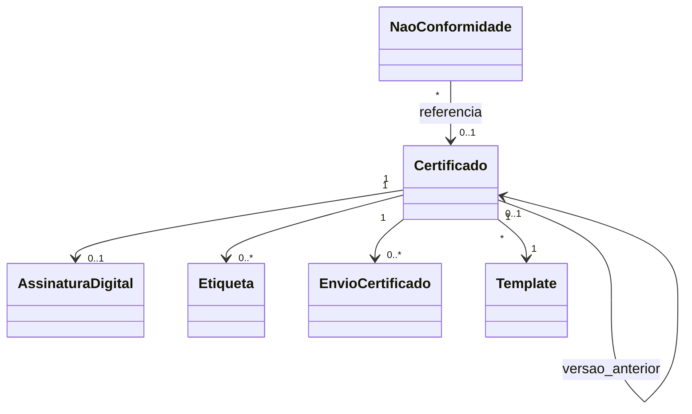

# Modelo de domínio — Certificados

> Entidades específicas. Transversais (Tenant, Usuario, Anexo, Cliente, Instrumento) ficam em `docs/comum/modelo-de-dominio.md`. Entidades de calibração (Calibracao, Leitura, Padrao, Incerteza) ficam em `../calibracao/modelo-de-dominio.md`.

---

## Entidades

### Certificado (raiz de agregado)
- **Atributos obrigatórios:** `id` (UUID), `tenant_id`, `tipo` (enum: CERT_CALIBRACAO, CERT_CALIBRACAO_RBC, RELATORIO_SERVICO, RELATORIO_FOTOGRAFICO, NC, LAUDO_TECNICO), `numero_sequencial` (inteiro), `ano`, `versao` (inteiro, inicia 1), `status` (RASCUNHO, PENDENTE_ASSINATURA, ASSINADO, ENVIADO, BAIXADO, SUBSTITUIDA, CANCELADO, **RECALL_ATIVO**, **SUSPENSO**, **ERRATA_APLICADA**), `calibracao_id` (FK, nullable se não-calibração), `cliente_id_atual` (FK `Cliente`, nullable — ADR-0032 `ReferenciaPIIAnonimizavel`), **`cliente_referencia_hash`** (HMAC tenant — preserva backref pós-anonimização Zona B), **`cliente_referencia_key_id`** (versão da chave KMS), **`cliente_nome_snapshot`** (texto imutável capturado em `gerarCertificado` — fonte única para auditor CGCRE 2050; INV-CER-ANON-001), `instrumento_id` (nullable), **`snapshot_equipamento_json`** (jsonb imutável — paridade com `Calibracao.snapshot_equipamento_json`), `rt_id` (FK Usuario com role RT), `template_id`, `template_versao`, `snapshot_dados_json` (JSONB imutável), `pdf_id` (FK Anexo), `hash_pdf_sha256`, **`xml_embedded_hash`** (SHA-256 do XML embedded — US-CER-016/017 PDF/A-3), **`tsa_iti_carimbo_id`** (FK `CarimboTempoTSAITI`, nullable até Onda 8), **`valor_servico_snapshot`** (decimal — snapshot pra ADR-0043 INV-CAL-FIN-001), **`override_emissao_id`** (FK `OverrideEmissaoCertificado`, nullable — ADR-0043 INV-CAL-FIN-002), `criado_em`, `criado_por`.
- **Atributos opcionais:** `data_validade_recalibracao` (sugestão), `versao_anterior_id` (FK self, se reemissão), `motivo_reemissao` (texto, >=50 chars se reemissão), `motivo_cancelamento`, `enviado_em`, `baixado_em`, **`suspenso_ate`** (timestamp UTC, set em `SUSPENSO`), **`dias_suspensao_acumulada`** (int, contador para vigência paralisada — INV-CER-SUSP-001).
- **Invariantes:** `INV-CER-NUM-001/002` (numeração contínua + virada anual + TTL reserva), `INV-001` (WORM), `INV-019` (RT habilitado), `INV-032` (acreditação vigente p/ RBC), `INV-CER-ANON-001` (snapshot cliente imutável pós-emissão), `INV-CER-EXP-001` (PDF/A-3 + TSA-ITI quando regulatório), `INV-CER-RECALL-001`, `INV-CER-SUSP-001`, `INV-CER-ERRATA-001`, `INV-CAL-FIN-001/002`, `INV-ANON-001`, `INV-TENANT-001`.
- **Ciclo de vida:** RASCUNHO → PENDENTE_ASSINATURA → ASSINADO → ENVIADO → BAIXADO; reemissão cria nova entidade com `versao+1` e `versao_anterior_id`, marca anterior SUBSTITUIDA. **Estados pós-emissão (ADR-0045):** `RECALL_ATIVO` (Recall por bug — bloqueia consulta operacional, preserva WORM), `SUSPENSO` (vigência paralisada — relógio para; reversível via `levantarSuspensaoCertificado`), `ERRATA_APLICADA` (apêndice anexo — cert original imutável).

### AssinaturaDigital
- **Atributos obrigatórios:** `id`, `tenant_id`, `certificado_id`, `tipo_cert` (A1, A3), `signer_cn`, `signer_cpf_cnpj`, `cert_thumbprint`, `signing_time` (server-controlled), `nonce_servidor`, `pkcs7_blob`, `verificado_em`, `verificado_resultado`.
- **Invariantes:** `INV-022`; nonce one-shot (não reusa); ADR-0009.
- **Ciclo de vida:** imutável após criação.

### Template
- **Atributos obrigatórios:** `id`, `tenant_id`, `nome`, `versao`, `tipo_aplicavel` (mesmo enum de Certificado.tipo), `html_engine_src`, `css_src`, `logo_id`, `cor_primaria`, `cabecalho_html`, `rodape_html`, `criado_em`, `ativo` (bool).
- **Invariantes:** apenas 1 ativo por tipo + tenant por vez; versões anteriores preservadas (snapshot in cert).
- **Ciclo de vida:** criar nova versão; antiga vira inativa mas referenciável.

### Etiqueta
- **Atributos obrigatórios:** `id`, `tenant_id`, `certificado_id`, `tamanho` (50x30, 80x40, custom), `qr_token` (opaco — não derivável do id), `url_publica`, `gerado_em`.
- **Invariantes:** `qr_token` aleatório criptograficamente seguro; não revela tenant nem PII.
- **Ciclo de vida:** imutável; pode-se reimprimir (mesma etiqueta) ou cancelar (invalida qr_token).

### EnvioCertificado
- **Atributos obrigatórios:** `id`, `tenant_id`, `certificado_id`, `destinatario_email`, `canal` (EMAIL, PORTAL), `tentativas`, `ultima_tentativa`, `status` (PENDENTE, ENVIADO, BOUNCE, FALHOU), `provider_message_id`.
- **Invariantes:** `INV-023` (rastreável); até 3 retries.

### NaoConformidade
- **Atributos obrigatórios:** `id`, `tenant_id`, `numero`, `origem` (CALIBRACAO, SERVICO, AUDITORIA_INTERNA), `referencia_id`, `descricao`, `aberto_em`, `aberto_por`, `acao_imediata`, `acao_corretiva_planejada`, `responsavel_id`, `prazo_fechamento`, `status` (ABERTA, EM_TRATAMENTO, FECHADA), `fechado_em`.
- **Invariantes:** `INV-022`; ISO 17025 8.7.

### VerificacaoPublica (log)
- **Atributos obrigatórios:** `id`, `qr_token`, `ip_origem` (hash), `user_agent` (truncado), `acessado_em`, `resultado` (VIGENTE, EXPIRADO, CANCELADO, SUBSTITUIDA, **RECALL_ATIVO**, **SUSPENSO**).
- **Invariantes:** LGPD — IP em hash, UA truncado.

### NumeroReservado (novo Onda 7 — A4-CAL / INV-CER-NUM-002)
- **Atributos obrigatórios:** `numero` (inteiro), `tenant_id`, `tipo` (mesmo enum de Certificado.tipo), `ano`, `certificado_id` (FK, **NULL** enquanto reservado), `reservado_em` (timestamp UTC), `ttl_segundos` (default 300), `liberado_em` (timestamp UTC, NULL enquanto vigente).
- **Chave única:** `(tenant_id, tipo, ano, numero)`.
- **Invariantes:** após `reservado_em + ttl_segundos` sem `certificado_id` setado, job `job_certificado_liberar_reservas` (a cada 60s) seta `liberado_em` + publica audit `NumeroCertificadoReservaExpirada(tenant_id, tipo, ano, numero, correlation_id)`. Tentativa de reuso de número após cancelamento/expiração bloqueia em PG (INV-CER-NUM-002).
- **Ciclo de vida:** RESERVADO (FK NULL) → FINALIZADO (FK setada) ou EXPIRADO (`liberado_em` setado).

### OverrideEmissaoCertificado (novo Onda 7 — C1-CAL / ADR-0043 / INV-CAL-FIN-002)
- **Atributos obrigatórios:** `id`, `tenant_id`, `cliente_id_atual` (FK Cliente), `cliente_referencia_hash` (paridade ANON), `certificado_id` (FK, NULL no momento da criação; setada após cert finalizar), `motivo` (texto ≥100 chars, anti-PII via INV-CAL-TXT-001), `gerente_id` (FK Usuario com papel.gerente_financeiro|admin_tenant), `audit_event_id` (FK EventoDeCertificado), `assinatura_a3_id` (FK AssinaturaDigital — obrigatória; INV-017), `criado_em` (timestamp UTC).
- **Invariantes:** imutável após criação (`INV-CAL-WORM-001` estendido); limite 5%/mês de cert overrideados por tenant (paridade ADR-0026); estouro vira alerta P1 + bloqueia novos overrides.

### CertificadoRecall (novo Onda 7 — C3-CAL / ADR-0045 / INV-CER-RECALL-001)
- **Atributos obrigatórios:** `id`, `tenant_id`, `certificado_id` (FK), `motivo_bug` (texto ≥100 chars, anti-PII), `replay_validacao_id` (FK — ADR-0025 evidência), `gestor_id` (FK Usuario), `criado_em` (timestamp UTC), `notificacao_cliente_at` (nullable até consumer publicar), `notificacao_anpd_at` (nullable; obrigatório se `impacto_titular=true`), `notificacao_cgcre_at` (nullable; SLA 30d), `impacto_titular` (bool — quando dado afetou decisão sobre titular: LGPD art. 48).
- **Invariantes:** SLA 24h cliente + 24h ANPD (quando aplicável) + 30d CGCRE; consumer idempotente por `certificado_id`; cert vai pra `RECALL_ATIVO` em transação atômica com INSERT.

### CertificadoErrata (novo Onda 7 — C3-CAL / ADR-0045 / INV-CER-ERRATA-001)
- **Atributos obrigatórios:** `id`, `tenant_id`, `certificado_id` (FK), `errata_seq` (inteiro — sequência incremental por cert), `campo_corrigido` (enum allowlist `errata-campos-permitidos.md`), `valor_anterior` (texto), `valor_novo` (texto), `justificativa` (≥30 chars anti-PII), `rt_autor_id` (FK Usuario), `assinatura_a3_apêndice_id` (FK AssinaturaDigital), `pdf_apêndice_id` (FK Anexo), `criado_em`.
- **Invariantes:** apenas campos da allowlist; tentativa em campo técnico bloqueia 422; cert original imutável (`INV-001`); incrementa `errata_seq` por cert.

---

## Agregados (DDD)

| Agregado raiz | Entidades incluídas | Invariantes |
|---|---|---|
| Certificado | AssinaturaDigital, Etiqueta, EnvioCertificado[] | INV-012, INV-013, INV-014, INV-019, INV-022, INV-TENANT-001 |
| Template | — | — |
| NaoConformidade | — | INV-022 |
| VerificacaoPublica | — | LGPD |

---

## Value Objects

| VO | Definição | Imutável? |
|---|---|---|
| SnapshotDados | JSONB com cliente, instrumento, padrões, leituras, incerteza, decisão | Sim |
| QrToken | string aleatória 32 bytes base64url | Sim |
| HashPDF | SHA-256 hex do PDF emitido | Sim |

---

## Eventos consumidos

| Evento | Origem | Reação |
|---|---|---|
| `Calibracao.Aprovada` | metrologia/calibracao | cria Certificado rascunho com dados da calibração |
| `Calibracao.Configurada` | metrologia/calibracao | **prepara template do certificado** (escolhe layout RBC/sem-marca conforme grandeza/faixa) antes da emissão — reduz latência no momento da assinatura |
| `Calibracao.Rejeitada` | metrologia/calibracao | cancela rascunho preparado (se existir) |
| `Padroes.CertificadoVencendo` | metrologia/calibracao | bloqueia novos certificados que dependem do padrão vencendo (alerta signatário) |
| `Licencas.BloqueioAtivado` | metrologia/licencas-acreditacoes | suspende emissão de certificados RBC enquanto bloqueio ativo |

---

## Eventos de domínio (publicados)

| Evento | Quando dispara | Payload | Quem consome |
|---|---|---|---|
| `Certificados.Emitido` | Status → PENDENTE_ASSINATURA | `{certificado_id, tipo, numero, versao}` | Auditoria, Notificacao |
| `Certificados.Assinado` | Status → ASSINADO | `{certificado_id, signer, signing_time}` | Envio, Auditoria |
| `Certificados.Enviado` | E-mail entregue | `{certificado_id, destinatario}` | Notificacao |
| `Certificados.Baixado` | Cliente baixou pelo portal | `{certificado_id, cliente_id, baixado_em}` | Auditoria LGPD |
| `Certificados.Reemitido` | Nova versão criada | `{cert_novo_id, cert_anterior_id, motivo}` | Cliente, Auditoria |
| `Certificados.Cancelado` | Anulação definitiva | `{certificado_id, motivo, cancelado_por}` | Auditoria |
| `Certificados.VerificacaoPublica` | Acesso à página pública | `{qr_token, resultado, ip_hash}` | Métricas |
| `Certificados.NCAberta` | Nova NaoConformidade | `{nc_id, origem, referencia}` | Qualidade |
| `CertificadoRecallEmitido` | Recall disparado (ADR-0045) | `{certificado_id, motivo_bug, replay_validacao_id, impacto_titular, correlation_id}` | notificar-cliente-recall, notificar-anpd-recall (cond), notificar-cgcre-recall, Auditoria |
| `CertificadoSuspenso` | Suspensão temporária (ADR-0045) | `{certificado_id, suspenso_ate, motivo_padrao_descalibrado, correlation_id}` | Cliente, Auditoria |
| `CertificadoErrataEmitida` | Errata aplicada (ADR-0045) | `{certificado_id, errata_seq, campo_corrigido, justificativa, correlation_id}` | Cliente, Auditoria |
| `NumeroCertificadoReservaExpirada` | TTL reserva expira (INV-CER-NUM-002) | `{tenant_id, tipo, ano, numero, correlation_id}` | Auditoria, Gap-detection |
| `ContasReceber.TituloEmitido` (consumer Financeiro reage a `Certificados.Emitido`) | Faturamento (ADR-0043) | `{certificado_id, conta_id, valor, vencimento, correlation_id}` | Financeiro |

---

## Comandos (entradas no módulo)

| Comando | Origem | Pré-condição | Pós-condição |
|---|---|---|---|
| `gerarCertificado` | UI/API RT | Calibração APROVADA + 2ª conferência; acreditação vigente se RBC | Certificado RASCUNHO → PENDENTE_ASSINATURA; numeração reservada |
| `assinarCertificado` | UI RT (Web PKI Lacuna) | Status PENDENTE_ASSINATURA; ART/RRT vigente | AssinaturaDigital; status → ASSINADO |
| `reemitirCertificado` | UI RT | Status ≥ ASSINADO; motivo ≥ 50 chars | Novo Certificado versao+1; anterior SUBSTITUIDA |
| `cancelarCertificado` | UI admin | Motivo; assinatura admin | Status → CANCELADO; número não reusa |
| `gerarEtiqueta` | UI RT | Cert ASSINADO | Etiqueta com qr_token opaco |
| `enviarPorEmail` | Automático ou manual | Cert ASSINADO; e-mail cliente | EnvioCertificado |
| `abrirNC` | UI RT | Origem identificada | NaoConformidade ABERTA |
| `criarTemplate` | UI admin | Tipo válido | Template inativo; ativar via ação separada |
| `recallCertificadoPorBug` | UI gestor qualidade (ADR-0045) | Bug confirmado via replay; gestor com papel | Cert → `RECALL_ATIVO`; eventos de notificação publicados (cliente 24h, ANPD 24h cond, CGCRE 30d) |
| `suspenderCertificado` | UI gestor qualidade (ADR-0045) | Motivo padrão descalibrado; investigação aberta | Cert → `SUSPENSO`; vigência paralisa; `suspenso_ate` setado |
| `levantarSuspensaoCertificado` | UI gestor qualidade | Cert SUSPENSO; investigação fechada sem Recall; justificativa ≥50 chars | Cert volta a `ASSINADO`; vigência retoma (descontados `dias_suspensao_acumulada`) |
| `emitirErrataCertificado` | UI RT (ADR-0045) | Cert ASSINADO; campo na allowlist; justificativa ≥30 chars | Apêndice PDF + `errata_seq` incrementado + assinatura A3 do autor |
| `overrideEmissaoCertificadoInadimplencia` | UI gerente financeiro (ADR-0043) | Cliente em `INADIMPLENCIA_DURA`; motivo ≥100 chars; assinatura A3 | `OverrideEmissaoCertificado` criado; libera emissão única |
| `reservarNumeroCertificado` | Interno (gerarCertificado) | Trans. iniciada | `NumeroReservado` INSERT com `certificado_id NULL` + TTL 300s |

---

## Schema físico

Ver `../schema-banco.md` quando consolidar. Entidades comuns em `../../../comum/schema-banco.md`.

## Diagramas

## Como este modelo evolui

- Entidade nova → verificar fronteira em `governanca-modelo-comum.md`.
- Atributo novo → migration + CHANGELOG.
- Entidade deprecada → ADR + janela.
