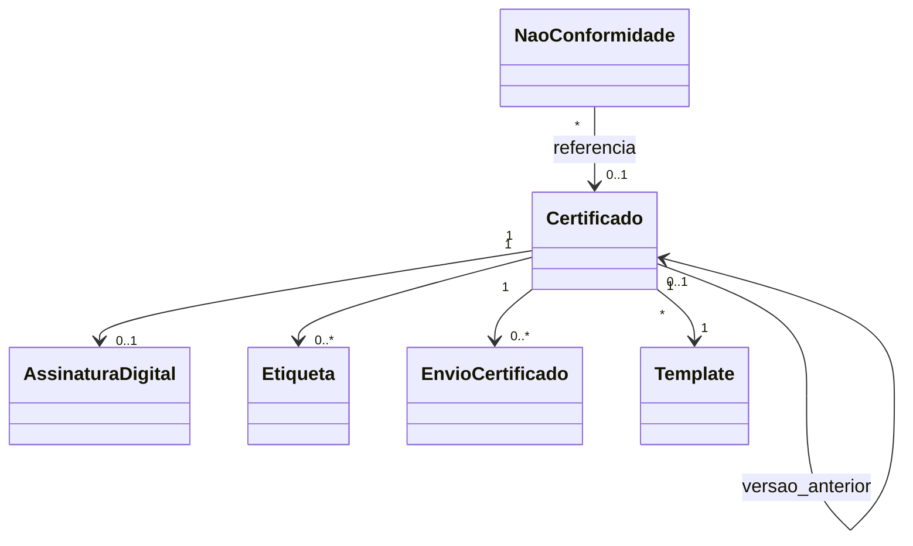

# Modelo de domínio — Certificados

> Entidades específicas. Transversais (Tenant, Usuario, Anexo, Cliente, Instrumento) ficam em `docs/comum/modelo-de-dominio.md`. Entidades de calibração (Calibracao, Leitura, Padrao, Incerteza) ficam em `../calibracao/modelo-de-dominio.md`.

---

## Entidades

### Certificado (raiz de agregado)
- **Atributos obrigatórios:** `id` (UUID), `tenant_id`, `tipo` (enum: CERT_CALIBRACAO, CERT_CALIBRACAO_RBC, RELATORIO_SERVICO, RELATORIO_FOTOGRAFICO, NC, LAUDO_TECNICO), `numero_sequencial` (inteiro), `ano`, `versao` (inteiro, inicia 1), `status` (RASCUNHO, PENDENTE_ASSINATURA, ASSINADO, ENVIADO, BAIXADO, SUBSTITUIDA, CANCELADO), `calibracao_id` (FK, nullable se não-calibração), `cliente_id`, `instrumento_id` (nullable), `rt_id` (FK Usuario com role RT), `template_id`, `template_versao`, `snapshot_dados_json` (JSONB imutável), `pdf_id` (FK Anexo), `hash_pdf_sha256`, `criado_em`, `criado_por`.
- **Atributos opcionais:** `data_validade_recalibracao` (sugestão), `versao_anterior_id` (FK self, se reemissão), `motivo_reemissao` (texto, >=50 chars se reemissão), `motivo_cancelamento`, `enviado_em`, `baixado_em`.
- **Invariantes:** `INV-013` (numeração contínua), `INV-014` (imutabilidade pós-assinatura), `INV-022` (WORM), `INV-019` (RT habilitado), `INV-012` (acreditação vigente p/ RBC), `INV-TENANT-001`.
- **Ciclo de vida:** RASCUNHO → PENDENTE_ASSINATURA → ASSINADO → ENVIADO → BAIXADO; reemissão cria nova entidade com `versao+1` e `versao_anterior_id`, marca anterior SUBSTITUIDA.

### AssinaturaDigital
- **Atributos obrigatórios:** `id`, `tenant_id`, `certificado_id`, `tipo_cert` (A1, A3), `signer_cn`, `signer_cpf_cnpj`, `cert_thumbprint`, `signing_time` (server-controlled), `nonce_servidor`, `pkcs7_blob`, `verificado_em`, `verificado_resultado`.
- **Invariantes:** `INV-022`; nonce one-shot (não reusa); ADR-0009.
- **Ciclo de vida:** imutável após criação.

### Template
- **Atributos obrigatórios:** `id`, `tenant_id`, `nome`, `versao`, `tipo_aplicavel` (mesmo enum de Certificado.tipo), `html_engine_src`, `css_src`, `logo_id`, `cor_primaria`, `cabecalho_html`, `rodape_html`, `criado_em`, `ativo` (bool).
- **Invariantes:** apenas 1 ativo por tipo + tenant por vez; versões anteriores preservadas (snapshot in cert).
- **Ciclo de vida:** criar nova versão; antiga vira inativa mas referenciável.

### Etiqueta
- **Atributos obrigatórios:** `id`, `tenant_id`, `certificado_id`, `tamanho` (50x30, 80x40, custom), `qr_token` (opaco — não derivável do id), `url_publica`, `gerado_em`.
- **Invariantes:** `qr_token` aleatório criptograficamente seguro; não revela tenant nem PII.
- **Ciclo de vida:** imutável; pode-se reimprimir (mesma etiqueta) ou cancelar (invalida qr_token).

### EnvioCertificado
- **Atributos obrigatórios:** `id`, `tenant_id`, `certificado_id`, `destinatario_email`, `canal` (EMAIL, PORTAL), `tentativas`, `ultima_tentativa`, `status` (PENDENTE, ENVIADO, BOUNCE, FALHOU), `provider_message_id`.
- **Invariantes:** `INV-023` (rastreável); até 3 retries.

### NaoConformidade
- **Atributos obrigatórios:** `id`, `tenant_id`, `numero`, `origem` (CALIBRACAO, SERVICO, AUDITORIA_INTERNA), `referencia_id`, `descricao`, `aberto_em`, `aberto_por`, `acao_imediata`, `acao_corretiva_planejada`, `responsavel_id`, `prazo_fechamento`, `status` (ABERTA, EM_TRATAMENTO, FECHADA), `fechado_em`.
- **Invariantes:** `INV-022`; ISO 17025 8.7.

### VerificacaoPublica (log)
- **Atributos obrigatórios:** `id`, `qr_token`, `ip_origem` (hash), `user_agent` (truncado), `acessado_em`, `resultado` (VIGENTE, EXPIRADO, CANCELADO, SUBSTITUIDA).
- **Invariantes:** LGPD — IP em hash, UA truncado.

---

## Agregados (DDD)

| Agregado raiz | Entidades incluídas | Invariantes |
|---|---|---|
| Certificado | AssinaturaDigital, Etiqueta, EnvioCertificado[] | INV-012, INV-013, INV-014, INV-019, INV-022, INV-TENANT-001 |
| Template | — | — |
| NaoConformidade | — | INV-022 |
| VerificacaoPublica | — | LGPD |

---

## Value Objects

| VO | Definição | Imutável? |
|---|---|---|
| SnapshotDados | JSONB com cliente, instrumento, padrões, leituras, incerteza, decisão | Sim |
| QrToken | string aleatória 32 bytes base64url | Sim |
| HashPDF | SHA-256 hex do PDF emitido | Sim |

---

## Eventos de domínio (publicados)

| Evento | Quando dispara | Payload | Quem consome |
|---|---|---|---|
| `Certificados.Emitido` | Status → PENDENTE_ASSINATURA | `{certificado_id, tipo, numero, versao}` | Auditoria, Notificacao |
| `Certificados.Assinado` | Status → ASSINADO | `{certificado_id, signer, signing_time}` | Envio, Auditoria |
| `Certificados.Enviado` | E-mail entregue | `{certificado_id, destinatario}` | Notificacao |
| `Certificados.Baixado` | Cliente baixou pelo portal | `{certificado_id, cliente_id, baixado_em}` | Auditoria LGPD |
| `Certificados.Reemitido` | Nova versão criada | `{cert_novo_id, cert_anterior_id, motivo}` | Cliente, Auditoria |
| `Certificados.Cancelado` | Anulação definitiva | `{certificado_id, motivo, cancelado_por}` | Auditoria |
| `Certificados.VerificacaoPublica` | Acesso à página pública | `{qr_token, resultado, ip_hash}` | Métricas |
| `Certificados.NCAberta` | Nova NaoConformidade | `{nc_id, origem, referencia}` | Qualidade |

---

## Comandos (entradas no módulo)

| Comando | Origem | Pré-condição | Pós-condição |
|---|---|---|---|
| `gerarCertificado` | UI/API RT | Calibração APROVADA + 2ª conferência; acreditação vigente se RBC | Certificado RASCUNHO → PENDENTE_ASSINATURA; numeração reservada |
| `assinarCertificado` | UI RT (Web PKI Lacuna) | Status PENDENTE_ASSINATURA; ART/RRT vigente | AssinaturaDigital; status → ASSINADO |
| `reemitirCertificado` | UI RT | Status ≥ ASSINADO; motivo ≥ 50 chars | Novo Certificado versao+1; anterior SUBSTITUIDA |
| `cancelarCertificado` | UI admin | Motivo; assinatura admin | Status → CANCELADO; número não reusa |
| `gerarEtiqueta` | UI RT | Cert ASSINADO | Etiqueta com qr_token opaco |
| `enviarPorEmail` | Automático ou manual | Cert ASSINADO; e-mail cliente | EnvioCertificado |
| `abrirNC` | UI RT | Origem identificada | NaoConformidade ABERTA |
| `criarTemplate` | UI admin | Tipo válido | Template inativo; ativar via ação separada |

---

## Schema físico

Ver `../schema-banco.md` quando consolidar. Entidades comuns em `../../../comum/schema-banco.md`.

## Diagramas

## Como este modelo evolui

- Entidade nova → verificar fronteira em `governanca-modelo-comum.md`.
- Atributo novo → migration + CHANGELOG.
- Entidade deprecada → ADR + janela.
