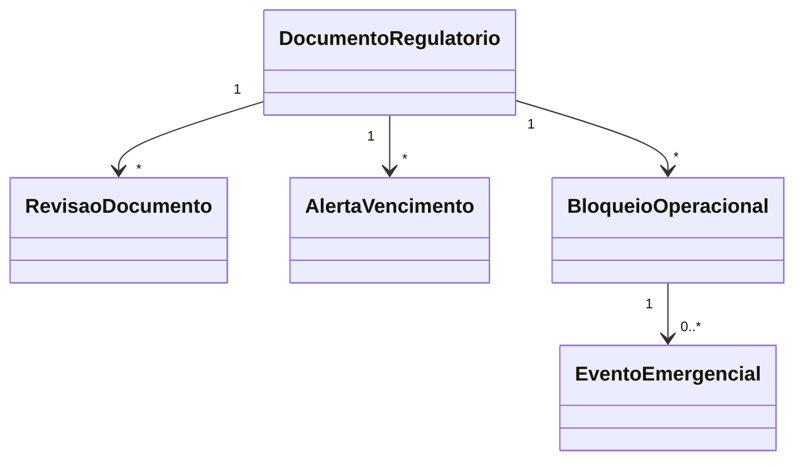

# Modelo de domínio — Licenças e Acreditações

> Entidades específicas. Transversais (Tenant, Usuario, Anexo) ficam em `docs/comum/modelo-de-dominio.md`.

---

## Entidades

### DocumentoRegulatorio (raiz de agregado)
- **Atributos obrigatórios:** `id` (UUID), `tenant_id`, `tipo` (enum: ACREDITACAO_CGCRE, ALVARA, LICENCA_AMBIENTAL, LICENCA_SANITARIA, CERTIDAO_NEGATIVA, ART, RRT, CERT_DIGITAL_A1, CERT_DIGITAL_A3, AUTORIZACAO_ANVISA, AUTORIZACAO_INMETRO, OUTRO), `numero`, `orgao_emissor`, `data_emissao`, `data_validade`, `status` (calculado: VIGENTE / VENCE_EM_BREVE / VENCIDO / EM_RENOVACAO), `bloqueante` (bool), `criado_em`, `criado_por`.
- **Atributos opcionais:** `escopo` (texto livre — obrigatório para ACREDITACAO_CGCRE), `titular` (CPF/CNPJ — obrigatório para ART/RRT/CERT_DIGITAL), `responsavel_id` (FK Usuario — quem cuida da renovação), `observacao`.
- **Invariantes de agregado:** `INV-021` (sempre tem anexo na revisão atual), `INV-022` (trilha WORM), `INV-TENANT-001` (tenant_id em toda query), `INV-LIC-001` (bloqueante = true só para tipos previstos).
- **Ciclo de vida:** criado quando admin cadastra → mutável só nos campos `responsavel_id`, `bloqueante`, `observacao` → revisões adicionais via `RevisaoDocumento`.

### RevisaoDocumento
- **Atributos obrigatórios:** `id`, `tenant_id`, `documento_id` (FK), `numero_revisao` (incremental por documento), `data_emissao`, `data_validade`, `anexo_id` (FK Anexo), `criado_em`, `criado_por`, `motivo` (enum: CADASTRO_INICIAL, RENOVACAO, RETIFICACAO).
- **Invariantes:** imutável após criação (INV-022); `data_validade > data_emissao`.
- **Ciclo de vida:** sempre cresce — nunca atualizada nem excluída.

### AlertaVencimento
- **Atributos obrigatórios:** `id`, `tenant_id`, `documento_id`, `data_disparo`, `janela_dias` (90/60/30/15/7), `canal` (EMAIL, DASHBOARD, APP), `destinatario_id`, `status` (PENDENTE, ENVIADO, LIDO, FALHOU), `tentativas`, `ultima_tentativa`.
- **Invariantes:** rastreável (INV-023).
- **Ciclo de vida:** agendado pelo scheduler ao cadastrar/renovar documento → enviado → marcado lido pelo destinatário.

### BloqueioOperacional
- **Atributos obrigatórios:** `id`, `tenant_id`, `documento_id`, `operacao_bloqueada` (string descritor — ex: "emissao_certificado_rbc"), `data_inicio_bloqueio`, `data_fim_bloqueio` (null se vigente).
- **Invariantes:** só ativo se documento bloqueante vencido; auto-resolvido na renovação.
- **Ciclo de vida:** criado no T+1 do vencimento → resolvido quando RevisaoDocumento nova é cadastrada e vigente.

### EventoEmergencial
- **Atributos obrigatórios:** `id`, `tenant_id`, `bloqueio_id`, `operacao_executada`, `justificativa`, `admin_id`, `assinatura_a3_id` (FK ao módulo de assinatura), `criado_em`.
- **Invariantes:** imutável (INV-022); exige assinatura A3 válida; gera evento WORM.

---

## Agregados (DDD)

| Agregado raiz | Entidades incluídas | Invariantes |
|---|---|---|
| DocumentoRegulatorio | RevisaoDocumento[], AlertaVencimento[], BloqueioOperacional[] | INV-021, INV-022, INV-TENANT-001, INV-LIC-001 |
| EventoEmergencial | — (raiz isolada) | INV-022 |

---

## Value Objects

| VO | Definição | Imutável? |
|---|---|---|
| PeriodoVigencia | data_emissao + data_validade + status calculado | Sim |
| JanelaAlerta | conjunto {90, 60, 30, 15, 7} dias | Sim |

---

## Eventos de domínio (publicados)

| Evento | Quando dispara | Payload | Quem consome |
|---|---|---|---|
| `Licencas.DocumentoCadastrado` | Admin cria DocumentoRegulatorio | `{documento_id, tipo, validade}` | Auditoria, Notificacao |
| `Licencas.DocumentoRenovado` | Nova RevisaoDocumento criada | `{documento_id, revisao_id, nova_validade}` | Notificacao, Bloqueio (resolve) |
| `Licencas.AlertaDisparado` | Cron atinge janela | `{documento_id, janela_dias, destinatario}` | Notificacao |
| `Licencas.DocumentoVencido` | T+1 da validade sem renovação | `{documento_id, dias_atraso}` | Bloqueio, Auditoria |
| `Licencas.BloqueioAtivado` | Vencimento de doc bloqueante | `{documento_id, operacao_bloqueada}` | Certificados, Calibracao |
| `Licencas.ModoEmergencialAcionado` | Admin libera operação com doc vencido | `{evento_id, operacao, justificativa, admin_id}` | Auditoria, Watchdog |

---

## Comandos (entradas no módulo)

| Comando | Origem | Pré-condição | Pós-condição |
|---|---|---|---|
| `cadastrarDocumento` | UI/API admin | RBAC=admin; anexo presente | DocumentoRegulatorio + RevisaoDocumento(1) + Alertas agendados |
| `renovarDocumento` | UI/API admin | Documento existe; novo anexo | Nova RevisaoDocumento; alertas reagendados; bloqueio resolvido se ativo |
| `marcarBloqueante` | UI admin | Documento existe; tipo permite | Atualiza flag; revalida bloqueios |
| `acionarModoEmergencial` | UI admin | Bloqueio ativo; justificativa + A3 | EventoEmergencial; libera operação por janela limitada |
| `gerarRelatorioAuditoria` | UI/API auditor | RBAC=auditor ou admin | PDF + hash SHA-256 + entrada WORM |

---

## Schema físico

Ver `../schema-banco.md` quando estabilizar; entidades comuns (Tenant, Usuario, Anexo) ficam em `../../../comum/schema-banco.md`.

## Diagramas

## Como este modelo evolui

- Entidade nova → adicionar + verificar fronteira em `governanca-modelo-comum.md`.
- Atributo novo → migration + bump CHANGELOG.
- Entidade descontinuada → ADR + janela de migração.
