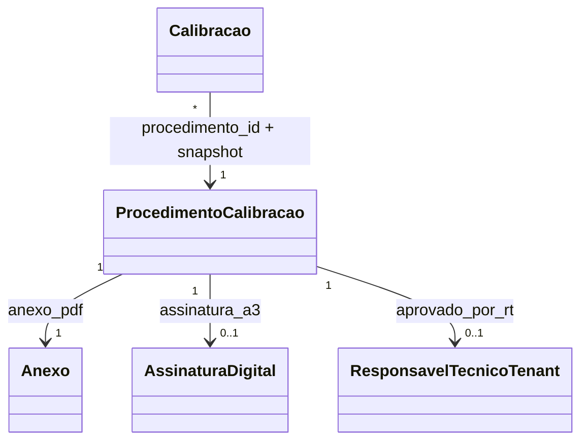

# Modelo de domínio — Procedimentos de Calibração (novo Onda 7 — A5-CAL)

> Entidades específicas. Transversais (Tenant, Usuario, Anexo) em `docs/comum/modelo-de-dominio.md`. Soft-delete Padrão B (ADR-0031); vigência temporal canônica (ADR-0030).

---

## Entidades

### ProcedimentoCalibracao (raiz de agregado)

- **Atributos obrigatórios:** `id` (UUID), `tenant_id`, `codigo` (texto — ex: `PROC-MASSA-001`), `versao` (texto — ex: `1.0`, `1.1`, `2.0`), `escopo_grandezas` (array de enum `Grandeza` — MASSA, COMPRIMENTO, TEMPERATURA, etc.), `escopo_faixa_min` (decimal, nullable), `escopo_faixa_max` (decimal, nullable), `escopo_unidade` (texto, nullable), `norma_referencia` (texto — ex: "NIT-DICLA-030 rev. 15 + OIML R76"), `anexo_pdf_id` (FK `Anexo`), `anexo_pdf_hash` (SHA-256 do PDF — imutável), `aprovado_por_rt_id` (FK `ResponsavelTecnicoTenant`, nullable enquanto RASCUNHO; obrigatório em VIGENTE), `data_aprovacao` (timestamp UTC, nullable em RASCUNHO), `assinatura_a3_id` (FK `AssinaturaDigital`, nullable em RASCUNHO; obrigatório em VIGENTE — INV-017), `vigencia_inicio` (timestamp UTC, nullable em RASCUNHO), `vigencia_fim` (timestamp UTC, nullable — INV-VIG-001/003), `revogado_em` (timestamp UTC, nullable; soft-delete Padrão B — ADR-0031), `motivo_revogacao` (texto ≥10 chars, obrigatório se `revogado_em IS NOT NULL` — INV-VIG-002), `status` (computado: RASCUNHO, VIGENTE, REVOGADO, EXPIRADO), `tz_referencia` (texto — UTC | America/Sao_Paulo | lab — INV-VIG-004), `criado_em`, `criado_por` (FK Usuario).
- **Chave única:** `(tenant_id, codigo, versao)`.
- **Invariantes:** `INV-PROC-001/002/003`, `INV-VIG-001..004`, `INV-SOFT-002` (WORM físico — DELETE bloqueado por trigger PG), `INV-017`, `INV-TENANT-001`, `INV-ANON-001` (RT aprovador pode ser anonimizado em Zona B — referencia via `ReferenciaPIIAnonimizavel`).
- **Ciclo de vida:** RASCUNHO → VIGENTE (aprovação — US-PROC-002) → REVOGADO (US-PROC-004) | EXPIRADO (`vigencia_fim <= now()`). REVOGADO/EXPIRADO preservados WORM (consulta histórica US-PROC-003).

---

## Agregados (DDD)

| Agregado raiz | Entidades incluídas | Invariantes |
|---|---|---|
| ProcedimentoCalibracao | — | INV-PROC-001/002/003, INV-VIG-001..004, INV-SOFT-002 |

---

## Value Objects

| VO | Definição | Imutável? |
|---|---|---|
| `JanelaVigencia` | `(vigencia_inicio, vigencia_fim, revogado_em, motivo_revogacao)` — reutilizado de `src/domain/shared/value_objects.py` (ADR-0030) | Sim |
| `EscopoProcedimento` | `(grandezas[], faixa_min, faixa_max, unidade)` — describe escopo de aplicação | Sim |

---

## Eventos publicados

| Evento | Quando dispara | Payload | Quem consome |
|---|---|---|---|
| `ProcedimentoAprovado` | RT aprova (US-PROC-002) | `{procedimento_id, codigo, versao, vigencia_inicio, correlation_id}` | Calibração (cache predicate), Auditoria |
| `ProcedimentoRevogado` | RT revoga (US-PROC-004) | `{procedimento_id, codigo, versao, revogado_em, motivo_revogacao, correlation_id}` | Calibração (invalida cache), Auditoria, Qualidade |
| `ProcedimentoExpirado` | `vigencia_fim` atingido (job diário) | `{procedimento_id, codigo, versao, vigencia_fim, correlation_id}` | Auditoria |

---

## Comandos

| Comando | Origem | Pré-condição | Pós-condição |
|---|---|---|---|
| `cadastrarProcedimento` | UI RT (US-PROC-001) | `codigo` único por tenant+versao; anexo PDF | Procedimento em RASCUNHO |
| `aprovarProcedimento` | UI RT (US-PROC-002) | RASCUNHO; A3 do RT vigente; `vigencia_inicio >= data_aprovacao` | Status VIGENTE; evento `ProcedimentoAprovado` |
| `revogarProcedimento` | UI RT (US-PROC-004) | VIGENTE; motivo ≥10 chars | Status REVOGADO; evento `ProcedimentoRevogado` |
| `resolverProcedimentoVigente` | Calibração (US-CAL-016) | `tenant_id`, grandeza, faixa, em_data | Retorna `ProcedimentoCalibracao` único ou None |

---

## Schema físico

Migrations Wave A — `procedimentos/migrations/0001_initial.py`:
- Trigger PG `procedimento_imutabilidade_pos_aprovacao_trg` (BEFORE UPDATE): bloqueia mudança em `anexo_pdf_hash`, `assinatura_a3_id`, `aprovado_por_rt_id`, `data_aprovacao` quando `status >= VIGENTE`.
- Constraint CHECK: `revogado_em IS NULL OR motivo_revogacao IS NOT NULL` (INV-VIG-002).
- Constraint CHECK: `vigencia_inicio IS NULL OR vigencia_fim IS NULL OR vigencia_inicio <= vigencia_fim` (INV-VIG-001).
- Constraint CHECK: `revogado_em IS NULL OR vigencia_fim IS NULL OR revogado_em <= vigencia_fim` (INV-VIG-003).
- Index parcial `procedimento_vigente_idx` em `(tenant_id, escopo_grandezas, vigencia_inicio)` WHERE `revogado_em IS NULL` — acelera `procedimento_vigente_para`.

## Diagramas

## Como este modelo evolui

- Atributo novo → migration + CHANGELOG.
- Mudança no predicate `procedimento_vigente_para` → ADR + revalidação software (ISO 17025 cl. 7.11).
