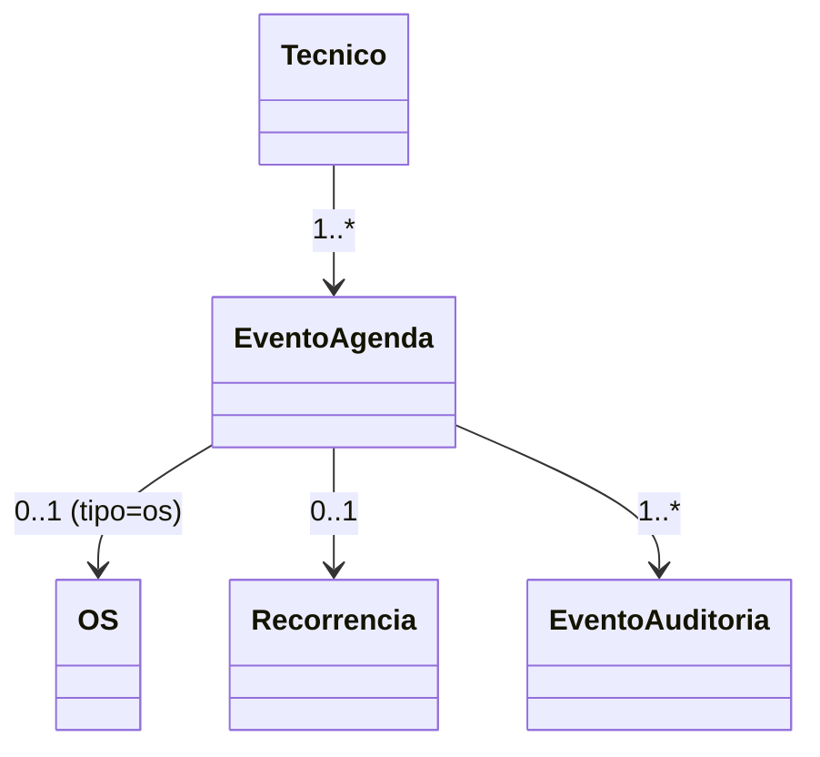

# Modelo de domínio — Módulo Agenda

> Técnico, Cliente vivem em `docs/comum/modelo-de-dominio.md`. Hook valida não-duplicação.

---

## Entidades

### Agenda — agregado raiz (por técnico × período)

A Agenda é a coleção de slots de UM técnico. Composição é virtual (não é tabela única) — slots vivem na tabela `evento_agenda` indexados por `tecnico_id` + `inicia_at`.

### EventoAgenda

- **Obrigatórios:** `id`, `tenant_id`, `tecnico_id`, `inicia_at`, `termina_at`, `tipo` (enum: os | bloqueio | descanso_legal | deslocamento | almoco | manutencao_interna | feriado), `criado_at`, `criado_por`.
- **Opcionais:** `atividade_id` (FK `AtividadeDaOS` — **obrigatório quando `tipo=os`**, INV-AG-ADR0023-001), `os_id` (**derivado** = `atividade.os_id`, denormalizado para query rápida; NÃO usar como fonte de verdade), `motivo` (se tipo=bloqueio), `recorrencia_id`, `geo_origem`, `geo_destino` (deslocamento), `aprovado_pelo_cliente_at`, `notas`, `tempo_deslocamento_estimado_s` (preenchido pelo `MapsProvider` — M-AG-003), `estado` (enum: agendado | em_execucao | concluido | cancelado | NO_SHOW — A-AG-002).
- **Invariantes:** `INV-020` (jornada UMC), regra de não-conflito (`unique(tecnico_id, inicia_at, termina_at)` com overlap proibido), RAT-08, **INV-AG-ADR0023-001**.
- **Ciclo de vida:** criado em qualquer momento futuro; eventos passados ficam imutáveis (audit). Move = update de timestamps + audit.

### RegistroNoShow (A-AG-002)

- **Obrigatórios:** `id`, `tenant_id`, `evento_id` (FK), `registrado_em`, `registrado_por`, `custo_deslocamento` (Decimal), `cobrar_cliente` (bool — política do tenant), `descricao`.
- **Regra:** criado quando `EventoAgenda.estado` transita para `NO_SHOW`. Se `cobrar_cliente=true`, dispara evento `Agenda.NoShowCobravelRegistrado` → `contas-receber` gera título.

### Bloqueio

Tipo especial de EventoAgenda com `tipo=bloqueio`. `motivo` ∈ {ferias, treinamento, atestado, outro}. Não aceita OS sobreposta.

### Feriado

`tipo=feriado`. Pode ser nacional (catálogo nacional default), estadual, municipal ou custom do tenant. Bloqueia agendamento de OS default; gerente pode forçar com confirmação.

### Recorrencia

- `id`, `tecnico_id`, `template_evento` (JSON), `regra_rrule` (RFC 5545 — ex: `FREQ=WEEKLY;BYDAY=MO`), `inicia_em`, `termina_em`, `criada_at`.
- Job diário materializa os próximos 90 dias em EventoAgenda.

### CapacidadeTecnico

- `tecnico_id`, `dia_semana` (0-6), `horas_uteis_max`, `inicio_jornada`, `fim_jornada`.
- Snapshot por período (versionado quando muda contrato/CLT).

### EventoAuditoria (append-only)

`evento_agenda_id`, `acao` (criado | movido | cancelado | aprovado), `de`, `para`, `at`, `ator_id`. Cobre RAT-08.

---

## Validação INV-020 — Lei 13.103 + CLT 235-C (CRÍTICA)

Hook `validar_jornada_umc(tecnico_id, inicia_at, termina_at)`:

1. **Identifica se técnico opera UMC** (flag no perfil).
2. **Carrega jornada das últimas 24h + próximas 24h** do técnico.
3. **Regra 1 (11h ininterruptas):** entre término da última jornada e início da próxima, ≥ 11h.
4. **Regra 2 (30min/5h30):** dentro de uma jornada contínua de direção, a cada 5h30 deve haver ≥ 30min de descanso (tipo `descanso_legal`).
5. **Regra 3 (tempo-espera):** se evento marca `tempo_espera=true`, conta como 1/3 (sobreaviso).
6. Retorna `{ok: bool, violacao?: string, sugestao_proximo_slot?: timestamp}`.

**Comportamento:**
- API bloqueia POST/PATCH com 422 se violação.
- UI mostra **antes** de salvar (validação no drag) — não pode aceitar e rejeitar depois.
- Audit log grava TODA tentativa que foi bloqueada (compliance trabalhista).

---

## Detecção de conflito

Função `detectar_conflito(tecnico_id, inicia_at, termina_at, exclude_id?)`:
1. Busca eventos do técnico com overlap temporal.
2. Se houver: bloqueia salvar; UI mostra evento conflitante.
3. **Nunca move automaticamente** — gerente decide.

---

## Agregados

| Raiz | Inclui | Invariantes |
|---|---|---|
| EventoAgenda | EventoAuditoria | INV-020, unique-overlap, RAT-08 |
| Recorrencia | (materializa em EventoAgenda) | — |

## Value Objects

| VO | Definição | Imutável? |
|---|---|---|
| TipoEvento | enum (7) | Sim |
| Janela | {inicia_at, termina_at} | Sim |
| RegraRecorrencia | RRULE RFC 5545 | Sim |

## Eventos publicados

> **Nomenclatura canônica:** prefixo `Agenda.*`. Aliases sem prefixo (`AgendaSlotAlocado`, etc.) ficam como **deprecated** até V2.

| Evento | Quando | Payload | Consumidores |
|---|---|---|---|
| `Agenda.SlotAlocado` | EventoAgenda criado com tipo=os | `{tenant_id, tecnico_id, atividade_id, os_id, slot}` | os (estado AGENDADA), crm, capacity-planning |
| `Agenda.Reagendada` | move de EventoAgenda tipo=os | `{tenant_id, atividade_id, os_id, slot_antigo, slot_novo}` | os, crm (notifica cliente), capacity-planning |
| `Agenda.ConflitoResolvido` | atendente resolve conflito (A-AG-001) | `{tenant_id, evento_id, decisao, resolvido_por}` | os, capacity-planning |
| `Agenda.NoShowRegistrado` | EventoAgenda transita para NO_SHOW (A-AG-002) | `{tenant_id, evento_id, cliente_id, custo_deslocamento, cobrar_cliente}` | contas-receber, crm |
| `Capacidade.Alterada` | CapacidadeTecnico atualizada (M-AG-002) | `{tenant_id, tecnico_id, snapshot}` | capacity-planning, bi |
| `Agenda.Bloqueada` | tipo=bloqueio criado | `{tenant_id, tecnico_id, slot, motivo}` | rh, observabilidade, capacity-planning |
| `Agenda.JornadaUMCViolada` | hook bloqueou tentativa | `{tenant_id, tecnico_id, tentativa, violacao}` | auditor, dpo |
| `Agenda.EventoCriado` / `Agenda.EventoAlterado` / `Agenda.EventoCancelado` | qualquer mutação em EventoAgenda | `{tenant_id, evento_id, tipo, diff?}` | capacity-planning (atualiza Alocacao) |
| `Agenda.SugestaoAplicada` | atendente aceita sugestão de capacity-planning | `{tenant_id, os_id, recurso_id, sugestao_id}` | capacity-planning (fecha loop), bi |

## Eventos consumidos

- `OS.Aberta` / `OS.Atribuida` (operacao/os) → cria/atualiza EventoAgenda tipo=os.
- `CapacityPlanning.DistribuicaoSugerida` (operacao/capacity-planning-operacional) → exibe sugestão de alocação ao atendente (aceitar/recusar) — gera `Agenda.SugestaoAplicada` quando aceita.
- `CapacityPlanning.SimulacaoAplicada` (idem) → aplica mudanças em lote nos EventoAgenda afetados.
- `Colaboradores.AusenciaRegistrada` / `Colaboradores.Desligado` → libera/bloqueia slots futuros.
- `SST.TecnicoBloqueadoSemNR` (rh/seguranca-trabalho) → impede alocação automática do técnico bloqueado.

## Comandos

| Comando | Pré | Pós |
|---|---|---|
| `criarEvento` | sem conflito + INV-020 ok | EventoAgenda criado + evento |
| `moverEvento` | mesmas pré + audit do antigo slot | EventoAgenda atualizado + AgendaReagendada |
| `criarBloqueio` | gerente; motivo válido | EventoAgenda tipo=bloqueio |
| `materializarRecorrencia` | job interno (M-AG-001 — noturno, janela 90d, idempotente por `recorrencia_id+data`) | EventoAgenda para próximos 90d |
| `aprovarReagendamento` | cliente via portal | `aprovado_pelo_cliente_at` setado |
| `resolverConflito(evento_id, decisao)` (A-AG-001) | atendente | decisao ∈ {manter_novo, manter_antigo, reagendar_ambos}; publica `Agenda.ConflitoResolvido` |
| `registrarNoShow(evento_id, custo_deslocamento, cobrar_cliente)` (A-AG-002) | gerente | RegistroNoShow criado + `Agenda.NoShowRegistrado` |

## Schema físico

Tabelas: `evento_agenda` (com índices em tecnico_id + tempo), `recorrencia`, `capacidade_tecnico`, `feriado`, `evento_auditoria_agenda`.

## Diagrama

## Como evolui

Atributo novo → migration. Mudança em regra INV-020 → ADR (regulado por lei federal).
