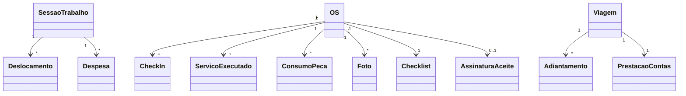

# Modelo de domínio — Módulo App do Técnico

> Entidades **específicas** do app. Transversais em `docs/comum/modelo-de-dominio.md`.

---

## Entidades

### Sessão de Trabalho (SessaoTrabalho)
- **Atributos obrigatórios:** id, tenant_id, tecnico_id, data, hora_inicio, hora_fim, status (aberta|encerrada).
- **Atributos opcionais:** observacoes.
- **Invariantes de agregado:** uma única sessão aberta por técnico por vez (constraint UNIQUE no banco; promover a `INV-NNN` no REGRAS-INEGOCIAVEIS se virar dor).
- **Ciclo de vida:** criada no primeiro check-in do dia; encerrada por ação ou auto-fechamento à meia-noite.

### Deslocamento
- **Atributos obrigatórios:** id, tenant_id, tecnico_id, os_id (opcional), origem_gps, destino_endereco, hora_inicio, hora_fim, distancia_km (opcional), status (em_andamento|pausado|concluido).
- **Atributos opcionais:** trajeto_polyline.
- **Invariantes:** pausa não conta no custo (regra de domínio do módulo; sem invariante crítica de plataforma).
- **Ciclo de vida:** inicia em "Iniciar deslocamento"; fecha em "Cheguei".

### CheckIn
- **Atributos obrigatórios:** id, tenant_id, tecnico_id, os_id, timestamp, gps_lat, gps_lng, distancia_endereco_m.
- **Atributos opcionais:** foto_url, justificativa_manual.
- **Ciclo de vida:** criado no toque "Cheguei"; imutável após criação.

### ServicoExecutado
- **Atributos obrigatórios:** id, tenant_id, os_id, servico_catalogo_id (ou descricao_livre), hora_inicio, hora_fim, tecnico_id.
- **Atributos opcionais:** observacoes.

### ConsumoPeca
- **Atributos obrigatórios:** id, tenant_id, os_id, peca_id, quantidade, veiculo_origem_id, timestamp.
- **Invariantes:** saldo do veículo não pode ficar negativo (CHECK no banco; regra de domínio).
- **Ciclo de vida:** baixa imediata no estoque do veículo (local); espelha no servidor pós-sync.

### SolicitacaoPeca
- **Atributos obrigatórios:** id, tenant_id, tecnico_id, peca_id, quantidade, os_id, prazo_desejado, status (solicitada|aceita|rejeitada|entregue).

### TransferenciaEstoque
- **Atributos obrigatórios:** id, tenant_id, veiculo_origem_id, veiculo_destino_id, peca_id, quantidade, hora_solicitacao, hora_aceite (opcional), status (pendente|aceita|recusada).

### Foto
- **Atributos obrigatórios:** id, tenant_id, os_id, categoria (antes|durante|depois|avaria), arquivo_url, timestamp, gps_lat, gps_lng.
- **Invariantes:** imutável após upload (`INV-001` — trilha WORM); EXIF preservado.

### Checklist (executado)
- **Atributos obrigatórios:** id, tenant_id, os_id, template_checklist_id, itens (json com {id, marcado, observacao}), status (parcial|completo).

### AssinaturaAceite
- **Atributos obrigatórios:** id, tenant_id, os_id, assinatura_imagem, nome_cliente, cpf_cliente, timestamp.
- **Invariantes:** NÃO é A3 ICP-Brasil — só aceite contratual com `INV-001` (WORM no aceite registrado). Ver ADR-0009 pra A3 do certificado de calibração regulado.

### Despesa
- **Atributos obrigatórios:** id, tenant_id, tecnico_id, categoria, valor, comprovante_url, viagem_id (opcional), os_id (opcional), timestamp.

### Adiantamento
- **Atributos obrigatórios:** id, tenant_id, tecnico_id, valor, justificativa, status (solicitado|aprovado|recusado|prestado_contas), aprovador_id (opcional).

### PrestacaoContas
- **Atributos obrigatórios:** id, tenant_id, tecnico_id, viagem_id, total_adiantamento, total_despesas, saldo (receber|devolver), status.

### MensagemChat
- **Atributos obrigatórios:** id, tenant_id, thread_id, autor_id, conteudo, timestamp, lida.

### OperacaoSyncPendente
- **Atributos obrigatórios:** id, tipo_operacao, payload_json, criada_em, tentativas, status (pendente|enviada|conflito|erro).
- **Ciclo de vida:** criada offline; removida ao sync com sucesso; vai pra "conflito" se servidor recusar.

---

## Agregados (DDD)

| Agregado raiz | Entidades incluídas | Invariantes |
|---|---|---|
| SessaoTrabalho | Deslocamento, CheckIn, Despesa do dia | Uma única sessão aberta por técnico |
| OS (em execução no app) | ServicoExecutado, ConsumoPeca, Foto, Checklist, AssinaturaAceite | OS só fecha com checklist obrigatório completo |
| Viagem | Adiantamento, PrestacaoContas, Despesas vinculadas | Saldo = adiantamento − despesas comprovadas |

---

## Value Objects

| VO | Definição | Imutável? |
|---|---|---|
| Coordenada | par {lat, lng, precisao_m} | Sim |
| Periodo | par {hora_inicio, hora_fim} | Sim |
| MontanteBRL | valor monetário com 2 casas | Sim |

---

## Eventos de domínio (publicados)

| Evento | Quando dispara | Payload | Quem consome |
|---|---|---|---|
| `AppTecnico.CheckInRealizado` | Técnico faz check-in | `{os_id, tecnico_id, gps, timestamp}` | OS, Agenda |
| `AppTecnico.OSExecutadaCampo` | OS fechada via app | `{os_id, servicos, pecas, fotos, assinatura}` | OS, Faturamento, Qualidade |
| `AppTecnico.PecaConsumida` | ConsumoPeca registrado | `{peca_id, qtd, veiculo_id, os_id}` | Estoque |
| `AppTecnico.PecaSolicitada` | Técnico solicita peça | `{peca_id, qtd, tecnico, prazo}` | Estoque, Coordenador |
| `AppTecnico.DespesaLancada` | Despesa registrada | `{tecnico_id, valor, categoria, viagem_id}` | Caixa do Técnico, Financeiro |
| `AppTecnico.AdiantamentoSolicitado` | Pedido criado | `{tecnico_id, valor, justificativa}` | Caixa do Técnico |
| `AppTecnico.ConflitoSyncEscalado` | Sync sem regra de merge | `{operacao, versao_local, versao_servidor}` | Coordenador |

---

## Comandos (entradas no módulo)

| Comando | Origem | Pré-condição | Pós-condição |
|---|---|---|---|
| `iniciarDeslocamento` | App UI | OS atribuída ao técnico | Deslocamento criado |
| `finalizarChegada` | App UI | Deslocamento em andamento | CheckIn criado, deslocamento concluído |
| `registrarConsumoPeca` | App UI | Saldo veículo ≥ qtd | ConsumoPeca + baixa estoque local |
| `solicitarPeca` | App UI | OS aberta | SolicitacaoPeca + push à base |
| `coletarAssinaturaAceite` | App UI | OS pronta pra fechar | AssinaturaAceite + PDF aceite |
| `lancarDespesa` | App UI | Sessão aberta | Despesa criada |
| `solicitarAdiantamento` | App UI | — | Adiantamento status=solicitado |
| `sincronizar` | Background scheduler | Conectividade | Fila processada / conflitos sinalizados |

---

## Schema físico

Ver `../schema-banco.md` (a criar) ou `../../../comum/schema-banco.md` quando comum.

## Diagramas

## Como este modelo evolui

- Entidade nova → verificar fronteira comum/módulo (`governanca-modelo-comum.md`).
- Atributo novo → migration + bump CHANGELOG.
- Entidade descontinuada → ADR + janela de migração.
