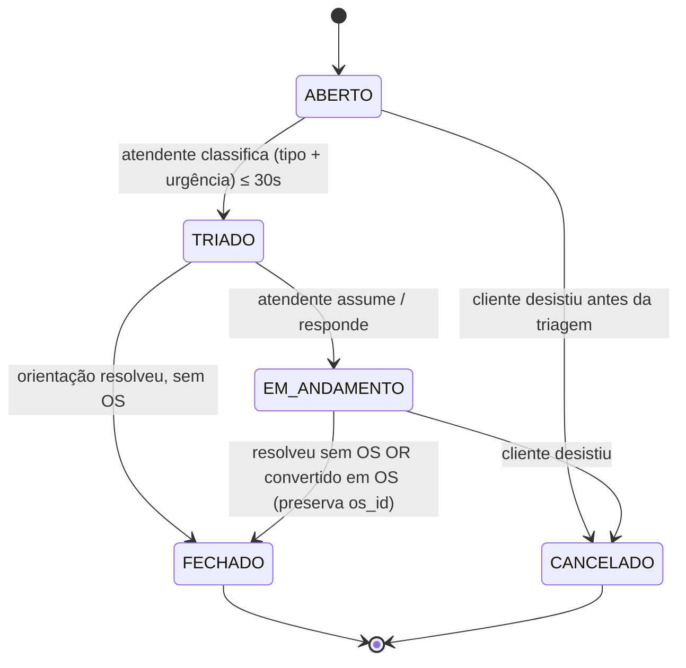

# Modelo de domínio — Módulo Chamados

> Cliente e Equipamento vivem em `docs/comum/modelo-de-dominio.md`. Hook valida não-duplicação.

---

## Entidades

### Chamado — agregado raiz

- **Atributos obrigatórios:** `id`, `tenant_id`, `canal_origem` (enum: whatsapp | telefone | portal | email | presencial), `cliente_id`, `texto_inicial`, `estado` (enum: ABERTO | TRIADO | EM_ANDAMENTO | FECHADO | CANCELADO), `criado_at`, `criado_por`.
- **Atributos opcionais:** `equipamento_id`, `tipo` (preenchido na triagem), `urgencia` (baixa | media | alta | critica), `sla_alvo_at`, `atribuido_a`, `os_id` (preenchido quando converte), `razao_fechamento`, `duplicado_de_id` (se humano marcou).
- **Invariantes:** RAT-08 (audit), LGPD RAT-03 (telefone do cliente é dado pessoal), regra de duplicação documental (não automática).

### MensagemDoChamado

- Histórico de interação (cliente↔atendente). Append-only.
- Atributos: `chamado_id`, `direcao` (entrada | saida), `canal`, `texto`, `at`, `autor_id`.

### EventoDoChamado (audit imutável)

- `chamado_id`, `evento_tipo`, `payload`, `at`, `ator_id`.

### SLAConfig (config por tenant)

- Tabela tenant × tipo × urgência → prazo (minutos para triagem, minutos para resolução).
- Mutável; mudança gera versão (snapshot no chamado preserva SLA original).

---

## Máquina de estados

**Regras:**
- Conversão em OS: estado vira FECHADO + `os_id` setado. Nova OS herda histórico via `os_origem_chamado_id`.
- FECHADO sem OS exige `razao_fechamento` ≠ null.
- CANCELADO exige razão.
- Transição reversa proibida.
- Audit em toda transição (RAT-08).

---

## Detecção de duplicados (regra crítica)

Função `detectar_duplicado(cliente_id, equipamento_id?, janela=7dias)`:
1. Busca chamados do mesmo cliente nos últimos 7 dias.
2. Se `equipamento_id` informado: filtra por mesmo equipamento.
3. Retorna lista ordenada por proximidade temporal.
4. **Nunca mescla sozinho.** UI mostra "Possível duplicado de #1234 (3 dias atrás). Confirma?" — humano decide.
5. Se humano confirma: novo chamado salvo com `duplicado_de_id`. Não apaga; apenas marca.

---

## Escalonamento de SLA

Job recorrente (1 min):
1. Pra cada chamado ≠ FECHADO/CANCELADO: calcula `% sla_consumido = (now - criado_at) / (sla_alvo_at - criado_at)`.
2. Se `% >= 75%` e não notificou ainda: envia notificação ao `atribuido_a`. Marca `notificado_75=true`.
3. Se `% >= 100%` e não escalou ainda: muda `atribuido_a` pro `gerente_operacional` (config do tenant) + notifica. Marca `escalado_100=true`. Não fecha automaticamente.

---

## Agregados

| Raiz | Inclui | Invariantes |
|---|---|---|
| Chamado | MensagemDoChamado, EventoDoChamado | RAT-08, RAT-03 |

## Value Objects

| VO | Definição | Imutável? |
|---|---|---|
| EstadoChamado | enum | Sim |
| CanalOrigem | enum (5) | Sim |
| Urgencia | enum (baixa, media, alta, critica) | Sim |
| SLAAlvo | timestamp calculado na triagem; snapshot no chamado | Sim |

## Eventos publicados

| Evento | Quando | Payload | Consumidores |
|---|---|---|---|
| `ChamadoAberto` | ABERTO criado | `{tenant_id, chamado_id, cliente_id, canal}` | crm (timeline) |
| `ChamadoTriado` | TRIADO setado | `{chamado_id, tipo, urgencia, sla_alvo_at}` | observabilidade |
| `ChamadoConvertidoEmOS` | FECHADO + `os_id` setado | `{chamado_id, os_id}` | os (cria com origem) |
| `ChamadoFechado` | FECHADO | `{chamado_id, razao, os_id?}` | crm |
| `ChamadoSLAEscalado` | escalonamento 100% | `{chamado_id, novo_atribuido}` | observabilidade |

## Comandos

| Comando | Pré | Pós |
|---|---|---|
| `abrirChamado` | cliente válido | ABERTO + evento |
| `triagem` | ABERTO | TRIADO + SLA calculado |
| `marcarDuplicado` | humano confirma | `duplicado_de_id` setado |
| `converterEmOS` | TRIADO/EM_ANDAMENTO | FECHADO + cria OS RASCUNHO |
| `fechar` | razão não-vazia | FECHADO |
| `cancelar` | razão | CANCELADO |

## Schema físico

Tabelas: `chamado`, `chamado_mensagem`, `chamado_evento`, `sla_config`.

## Como evolui

Atributo novo → migration. Mudança em máquina estados → ADR.
