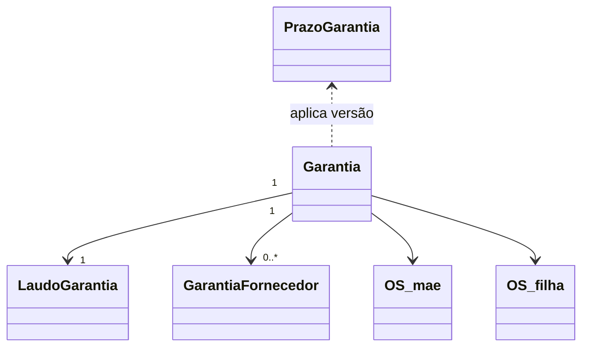

# Modelo de domínio — Módulo Garantia

> Entidades específicas. Transversais em `docs/comum/modelo-de-dominio.md`.

---

## Entidades

### PrazoGarantia
- **Atributos obrigatórios:** id, tenant_id, tipo (SERVIÇO | PEÇA | EQUIPAMENTO_VENDIDO), prazo_dias, vigente_de, vigente_ate (null = atual), criado_por, criado_em
- **Invariantes de agregado:** versionamento — mudança nunca retroage (`INV-026` análogo); prazo > 0
- **Ciclo de vida:** criada → vigente → substituída por nova versão → arquivada (nunca deletada — `INV-001`)

### Garantia (raiz)
- **Atributos obrigatórios:** id, tenant_id, tipo (SERVIÇO | PEÇA | EQUIPAMENTO_VENDIDO), os_mae_id (FK), os_filha_id (FK, null até abrir filha), peca_id (null se tipo SERVIÇO), equipamento_serial (null se não EQUIPAMENTO), prazo_dias_aplicado, data_limite, status (ABERTA | EM_ANALISE | PROCEDENTE | IMPROCEDENTE | PARCIAL | FECHADA), aberta_por, aberta_em
- **Invariantes:** `INV-001` (audit trail); data_limite = OS-mãe.concluida_em + prazo_dias_aplicado
- **Ciclo de vida:** ABERTA → EM_ANALISE → (PROCEDENTE | IMPROCEDENTE | PARCIAL) → FECHADA. Reabertura cria nova Garantia referenciando a anterior.

### LaudoGarantia
- **Atributos obrigatórios:** id, garantia_id, texto, anexos[], decisao (PROCEDENTE | IMPROCEDENTE | PARCIAL), parcela_cobravel_pct (0–100), causa_raiz_codigo, assinado_por, assinado_em, hash
- **Invariantes:** imutável após assinatura (`INV-001`); confidencialidade (`INV-013`)

### GarantiaFornecedor
- **Atributos obrigatórios:** id, garantia_id, fornecedor_id, peca_id, nota_remessa, data_envio, prazo_retorno, status (ENVIADA | RETORNADA | RESSARCIDA | EXPIRADA), valor_enviado, valor_ressarcido, observacao
- **Invariantes:** `INV-001`

### IndicadorReincidencia (entidade calculada / materialized view)
- **Atributos:** entidade_tipo (CLIENTE | TECNICO | PECA_MODELO | EQUIPAMENTO_SERIAL), entidade_id, qtd_procedentes_6m, ultima_atualizacao, flag_reincidente
- **Ciclo de vida:** recalculada por job; nunca editada à mão

---

## Agregados (DDD)

| Agregado raiz | Entidades incluídas | Invariantes |
|---|---|---|
| Garantia | Garantia, LaudoGarantia, GarantiaFornecedor | `INV-001`, `INV-013` |
| PrazoGarantia | PrazoGarantia (versionado) | `INV-026` análogo |

---

## Value Objects

| VO | Definição | Imutável? |
|---|---|---|
| PrazoAplicado | prazo_dias + tipo + versão-do-prazo | sim |
| DecisaoLaudo | enum + parcela_cobravel_pct | sim |
| CausaRaiz | código padronizado (DEFEITO_PECA, ERRO_MONTAGEM, MAU_USO_CLIENTE, FALHA_PROJETO, OUTRO) | sim |

---

## Eventos de domínio publicados

| Evento | Quando dispara | Payload | Quem consome |
|---|---|---|---|
| `Garantia.Aberta` | nova OS-filha vinculada | `{garantia_id, os_mae_id, os_filha_id, tipo}` | OS, Financeiro |
| `Garantia.Analisada` | laudo assinado | `{garantia_id, decisao, parcela_cobravel_pct}` | Financeiro |
| `Garantia.Procedente` | decisao = PROCEDENTE | `{garantia_id, custo}` | Financeiro (bloqueia cobrança), Reincidência |
| `Garantia.Improcedente` | decisao = IMPROCEDENTE | `{garantia_id}` | Financeiro (libera cobrança) |
| `Garantia.Parcial` | decisao = PARCIAL | `{garantia_id, parcela_cobravel_pct}` | Financeiro |
| `GarantiaFornecedor.Aberta` | peça enviada ao fornecedor | `{garantia_id, fornecedor_id, peca_id}` | Compras, Estoque |
| `GarantiaFornecedor.Retornada` | retorno do fornecedor registrado | `{garantia_id, valor_ressarcido}` | Financeiro |

---

## Comandos (entradas no módulo)

| Comando | Origem | Pré-condição | Pós-condição |
|---|---|---|---|
| cadastrarPrazoGarantia | UI gerente | tenant ativo; prazo > 0 | nova versão vigente |
| abrirGarantia | UI atendente / API | OS-mãe concluída; dentro do prazo (ou aprovação) | Garantia ABERTA + OS-filha vinculada bloqueada |
| iniciarAnalise | UI técnico | Garantia ABERTA | Garantia EM_ANALISE |
| registrarLaudo | UI técnico/metrologista | Garantia EM_ANALISE | LaudoGarantia + decisão + evento |
| desbloquearCobranca | UI gerente | Garantia PROCEDENTE; motivo obrigatório | flag financeira libera; audit log |
| abrirGarantiaFornecedor | UI comprador | peça substituída em garantia procedente | GarantiaFornecedor ENVIADA |
| registrarRetornoFornecedor | UI comprador | GarantiaFornecedor ENVIADA | status RETORNADA + valor_ressarcido |

---

## Schema físico

Ver `../schema-banco.md` quando criado, ou tabela conjunta com OS.

## Diagrama

## Como evolui

Entidade nova → verificar fronteira em `governanca-modelo-comum.md`. Atributo novo → migration + bump CHANGELOG.
