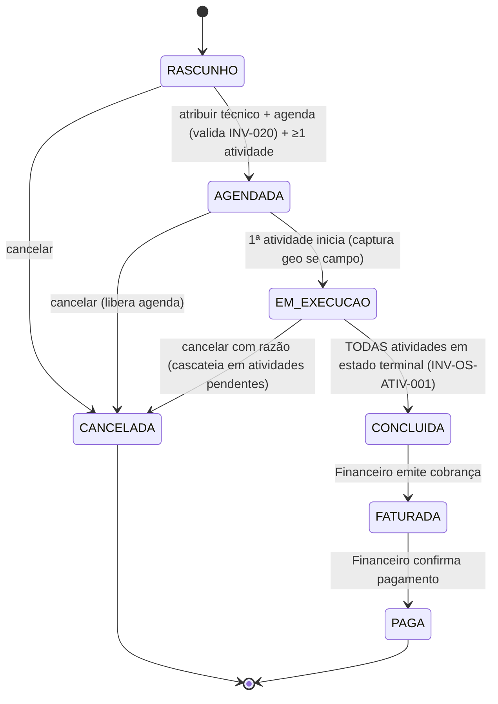
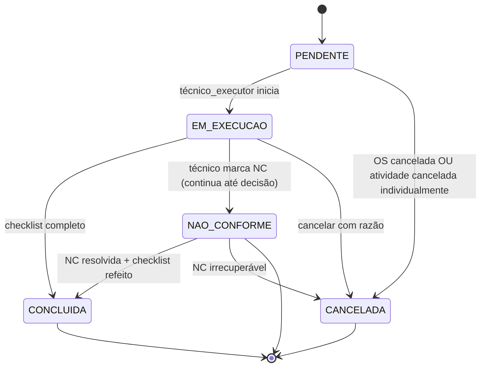

# Modelo de domínio — Módulo OS

> Entidades específicas do módulo. Cliente, Equipamento, Padrão, Técnico vivem em `docs/comum/modelo-de-dominio.md`. Hook valida não-duplicação.
>
> **Revisado em 2026-05-23 (ADR-0023):** modelo adotou "OS com Atividades" — OS continua container comercial/financeiro, mas o trabalho técnico se divide em N entidades `AtividadeDaOS` (cada uma com tipo + checklist + estado próprios). Ver `docs/adr/0023-os-com-atividades.md`.

---

## Entidades

### OS (Ordem de Serviço) — agregado raiz

- **Atributos obrigatórios:** `id` (uuid), `tenant_id`, `estado` (enum INV-027 — derivado das atividades), `cliente_id`, `equipamento_id`, `correlation_id` (uuid NOT NULL — raiz da cadeia forense; herdado do evento Orcamento.Aprovado quando aplicável, senão `= id`), `criada_at`, `criada_por`.
- **Atributos opcionais:** `tipo_predominante` (estatística cache; recalculada via trigger PG `os_tipo_predominante_recalc_trg` após INSERT/UPDATE/DELETE em `os_atividade` — algoritmo: tipo com maior contagem de atividades não-canceladas; empate vai pra ordem alfabética; um único `tipo` → vira `tipo_predominante`), `tecnico_atribuido_id` (responsável geral), `agendada_para`, `iniciada_at`, `concluida_at`, `cancelada_at`, `razao_cancelamento`, `os_origem_id` (reabertura), `nao_conformidade_global` (bool — TRUE se qualquer atividade marcou NC), `prazo_prometido`.
- **Invariantes:** `INV-027` (máquina de estados), `INV-020` (jornada UMC ao atribuir), `INV-012` (NC em atividade de calibração bloqueia certificado), `INV-026` (preço congelado na criação), `INV-OS-ATIV-001/002/003/004` (ADR-0023), RAT-08 (audit log).
- **Ciclo de vida:** criada como RASCUNHO; imutável após FATURADA exceto cancelamento.

### AtividadeDaOS — nova entidade (ADR-0023)

- **Atributos obrigatórios:** `id` (uuid), `tenant_id`, `os_id`, `tipo` (enum: `calibracao | manutencao_corretiva | manutencao_preventiva | instalacao | verificacao_inmetro | vistoria`), `estado_atividade` (enum: PENDENTE | EM_EXECUCAO | CONCLUIDA | NAO_CONFORME | CANCELADA), `sequencia` (int — ordem dentro da OS, ex: manutenção corretiva 1, calibração 2), `correlation_id` (uuid NOT NULL — herdado de `OS.correlation_id`), `criada_at`.
- **Atributos opcionais:** `tecnico_executor_id` (pode diferir entre atividades — metrologista calibra, mecânico conserta), `iniciada_at`, `concluida_at`, `razao_nao_conformidade`.
- **Relação reversa com módulo técnico (cravada em 2026-05-23 — NOVO-CRIT-1 rodada 2):** a FK fica no módulo técnico, não na AtividadeDaOS. Exemplo: `Calibracao.atividade_os_id` aponta pra `AtividadeDaOS.id`. Query reversa via `AtividadeDaOS.calibracao_set` (Django) ou JOIN explícito. **PROIBIDO** carregar `link_modulo_tecnico` na AtividadeDaOS — quebra INV-TENANT-001 (FK polimórfica sem validador de tenant) e duplica fonte de verdade.
- **Invariantes:** `INV-OS-ATIV-001..005`, `INV-TENANT-001` (herda da OS pai).
- **Imutável após** estado terminal (CONCLUIDA/CANCELADA).

### ItemDeOS

- Atributos: `os_id`, `atividade_id` (opcional — associa item a uma atividade específica; NULL = item da OS geral, ex: deslocamento), `descricao`, `quantidade`, `preco_unit_snapshot`, `tipo_item` (servico | peca | deslocamento).
- Imutável após OS CONCLUIDA.

### ChecklistDaAtividade (renomeado de ChecklistDeOS)

- Atributos: `atividade_id`, `tipo_item` (foto | assinatura | padrao_usado | peca_consumida | leitura), `valor`, `obrigatorio`, `preenchido_at`.
- **Regra: lista de obrigatórios depende de `AtividadeDaOS.tipo`** (calibração exige `padrao_usado` + `assinatura`; manutenção exige `peca_consumida` + `foto`).
- Bloqueia transição da ATIVIDADE de EM_EXECUCAO → CONCLUIDA se algum obrigatório vazio (não bloqueia a OS toda — outras atividades podem continuar).

### EventoDeOS (audit imutável WORM)

- **Atributos:** `id`, `tenant_id`, `os_id`, `atividade_id` (opcional — NULL quando é evento da OS toda), `evento_tipo`, `payload` (jsonb sanitizado por `sanitizar_payload_evento_os()` — INV-OS-AUD-001), `at`, `ator_id_hash` (HMAC-tenant, nunca UUID cru), `ip_hash` (HMAC-tenant), `geo_hash` (precisão limitada por INV-OS-GEO-001 — município/bairro), `correlation_id`, `causation_id`.
- **Append-only:** trigger PG `os_evento_anti_update_delete_trg` bloqueia UPDATE/DELETE; tabela `# audit-immutability` declarada.
- **Sanitização na escrita:** payload passa por `sanitizar_payload_evento_os()` ANTES do INSERT — proibido `cliente_id`/`tecnico_id` UUID cru, `razao_*` texto livre cru, `geo` precisão alta. Defesa em profundidade: leitura também sanitiza (bug-classe `sanitizar_payload_audit` 2026-05-19).
- **Retenção:** 25 anos quando vinculado a atividade `calibracao` ou certificado emitido; 5 anos caso contrário (RAT-08 + matriz retenção).
- **Invariantes:** RAT-08, INV-001, INV-AUTHZ-002, INV-OS-AUD-001, INV-OS-GEO-001.

### DelegacaoExecucao (INV-OS-ATIV-005(a) — NOVO-ALTO-3 R2)

> Adicionada em 2026-05-23 (Onda 7B). INV-OS-ATIV-005(a) exige "delegação só explícita com audit"; sem entidade, hook trava ou libera tudo. Cobre: atendente preenche checklist por técnico ausente (caso BCT comum em laboratórios pequenos) com rastro completo.

- **Atributos obrigatórios:** `id` (uuid), `tenant_id`, `atividade_id` (FK AtividadeDaOS), `tecnico_executor_original_id` (FK Usuario — quem deveria executar), `delegado_para_usuario_id` (FK Usuario — quem efetivamente executa), `delegado_por_usuario_id` (FK Usuario — gerente ou admin que autoriza), `motivo` (≥30 chars, anti-PII via INV-OS-TXT-001), `delegada_em` (timestamp UTC), `correlation_id`.
- **Imutável após INSERT** — trigger PG BLOCK UPDATE/DELETE.
- **Restrição:** quando atividade `tipo IN (calibracao, verificacao_inmetro)`, delegação só permitida se `delegado_para_usuario_id` tem competência ativa para a grandeza (INV-CAL-RT-001 + ADR-0022). Outras delegações livres.
- **Bypass de INV-OS-ATIV-005(a):** servidor permite `concluirAtividade` quando existe `DelegacaoExecucao` ativa onde `delegado_para = sessao.usuario.id`. Audit `EventoDeOS.tipo=atividade_concluida_via_delegacao`.

### TipoAtividadeConfig (tabela tipo → exige_aceite — NOVO-ALTO-2 R2)

> Adicionada em 2026-05-23 (Onda 7B). US-OS-004 AC-1 fala "aceite quando exigido pelo tipo" sem tabela. Sem isso, tipo novo entra em produção sem aceite Lei 14.063.

- Tabela **estática versionada** (não-tenant — comum a todos os tenants): `{ tipo, exige_aceite_cliente, requer_competencia_rt, requer_foto, requer_padrao_usado, exige_certificado_emitido, descricao }`.
- Valores Marco 3 cravados:

| tipo | exige_aceite_cliente | requer_competencia_rt | requer_foto | requer_padrao_usado | exige_certificado_emitido |
|---|---|---|---|---|---|
| calibracao | true | true | false (cliente pode dispensar — TEMA-D.9) | true | true |
| manutencao_corretiva | true | false | true | false | false |
| manutencao_preventiva | true | false | true | false | false |
| instalacao | true | false | true | false | false |
| verificacao_inmetro | true | true (RT INMETRO credenciado) | true | true | false (laudo, não cert) |
| vistoria | true | false (mas RT credenciado em vistoria recomendado) | true | false | false (laudo) |

- Mudar valor exige ADR + migration.
- Aplicação: `concluirAtividade` consulta `TipoAtividadeConfig.exige_aceite_cliente` → se true, `AceiteAtividade` obrigatório no checklist; senão opcional.

### AceiteAtividade (Lei 14.063/2020 + LGPD art. 7º V + art. 11 II "g")

> Nova entidade — TEMA-D.3 da auditoria 10 lentes. Garante aceite versionado + hash de texto + IP + carimbo tempo, necessário pra assinatura eletrônica simples ter valor jurídico (Lei 14.063 art. 4º).
>
> **Revisado em 2026-05-23 (NOVO-CRIT-2 + NOVO-CRIT-3 rodada 2):** texto canônico v1.0 existe em `docs/conformidade/comum/termos/aceite-atividade-v1.0.md` (CRT-2 fechado); `assinatura_base64` reclassificada como biometria sensível LGPD art. 11 — cifrada com chave KMS dedicada `BIOMETRIA_KEY_*` (CRT-3 fechado via INV-OS-ACEITE-BIO-001 + DPIA `docs/conformidade/comum/dpia-assinatura-touch.md`).

- **Atributos obrigatórios:** `id` (uuid), `tenant_id`, `atividade_id` (FK AtividadeDaOS, 1:1), `versao_termo` (string — ex: `v1.0-2026-05-23` apontando para arquivo versionado), `hash_texto_termo` (32 bytes SHA-256 sobre corpo canonicalizado pelo ADR-0029), `metodo_assinatura` (enum: `touch` | `A1` | `A3` | `presencial_atendente`), `aceito_em` (timestamp UTC), `ip_hash` (HMAC-tenant — IP cleartext NUNCA persiste fora do request scope), `correlation_id`.
- **Atributos opcionais:** `assinatura_cifrada_bytea` (touch — cifrada com `BIOMETRIA_KEY_<tenant_id>`, NUNCA em claro); `assinatura_metadata_jsonb` (touch — `{n_pontos, bbox_area, hash_contexto, capturada_em}` para auditoria sem revelar traçado); `certificado_subject_cn_hash` (A1/A3 — HMAC-tenant); `certificado_emissor_hash` (A1/A3 — HMAC-tenant); `geo_hash` (município/bairro — INV-OS-GEO-001).
- **Imutável após INSERT:** trigger PG bloqueia UPDATE/DELETE.
- **Texto canônico v1.0:** `docs/conformidade/comum/termos/aceite-atividade-v1.0.md` (corpo entre `<<<CORPO INICIO>>>` e `<<<CORPO FIM>>>`); canonicalização determinística por ADR-0029.
- **Validações server-side:**
  - se `metodo_assinatura=A3`: INV-CER-FRAUD-A3-001 (`certificado.subject_cn.cpf == sessao.usuario.cpf`).
  - se `metodo_assinatura=touch`: INV-OS-ACEITE-BIO-001 — `len(trajetoria_pontos) ≥ 8` + bounding box ≥ 30×20px + cifragem `BIOMETRIA_KEY_*` + watermark com `hash_contexto`.
  - `hash_texto_termo` recalculado server-side a partir do arquivo versionado; cliente NÃO controla o hash.
- **Invariantes:** Lei 14.063 art. 4º, LGPD art. 11 II "g" + "a", INV-CER-FRAUD-A3-001, INV-OS-ACEITE-BIO-001, INV-OS-AUD-001, INV-DOC-CANON-001.

---

## RLS e isolamento multi-tenant (INV-TENANT-003 + INV-AUTHZ-003)

> Adicionado em 2026-05-23 — TEMA-C.1 da auditoria 10 lentes. Toda migration que cria essas tabelas obriga policy RLS na mesma migration (hook `migration-rls-check.sh` valida).

| Tabela | Coluna tenant | Policy SELECT | Policy INSERT | Policy UPDATE | Policy DELETE |
|---|---|---|---|---|---|
| `os` | `tenant_id` | `USING (tenant_id::text = ANY(string_to_array(current_setting('app.tenant_ids'), ',')))` | mesma | mesma | mesma |
| `os_atividade` | `tenant_id` (herdado da OS — INV-OS-ATIV-002) | mesma policy | mesma | mesma | mesma |
| `os_item` | `tenant_id` | mesma policy | mesma | mesma | mesma |
| `os_checklist_atividade` | `tenant_id` (via atividade) | mesma policy | mesma | mesma | mesma |
| `os_evento` | `tenant_id` | mesma policy | mesma | trigger BLOCK UPDATE | trigger BLOCK DELETE |
| `os_aceite_atividade` | `tenant_id` | mesma policy | mesma | trigger BLOCK UPDATE (imutável) | trigger BLOCK DELETE |

**Role `app_user`:** `NOBYPASSRLS` + `NOSUPERUSER` (INV-TENANT-004 preservado).
**Middleware Django** seta `SET LOCAL app.tenant_ids = '<uuid1>,<uuid2>,...'` em toda request (lista mesmo pra usuário com 1 tenant — INV-AUTHZ-003).
**Cross-tenant em FKs reversas pra atividade** (`Calibracao.atividade_os_id`, futuro `Manutencao.atividade_os_id`, etc.) bloqueado por INV-OS-ATIV-005 (a) trigger PG validando `modulo_tecnico.tenant_id == atividade.tenant_id` em INSERT/UPDATE; (b) hook `port-binding-validator.sh` valida em código. **Não existe `link_modulo_tecnico` na AtividadeDaOS** — a FK fica no módulo técnico (decisão NOVO-CRIT-1 rodada 2 — ver §AtividadeDaOS).

---

## Máquina de estados (INV-027) — CRÍTICA

### Estados da OS (derivados das atividades)

### Estados da AtividadeDaOS

**Regras invioláveis:**

- Transição reversa **proibida** em ambas as máquinas. Hook bloqueia.
- **Reabertura NÃO volta o estado:** cria nova OS (`os_origem_id` aponta a antiga). OS antiga permanece CONCLUIDA/FATURADA/PAGA. Wave B avalia reabertura granular por atividade.
- **OS só vai pra CONCLUIDA quando TODAS as atividades estão em estado terminal** (INV-OS-ATIV-001).
- Atividade CONCLUIDA com NC marca `os.nao_conformidade_global=TRUE` e bloqueia emissão de certificado se atividade tipo=calibracao (INV-012).
- CANCELADA exige `razao_cancelamento` não-nula. Cancelar OS cascateia em atividades PENDENTE/EM_EXECUCAO.
- Toda transição (OS e atividade) grava `EventoDeOS` (RAT-08).

---

## Agregados

| Agregado raiz | Inclui | Invariantes |
|---|---|---|
| OS | AtividadeDaOS, ItemDeOS, ChecklistDaAtividade, EventoDeOS | INV-027, INV-012, INV-020, INV-026, INV-OS-ATIV-001..004 |

## Value Objects

| VO | Definição | Imutável? |
|---|---|---|
| EstadoOS | enum INV-027 (6 valores) | Sim |
| EstadoAtividade | enum (5 valores — PENDENTE/EM_EXECUCAO/CONCLUIDA/NAO_CONFORME/CANCELADA) | Sim |
| TipoAtividade | enum (6 tipos — calibracao + manutencao_corretiva + manutencao_preventiva + instalacao + verificacao_inmetro + vistoria) | Sim |
| Geolocalizacao | {lat, long, precisao, capturada_at} | Sim |

---

## Eventos publicados

Schemas detalhados em `docs/comum/integracoes-inter-modulos.md`.

### Eventos de OS

| Evento | Quando | Payload (resumo) | Consumidores |
|---|---|---|---|
| `OSAberta` | RASCUNHO criada | `{tenant_id, os_id, cliente_id, atividades_planejadas: [{tipo, sequencia}], abertura_at}` | crm, mobile.sync |
| `OSAtribuida` | tecnico_atribuido_id setado | `{tenant_id, os_id, tecnico_id, atribuicao_at}` | mobile.sync, agenda |
| `OSConcluida` | transição CONCLUIDA (todas atividades terminais) | `{tenant_id, os_id, conclusao_at, tipo_predominante, tem_nc, atividades: [{id, tipo, estado_final}]}` | crm, financeiro |
| `OSCancelada` | transição CANCELADA | `{tenant_id, os_id, razao, cancelamento_at}` | financeiro, crm, agenda |

### Eventos de AtividadeDaOS (novos — ADR-0023)

| Evento | Quando | Payload (resumo) | Consumidores |
|---|---|---|---|
| `AtividadeIniciada` | PENDENTE → EM_EXECUCAO | `{tenant_id, os_id, atividade_id, tipo, tecnico_executor_id, iniciada_at}` | calibracao (se tipo=calibracao), manutencao, mobile.sync |
| `AtividadeConcluida` | EM_EXECUCAO → CONCLUIDA | `{tenant_id, os_id, atividade_id, tipo, conclusao_at, tem_nc, link_modulo_tecnico}` | certificados (se tipo=calibracao e tem_nc=False), financeiro |
| `AtividadeNaoConforme` | EM_EXECUCAO → NAO_CONFORME | `{tenant_id, os_id, atividade_id, tipo, razao_nao_conformidade, marcada_at}` | qualidade (CAPA), crm, certificados (bloqueia emissão) |

---

## Comandos

| Comando | Origem | Pré-condição | Pós-condição |
|---|---|---|---|
| `abrirOS` | API / Comercial (orçamento aprovado) | tenant ativo, cliente válido | OS em RASCUNHO + N atividades em PENDENTE + evento `OSAberta` |
| `adicionarAtividade` | API / UI atendente | OS em RASCUNHO/AGENDADA | nova atividade em PENDENTE |
| `atribuirTecnico` | API / UI gerente | OS em RASCUNHO, agenda valida INV-020 | OS em AGENDADA + evento `OSAtribuida` |
| `iniciarAtividade` | App mobile técnico executor | atividade em PENDENTE, OS em AGENDADA, técnico = executor | atividade em EM_EXECUCAO + evento `AtividadeIniciada` + OS migra pra EM_EXECUCAO se 1ª |
| `concluirAtividade` | App mobile | atividade em EM_EXECUCAO, checklist completo | atividade em CONCLUIDA + evento `AtividadeConcluida` + OS migra pra CONCLUIDA se todas terminais |
| `marcarNaoConformidadeAtividade` | App mobile / RT | atividade em EM_EXECUCAO | atividade em NAO_CONFORME + evento `AtividadeNaoConforme` |
| `cancelarOS` | API / UI | razão preenchida, estado ≠ FATURADA/PAGA | OS em CANCELADA + cascateia atividades PENDENTE/EM_EXECUCAO + evento `OSCancelada` |
| `reabrirOS` | UI gerente | OS em CONCLUIDA/FATURADA/PAGA | **nova OS** criada com `os_origem_id` + atividades clonadas |

---

## Schema físico

Ver `../schema-banco.md` quando definido. Tabelas:

- `os` (agregado raiz)
- `os_atividade` (ADR-0023)
- `os_item` (com FK opcional pra `os_atividade.id`)
- `os_checklist_atividade` (renomeado de `os_checklist`)
- `os_evento` (com `atividade_id` opcional)

## Como evolui

Atributo novo → migration + bump CHANGELOG. Mudança em máquina de estados (OS ou AtividadeDaOS) → ADR + INV-027 atualizado. Tipo novo de atividade → ADR (INV-OS-ATIV-003).
