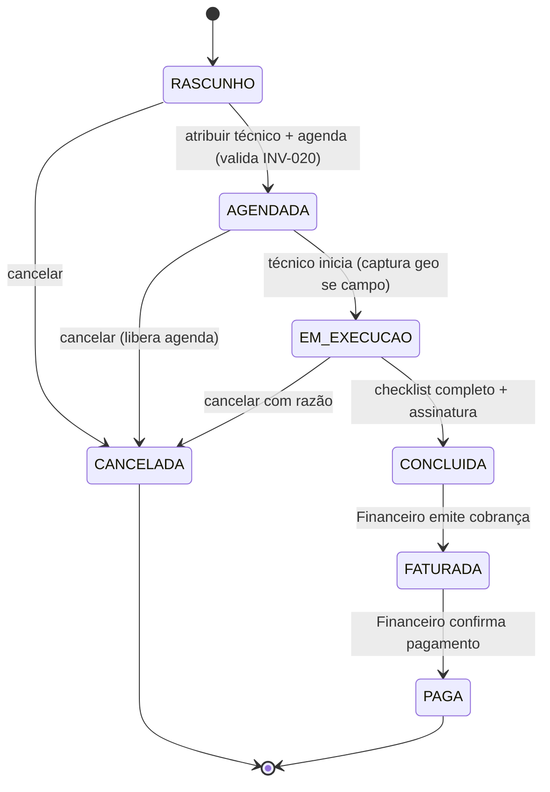

# Modelo de domínio — Módulo OS

> Entidades específicas do módulo. Cliente, Equipamento, Padrão, Técnico vivem em `docs/comum/modelo-de-dominio.md`. Hook valida não-duplicação.

---

## Entidades

### OS (Ordem de Serviço) — agregado raiz

- **Atributos obrigatórios:** `id` (uuid), `tenant_id`, `tipo` (enum: calibracao | manutencao | instalacao | verificacao_inmetro | vistoria), `estado` (enum INV-027), `cliente_id`, `equipamento_id`, `criada_at`, `criada_por`.
- **Atributos opcionais:** `tecnico_atribuido_id`, `agendada_para`, `iniciada_at`, `concluida_at`, `cancelada_at`, `razao_cancelamento`, `os_origem_id` (reabertura), `nao_conformidade` (bool), `prazo_prometido`.
- **Invariantes:** `INV-027` (máquina de estados), `INV-020` (jornada UMC ao atribuir), `INV-012` (NC bloqueia certificado), `INV-026` (preço congelado na criação), RAT-08 (audit log).
- **Ciclo de vida:** criada como RASCUNHO; imutável após FATURADA exceto cancelamento.

### ItemDeOS

- Atributos: `os_id`, `descricao`, `quantidade`, `preco_unit_snapshot`, `tipo_item` (servico | peca | deslocamento).
- Imutável após OS CONCLUIDA.

### ChecklistDeOS

- Atributos: `os_id`, `tipo_item` (foto | assinatura | padrao_usado | peca_consumida | leitura), `valor`, `obrigatorio`, `preenchido_at`.
- Regra: lista de obrigatórios depende de `OS.tipo` (calibração exige `padrao_usado` + `assinatura`; manutenção exige `peca_consumida` + `foto`).
- Bloqueia transição EM_EXECUCAO → CONCLUIDA se algum obrigatório vazio.

### EventoDeOS (audit imutável)

- Atributos: `os_id`, `evento_tipo`, `payload`, `at`, `ator_id`, `geo` (opt-in).
- Append-only. Cobre RAT-08.

---

## Máquina de estados (INV-027) — CRÍTICA

**Regras invioláveis:**
- Transição reversa **proibida**. Hook bloqueia.
- **Reabertura NÃO volta o estado:** cria nova OS (`os_origem_id` aponta a antiga). OS antiga permanece CONCLUIDA/FATURADA/PAGA.
- CONCLUIDA com NC dispara evento mas **bloqueia** emissão de certificado em Metrologia (INV-012).
- CANCELADA exige `razao_cancelamento` não-nula.
- Toda transição grava `EventoDeOS` (RAT-08).

---

## Agregados

| Agregado raiz | Inclui | Invariantes |
|---|---|---|
| OS | ItemDeOS, ChecklistDeOS, EventoDeOS | INV-027, INV-012, INV-020, INV-026 |

## Value Objects

| VO | Definição | Imutável? |
|---|---|---|
| EstadoOS | enum INV-027 | Sim |
| TipoOS | enum (5 tipos) | Sim |
| Geolocalizacao | {lat, long, precisao, capturada_at} | Sim |

---

## Eventos publicados

Schemas detalhados em `docs/comum/integracoes-inter-modulos.md`.

| Evento | Quando | Payload (resumo) | Consumidores |
|---|---|---|---|
| `OSAberta` | RASCUNHO criada | `{tenant_id, os_id, cliente_id, tipo, abertura_at}` | crm, mobile.sync |
| `OSAtribuida` | tecnico_atribuido_id setado | `{tenant_id, os_id, tecnico_id, atribuicao_at}` | mobile.sync, agenda |
| `OSConcluida` | transição CONCLUIDA | `{tenant_id, os_id, conclusao_at, tipo, tem_nc}` | calibracao, crm, financeiro |
| `OSCancelada` | transição CANCELADA | `{tenant_id, os_id, razao, cancelamento_at}` | financeiro, crm, agenda |

---

## Comandos

| Comando | Origem | Pré-condição | Pós-condição |
|---|---|---|---|
| `abrirOS` | API / Comercial (orçamento aprovado) | tenant ativo, cliente válido | OS em RASCUNHO + evento `OSAberta` |
| `atribuirTecnico` | API / UI gerente | OS em RASCUNHO, agenda valida INV-020 | OS em AGENDADA + evento `OSAtribuida` |
| `iniciarExecucao` | App mobile técnico | OS em AGENDADA, técnico = atribuído | OS em EM_EXECUCAO + geo capturada |
| `concluirOS` | App mobile | checklist completo, assinatura ok | OS em CONCLUIDA + evento `OSConcluida` |
| `cancelarOS` | API / UI | razão preenchida, estado ≠ FATURADA/PAGA | OS em CANCELADA + evento `OSCancelada` |
| `reabrirOS` | UI gerente | OS em CONCLUIDA/FATURADA/PAGA | **nova OS** criada com `os_origem_id` |

---

## Schema físico

Ver `../schema-banco.md` quando definido. Tabelas: `os`, `os_item`, `os_checklist`, `os_evento`.

## Como evolui

Atributo novo → migration + bump CHANGELOG. Mudança em máquina de estados → ADR + INV-027 atualizado.
