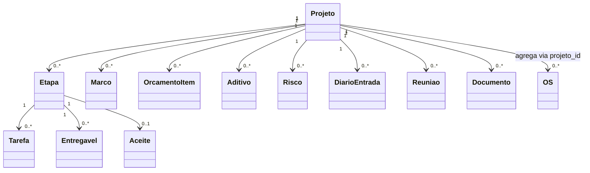

# Modelo de domínio — Módulo Gestão de Projetos

> Específicos. Transversais em `docs/comum/modelo-de-dominio.md`.

---

## Entidades

### Projeto (agregado raiz)
- **Obrigatórios:** id, tenant_id, codigo (humano, único por tenant), nome, cliente_id (FK CRM), responsavel_id, status (PLANEJADO | EM_EXECUCAO | PAUSADO | CONCLUIDO | CANCELADO), data_inicio_prevista, data_fim_prevista, orcamento_previsto, receita_prevista, criado_em, criado_por
- **Opcionais:** data_inicio_real, data_fim_real, descricao_escopo, observacoes
- **Invariantes:** `INV-001`, `INV-TENANT-001`; status segue máquina de estados; data_fim_prevista ≥ data_inicio_prevista
- **Ciclo:** PLANEJADO → EM_EXECUCAO → (PAUSADO ↔ EM_EXECUCAO) → CONCLUIDO ou CANCELADO

### Etapa
- **Obrigatórios:** id, projeto_id, ordem, nome, responsavel_id, data_prev_inicio, data_prev_fim, status (NAO_INICIADA | EM_EXECUCAO | CONCLUIDA | CANCELADA), pct_concluido, marco_de_faturamento (bool), valor_faturamento (se marco)
- **Opcionais:** data_real_inicio, data_real_fim, descricao
- **Invariantes:** ordem única dentro do projeto; pct_concluido 0–100

### Tarefa
- **Obrigatórios:** id, etapa_id, nome, responsavel_id, prazo, status, pct_concluido
- **Opcionais:** dependencias[] (FK outras tarefas), observacoes

### Marco
- **Obrigatórios:** id, projeto_id, etapa_id (null se marco geral), nome, data_prevista, tipo (ENTREGA | FATURAMENTO | DECISAO), atingido (bool), data_atingido
- **Invariantes:** evento `Marco.Atingido` quando atingido=true

### OrcamentoItem
- **Obrigatórios:** id, projeto_id, etapa_id (opcional), categoria (MAO_OBRA | PECA | SERVICO | DESLOCAMENTO | OUTRO), descricao, valor_previsto, valor_realizado (calculado)
- **Invariantes:** valor_realizado agregado de OS, Compras e Estoque vinculados

### Aditivo
- **Obrigatórios:** id, projeto_id, versao, motivo, alteracao_escopo (texto), alteracao_prazo_dias (int, pode ser negativo), alteracao_valor, status (PROPOSTO | APROVADO | REJEITADO), proposto_em, proposto_por, aprovado_em, aprovado_por
- **Invariantes:** versão sequencial; `INV-026` análogo — não retroage; muda data_fim_prevista e orçamento ao aprovar

### Risco
- **Obrigatórios:** id, projeto_id, descricao, probabilidade (1–5), impacto (1–5), nivel (calculado = prob × imp), categoria, plano_mitigacao, responsavel_id, prazo, status (ABERTO | MITIGADO | MATERIALIZADO | ENCERRADO)
- **Opcionais:** ocorrencias[] (link a entradas de diário)

### DiarioEntrada
- **Obrigatórios:** id, projeto_id, data, autor_id, texto, anexos[], hash
- **Invariantes:** imutável após gravação (`INV-001`)

### Reuniao
- **Obrigatórios:** id, projeto_id, data, participantes[], pauta, ata, decisoes[], proximos_passos[]
- **Opcionais:** anexos[]

### Documento
- **Obrigatórios:** id, projeto_id, tipo (CONTRATO | PLANTA | ATA | RELATORIO | OUTRO), nome, versao, arquivo_uri, subiu_em, subiu_por
- **Opcionais:** descricao
- **Invariantes:** versão sequencial; nunca sobrescreve (`INV-001`)

### Entregavel
- **Obrigatórios:** id, etapa_id, descricao, status (PENDENTE | ENTREGUE | ACEITO | REJEITADO), data_entrega, data_aceite
- **Opcionais:** evidencias_uri[]

### Aceite
- **Obrigatórios:** id, etapa_id, cliente_representante (nome+cpf), data_aceite, evidencia (assinatura digital opcional, hash), observacoes
- **Invariantes:** imutável (`INV-001`); habilita faturamento da etapa

---

## Agregados

| Raiz | Inclui | Invariantes |
|---|---|---|
| Projeto | Projeto, Etapa, Tarefa, Marco, OrcamentoItem, Aditivo, Risco, DiarioEntrada, Reuniao, Documento, Entregavel, Aceite | `INV-001`, `INV-TENANT-001`, `INV-026` análogo |

---

## Value Objects

| VO | Definição | Imutável? |
|---|---|---|
| Janela | data_inicio + data_fim | sim |
| NivelRisco | enum (BAIXO | MEDIO | ALTO | CRITICO) calculado de prob×imp | sim |
| Categoria orçamento | enum 5 valores | sim |

---

## Eventos publicados

| Evento | Quando | Payload | Consome |
|---|---|---|---|
| `Projeto.Aberto` | criação | `{projeto_id, cliente_id}` | CRM, Financeiro |
| `Projeto.Concluido` | status=CONCLUIDO | `{projeto_id, margem_final}` | Financeiro, Comercial |
| `Etapa.Concluida` | status=CONCLUIDA | `{projeto_id, etapa_id, marco_de_faturamento}` | Financeiro (se marco) |
| `Marco.Atingido` | atingido=true | `{marco_id, tipo, valor_faturamento}` | Financeiro |
| `Aditivo.Aprovado` | status=APROVADO | `{aditivo_id, valor, prazo_dias}` | Financeiro, CRM, Comercial |
| `Risco.Materializado` | status=MATERIALIZADO | `{risco_id, projeto_id}` | Governança/QA |

## Comandos

| Comando | Origem | Pré | Pós |
|---|---|---|---|
| criarProjeto | UI/API | cliente ativo | Projeto PLANEJADO |
| iniciarProjeto | UI | PLANEJADO | EM_EXECUCAO |
| pausarProjeto | UI | EM_EXECUCAO | PAUSADO + motivo |
| concluirProjeto | UI | todas etapas CONCLUIDA + aceites | CONCLUIDO |
| criarEtapa | UI | projeto não CONCLUIDO | Etapa NAO_INICIADA |
| vincularOSaProjeto | API OS | projeto EM_EXECUCAO | OS marcada |
| proporAditivo | UI | EM_EXECUCAO | Aditivo PROPOSTO |
| aprovarAditivo | UI gerente/dono | Aditivo PROPOSTO | APROVADO + recálculo orçamento |
| registrarAceiteEtapa | UI | Etapa CONCLUIDA | Aceite + faturamento habilitado |
| registrarRisco | UI | qualquer status (≠ CANCELADO) | Risco ABERTO |
| registrarDiarioEntrada | UI/mobile | EM_EXECUCAO ou PAUSADO | DiarioEntrada imutável |

---

## Schema físico

Ver `../schema-banco.md` (a criar). Projeto é container; tabelas filhas todas com FK projeto_id NOT NULL.

## Diagrama

## Como evolui

Entidade nova → verificar fronteira em `governanca-modelo-comum.md`. Atributo novo → migration + bump CHANGELOG.
