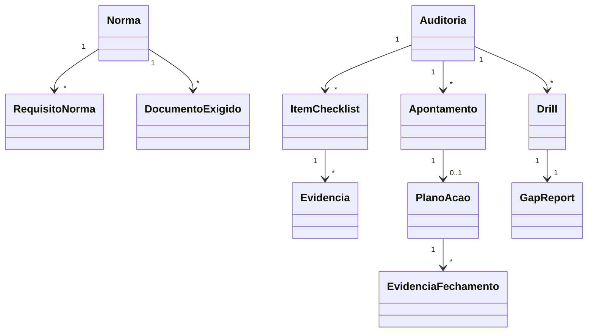

# Modelo de domínio — Módulo Auditoria Externa

> Entidades **específicas** do módulo. Transversais em `docs/comum/modelo-de-dominio.md`.

---

## Entidades

### Norma
- **Atributos obrigatórios:** id, tenant_id (ou global se norma pública), codigo (ex: "ISO/IEC 17025:2017"), nome_completo, versao_ano, ativa.
- **Atributos opcionais:** url_oficial.
- **Ciclo de vida:** criada por seed (normas públicas) ou pelo tenant (normas customizadas/cliente).

### RequisitoNorma
- **Atributos obrigatórios:** id, norma_id, codigo_clausula (ex: "7.5.3"), titulo, descricao_pt_br, criticidade (alta|media|baixa).
- **Ciclo de vida:** criado por seed ou pelo tenant em normas customizadas.

### Auditoria
- **Atributos obrigatórios:** id, tenant_id, norma_id, organismo (CGCRE|certificadora|cliente|outro), nome_organismo, data_inicio, data_fim, escopo, responsavel_geral_id, status (planejada|em_andamento|concluida|cancelada).
- **Atributos opcionais:** observacoes.
- **Invariantes:** uma auditoria com status concluida não pode ser alterada exceto pra registrar follow-up (`INV-001` — WORM; follow-up cria nova versão).
- **Ciclo de vida:** planejada → em_andamento → concluida; ou cancelada.

### ItemChecklist
- **Atributos obrigatórios:** id, auditoria_id, requisito_norma_id (ou descricao_customizada), responsavel_id, prazo_entrega, status (pendente|em_andamento|completo|nao_aplicavel).
- **Ciclo de vida:** copiado do template ao criar auditoria; pode ser adicionado ad-hoc.

### Evidencia
- **Atributos obrigatórios:** id, tenant_id, item_checklist_id, tipo (arquivo|link_doc_controlado|registro_sistema), referencia (url ou doc_id), autor_id, timestamp, versao_doc_quando_anexada.
- **Atributos opcionais:** observacoes.
- **Invariantes:** evidência imutável após auditoria concluída (`INV-001` — WORM); se doc controlado for atualizado, sistema sinaliza desatualizada.

### Apontamento
- **Atributos obrigatórios:** id, auditoria_id, tipo (nc_maior|nc_menor|observacao|oportunidade), descricao, requisito_norma_id, evidencia_apresentada_id, registrado_por, timestamp_registro.
- **Atributos opcionais:** foto_url.
- **Ciclo de vida:** aberto durante auditoria; fechado quando plano de ação concluído.

### PlanoAcao
- **Atributos obrigatórios:** id, apontamento_id, causa_raiz, metodo_causa_raiz (5_porquês|ishikawa|outro), acao_corretiva, responsavel_id, prazo, status (aberto|em_andamento|aguardando_aprovacao|fechado|atrasado).
- **Atributos opcionais:** acao_preventiva.
- **Invariantes:** NC maior obriga causa raiz por 5-porquês (regra de domínio + ISO 17025 cl. 8.7; `INV-012` — NC bloqueia emissão até resolução documentada).

### EvidenciaFechamento
- **Atributos obrigatórios:** id, plano_acao_id, descricao, arquivo_url, anexada_por, timestamp, aprovada_por (opcional), aprovada_em (opcional).

### DocumentoExigido
- **Atributos obrigatórios:** id, tenant_id, norma_id, codigo (referência cláusula), titulo, doc_controlado_id (link ao módulo Qualidade), responsavel_id, validade_meses, status (vigente|vencido|em_revisao).

### Drill (SimulacaoAuditoria)
- **Atributos obrigatórios:** id, auditoria_real_id (referencia), auditor_simulado_id (pessoa ou agente), data_execucao, status.
- **Ciclo de vida:** cópia do checklist da auditoria real marcada como simulação; gera "GapReport".

### GapReport
- **Atributos obrigatórios:** id, drill_id, lista_gaps (json), criado_em.

### MatrizConformidade (view/computado)
- Não persistida — view calculada por: para cada (norma, requisito) → último ItemChecklist + status evidência.

---

## Agregados (DDD)

| Agregado raiz | Entidades incluídas | Invariantes |
|---|---|---|
| Auditoria | ItemChecklist, Apontamento, PlanoAcao (via apontamento), Evidencia | Auditoria concluída é imutável |
| PlanoAcao | EvidenciaFechamento | NC maior exige causa raiz 5-porquês |
| Norma | RequisitoNorma, DocumentoExigido | Versão da norma imutável após uso em auditoria |

---

## Value Objects

| VO | Definição | Imutável? |
|---|---|---|
| CodigoClausula | string normalizada (ex: "7.5.3") | Sim |
| Criticidade | enum alta\|media\|baixa | Sim |
| SemaforoPrep | enum verde\|amarelo\|vermelho com motivo | Sim |

---

## Eventos de domínio (publicados)

| Evento | Quando dispara | Payload | Quem consome |
|---|---|---|---|
| `AuditoriaExterna.AuditoriaPlanejada` | Auditoria criada | `{auditoria_id, norma, data_inicio}` | Calendário, Notificações |
| `AuditoriaExterna.NCMaiorRegistrada` | Apontamento tipo nc_maior | `{apontamento_id, requisito, descricao}` | Diretoria (alerta P0) |
| `AuditoriaExterna.NCFechada` | Plano fechado e aprovado | `{nc_id, data_fechamento, aprovador}` | Histórico, Qualidade |
| `AuditoriaExterna.DocExigidoVencido` | Job diário detecta vencimento | `{doc_id, norma, responsavel}` | RQ + responsável |
| `AuditoriaExterna.SemaforoMudou` | Painel de prontidão muda cor | `{norma, semaforo_de, semaforo_para}` | Diretoria |
| `AuditoriaExterna.DrillConcluido` | Simulação fechada | `{drill_id, qtd_gaps}` | RQ |

---

## Comandos (entradas no módulo)

| Comando | Origem | Pré-condição | Pós-condição |
|---|---|---|---|
| `criarAuditoria` | UI web | RQ autenticado | Auditoria status=planejada + checklist carregado |
| `atribuirResponsavelEvidencia` | UI web | Item checklist existe | Responsável notificado |
| `anexarEvidencia` | UI web/mobile | Item atribuído | Evidência vinculada + timestamp |
| `registrarApontamento` | UI durante auditoria | Auditoria em andamento | Apontamento criado |
| `criarPlanoAcao` | UI | Apontamento existe | PlanoAcao status=aberto |
| `anexarEvidenciaFechamento` | UI | Plano aberto | Evidência anexa; aguarda aprovação |
| `aprovarFechamentoNC` | UI (RQ) | Evidência fechamento existe | NC status=fechada |
| `executarDrill` | UI | Auditoria planejada | Drill criado + checklist copiado |
| `gerarRelatorioFinal` | UI | Auditoria concluída | PDF gerado |

---

## Schema físico

Ver `../schema-banco.md` (a criar) ou `../../../comum/schema-banco.md`.

## Diagramas

## Como este modelo evolui

- Entidade nova → verificar fronteira comum/módulo (`governanca-modelo-comum.md`).
- Atributo novo → migration + bump CHANGELOG.
- Entidade descontinuada → ADR + janela de migração.
