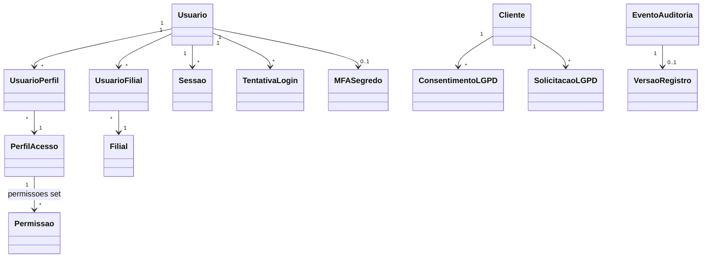

# Modelo de domínio — Módulo Acesso, Segurança e Controle de Usuários (ACS)

> Entidades **específicas** do módulo. `Tenant`, `Filial` e `EnderecoIP` são transversais e ficam em `docs/comum/modelo-de-dominio.md`.
>
> **Regra de fronteira:** ver `governanca-modelo-comum.md`. Hook valida não-duplicação.

---

## Entidades

### Usuario
- **Atributos obrigatórios:** `id` (UUID), `tenant_id` (FK), `email`, `nome_completo`, `senha_hash` (bcrypt/argon2), `status` (`ativo`|`desativado`|`pendente`), `criado_em`, `criado_por`.
- **Atributos opcionais:** `cpf`, `telefone`, `mfa_segredo_cifrado` (KMS-envelope), `ultimo_login_em`, `foto_url`.
- **Invariantes:** `INV-001` (consistência), `INV-002` (não-mascaramento), `INV-009` (menor privilégio), `INV-TENANT-001` (tenant_id obrigatório), `SEC-001`, `SEC-002`.
- **Ciclo de vida:** criada por admin tenant (status `pendente`) → 1º login com setup de senha + MFA → `ativo` → eventualmente `desativado` (não excluída — preserva trilha).
- **Não exclui fisicamente** — desativação preserva auditoria. Exclusão real só via fluxo LGPD (`SolicitacaoLGPD`).

### PerfilAcesso
- **Atributos obrigatórios:** `id`, `tenant_id`, `nome` (único por tenant), `descricao`, `permissoes` (set de `Permissao.codigo`), `mfa_obrigatorio` (bool), `timeout_sessao_min`, `criado_em`.
- **Atributos opcionais:** `e_semente` (bool — perfil pré-configurado, não editável).
- **Invariantes:** `INV-001`, `INV-009`, `INV-TENANT-001`.
- **Ciclo de vida:** criado por admin tenant → editado → desativado (sem usuários ativos).

### Permissao
- **Atributos obrigatórios:** `codigo` (string namespaced: `cliente.criar`, `certificado.emitir`, `lancamento.editar_conciliado`), `descricao`, `modulo`, `tela`, `acao` (`criar`|`ler`|`editar`|`excluir`|`executar_X`), `e_sensivel` (bool — exige permissão dedicada e MFA recente).
- **Invariantes:** `INV-009`.
- **Ciclo de vida:** definida em código (catálogo plataforma, não editável pelo tenant). Adição = release do produto.

### UsuarioPerfil
- **Atributos obrigatórios:** `usuario_id`, `perfil_id`, `atribuido_em`, `atribuido_por`.
- Junção N:N entre `Usuario` e `PerfilAcesso`.
- **Invariantes:** `INV-001`, `INV-TENANT-001` (perfil e usuário do mesmo tenant).

### UsuarioFilial
- **Atributos obrigatórios:** `usuario_id`, `filial_id`, `e_padrao` (bool).
- Junção N:N entre `Usuario` e `Filial`.
- **Invariantes:** `INV-TENANT-002` (filial pertence ao mesmo tenant do usuário), `INV-TENANT-003`.

### Sessao
- **Atributos obrigatórios:** `id` (UUID), `usuario_id`, `tenant_id`, `filial_id_contexto`, `iniciada_em`, `ultima_atividade_em`, `expira_em`, `ip`, `user_agent`, `pais`, `cidade_aprox`, `motivo_encerramento` (`logout`|`timeout`|`troca_senha`|`admin`|`repudio_usuario`|null).
- **Invariantes:** `INV-001`, `INV-009`, `INV-TENANT-001`.
- **Ciclo de vida:** criada no login OK → atualizada a cada request → encerrada por timeout/logout/troca-senha/repúdio.
- **Imutável** após encerramento (parte da trilha).

### TentativaLogin
- **Atributos obrigatórios:** `id`, `tenant_id_inferido` (pode ser null se email não existe), `email_tentado`, `ip`, `user_agent`, `timestamp`, `resultado` (`sucesso`|`senha_invalida`|`usuario_desativado`|`mfa_invalido`|`bloqueado_ratelimit`|`bloqueado_conta`).
- **Invariantes:** `INV-001`, `SEC-001` (não revelar se email existe), `SEC-002` (suporta rate-limit).
- **Imutável** — WORM.

### MFASegredo
- Atributo embutido em `Usuario` (`mfa_segredo_cifrado`), separado conceitualmente para clareza.
- **Cifragem:** envelope com KMS (chave por tenant — crypto-shredding LGPD).
- **Rotação:** apenas mediante reset explícito (admin tenant ou usuário regenerar).

### TokenRecuperacaoSenha
- **Atributos obrigatórios:** `id` (UUID — não previsível), `usuario_id`, `hash_token`, `criado_em`, `expira_em` (30min), `usado_em` (null se não usado), `ip_solicitante`.
- **Invariantes:** `INV-001`, `SEC-001`, `SEC-002`.
- **Ciclo de vida:** criado no pedido → usado 1x → consumido.
- **Use-once** — segunda tentativa de uso = falha + alerta.

### EventoAuditoria
- **Atributos obrigatórios:** `id`, `tenant_id`, `usuario_id` (null se sistema), `timestamp`, `tipo_evento` (namespaced: `acs.login.sucesso`, `cliente.editado`, `certificado.emitido`), `entidade_tipo`, `entidade_id`, `acao`, `valores_antes` (JSONB), `valores_depois` (JSONB), `ip`, `user_agent`, `correlation_id`.
- **Invariantes:** `INV-001` (WORM), `INV-002`, `INV-TENANT-001`, `SEC-001`.
- **Imutabilidade absoluta** — nenhum perfil pode editar/apagar.
- **Storage:** PostgreSQL com FK NOT VALID + cópia paralela em Backblaze B2 WORM (`docs/seguranca/` — referência).

### VersaoRegistro
- **Atributos obrigatórios:** `id`, `tenant_id`, `entidade_tipo`, `entidade_id`, `versao_num`, `dados_snapshot` (JSONB), `criado_em`, `criado_por_usuario_id`, `evento_auditoria_id` (FK).
- Aplica-se a registros críticos: `Cliente`, `Certificado`, `OrdemServico`, `LancamentoFinanceiro` (lista no `auth-rbac.md`).
- **Invariantes:** `INV-001`, `INV-TENANT-001`.

### ConsentimentoLGPD
- **Atributos obrigatórios:** `id`, `tenant_id`, `titular_id` (FK para `Cliente`/`Pessoa`), `finalidade` (`atendimento`|`marketing`|`compartilhamento_parceiro_X`|...), `base_legal` (`consentimento`|`execucao_contrato`|`obrigacao_legal`|`legitimo_interesse`|`protecao_credito`|...), `versao_termo`, `texto_termo_hash`, `aceito_em`, `ip_aceitacao`, `revogado_em` (null), `motivo_revogacao`.
- **Invariantes:** `INV-001` (WORM no histórico — revogação cria nova linha, não edita).
- **Histórico imutável** — revogação preserva linha original e cria evento novo.

### SolicitacaoLGPD
- **Atributos obrigatórios:** `id`, `tenant_id`, `titular_id`, `tipo` (`exportacao`|`anonimizacao`|`exclusao`), `aberta_em`, `prazo_legal` (15 dias após `aberta_em`), `status` (`aberta`|`em_processamento`|`pendente_retencao_legal`|`concluida`|`negada`), `motivo_negativa`, `concluida_em`, `comprovante_url` (PDF assinado), `responsavel_usuario_id`.
- **Invariantes:** `INV-001`, LGPD Art. 18/19.
- **Ciclo de vida:** aberta → em processamento → (pode ficar `pendente_retencao_legal` se exclusão antes da retenção mínima) → concluída.

### TokenSessaoTitular
- Token leve para o portal LGPD do titular (não é login completo).
- **Atributos:** `id`, `titular_id`, `token_hash`, `criado_em`, `expira_em` (60min).
- **Use-once** + rate-limit forte.

---

## Agregados (DDD)

| Agregado raiz | Entidades incluídas | Invariantes |
|---|---|---|
| `Usuario` | `Usuario`, `UsuarioPerfil`, `UsuarioFilial`, `MFASegredo` | `INV-001`, `INV-009`, `INV-TENANT-001..004` |
| `PerfilAcesso` | `PerfilAcesso` + referências a `Permissao` (catálogo externo) | `INV-001`, `INV-009`, `INV-TENANT-001` |
| `Sessao` | `Sessao` | `INV-001`, `INV-TENANT-001` |
| `EventoAuditoria` | `EventoAuditoria` (raiz imutável) + `VersaoRegistro` (apêndice) | `INV-001`, `INV-TENANT-001` |
| `ConsentimentoLGPD` | `ConsentimentoLGPD` | `INV-001` |
| `SolicitacaoLGPD` | `SolicitacaoLGPD` | `INV-001` |

---

## Value Objects

| VO | Definição | Imutável? |
|---|---|---|
| `CodigoPermissao` | String namespaced `<modulo>.<acao>` validada contra catálogo | Sim |
| `JanelaSessao` | Composição de `iniciada_em` + `expira_em` + cálculo de timeout | Sim |
| `LocalizacaoAprox` | `{pais, cidade}` derivada de IP — nunca GPS | Sim |
| `HashSenha` | bcrypt/argon2 — algoritmo + custo + hash em string única | Sim |
| `TermoConsentimento` | Versão + texto + hash SHA-256 do texto | Sim |
| `Diff` | JSONB `{antes, depois}` campo-a-campo | Sim |

---

## Eventos de domínio (publicados)

> Outros módulos consomem via barramento interno (ADR a definir — provavelmente outbox pattern). Ver `docs/comum/integracoes-inter-modulos.md`.

| Evento | Quando dispara | Payload (resumo) | Quem consome |
|---|---|---|---|
| `acs.usuario.criado` | Admin cria usuário | `{usuario_id, tenant_id, criado_por}` | Onboarding (envio de boas-vindas), email |
| `acs.usuario.desativado` | Admin desativa | `{usuario_id, tenant_id, motivo}` | Sessões (encerra todas), notificações |
| `acs.login.sucesso` | Login completo (incluindo MFA) | `{usuario_id, sessao_id, ip, localizacao}` | Métricas, alerta de localização nova |
| `acs.login.falha` | Falha por qualquer motivo | `{email_tentado, ip, motivo, tenant_id_inferido}` | Rate-limit, alerta de burst |
| `acs.login.bloqueado` | Rate-limit ou conta bloqueada | `{ip, email, motivo, ate}` | Segurança |
| `acs.sessao.encerrada` | Logout / timeout / admin / repúdio | `{sessao_id, motivo}` | Auditoria |
| `acs.sessao.repudiada` | Usuário marcou "esse não fui eu" | `{sessao_id, usuario_id}` | Segurança (P1), notificações admin |
| `acs.permissao.alterada` | Admin muda matriz de um perfil | `{perfil_id, diff_permissoes, usuarios_afetados}` | Caches de autorização (invalidar) |
| `acs.acesso.negado` | Usuário tentou ação sem permissão | `{usuario_id, codigo_permissao, tela}` | Métricas, alerta de tentativa anormal |
| `acs.registro.alterado` | Mudança em registro crítico | `{entidade_tipo, entidade_id, versao_num, diff, usuario_id}` | Auditoria, indexador de busca |
| `acs.consentimento.aceito` | Titular aceita finalidade | `{titular_id, finalidade, base_legal, versao_termo}` | Módulos que tratam dado (validam base legal antes) |
| `acs.consentimento.revogado` | Titular revoga | `{titular_id, finalidade}` | Marketing (para de enviar), parceiros (notifica) |
| `acs.lgpd.solicitacao_aberta` | Titular abre pedido | `{solicitacao_id, tipo, prazo_legal}` | Workflow LGPD (orquestração) |
| `acs.lgpd.solicitacao_concluida` | Pedido concluído | `{solicitacao_id, tipo, comprovante_url}` | Notificação titular |

---

## Comandos (entradas no módulo)

| Comando | Origem | Pré-condição | Pós-condição |
|---|---|---|---|
| `criarUsuario` | UI admin tenant | admin tem permissão `usuario.criar`; email único no tenant | `Usuario(status=pendente)` + evento `acs.usuario.criado` + email enviado |
| `definirSenhaInicial` | UI titular do link | token válido e não usado | `Usuario(status=ativo, senha_hash=...)` + token consumido |
| `iniciarLogin` | UI / API | rate-limit OK | retorna challenge MFA (se aplicável) ou sessão |
| `validarMFA` | UI / API | sessão pendente MFA | sessão ativa OU bloqueio após 3 falhas |
| `solicitarRecuperacaoSenha` | UI pública | rate-limit OK | `TokenRecuperacaoSenha` criado + email (resposta genérica) |
| `redefinirSenha` | UI titular do link | token válido | senha trocada + sessões encerradas |
| `criarPerfil` | UI admin tenant | permissão `perfil.criar` | `PerfilAcesso` criado |
| `atribuirPerfil` | UI admin tenant | usuário e perfil no mesmo tenant | `UsuarioPerfil` criado + caches invalidados |
| `definirMatrizPermissoes` | UI admin tenant | permissão `permissao.gerir` | `PerfilAcesso.permissoes` atualizado + evento |
| `vincularUsuarioFilial` | UI admin tenant | filial pertence ao tenant | `UsuarioFilial` criado |
| `encerrarSessao` | UI usuário ou admin | proprietário OU admin tenant | sessão fechada + evento |
| `repudiarSessao` | UI usuário | sessão própria | sessão fechada + alerta P1 |
| `registrarConsentimento` | UI cliente OU UI ACS | termo válido | `ConsentimentoLGPD` criado + evento |
| `revogarConsentimento` | Portal LGPD titular | consentimento existe | linha de revogação + evento |
| `abrirSolicitacaoLGPD` | Portal LGPD titular | titular autenticado (token) | `SolicitacaoLGPD` criada + workflow disparado |

---

## Schema físico

A definir em `../schema-banco.md` (deste módulo) após ADR-0001 e Foundation F-A. Notas:
- Todas as tabelas com `tenant_id NOT NULL` e RLS habilitado (`INV-TENANT-001`).
- `eventos_auditoria` particionada por mês + replicação WORM Backblaze B2.
- `mfa_segredo_cifrado` envelope KMS (chave por tenant).
- Índices: `(tenant_id, email)` único parcial em `usuarios`; `(tenant_id, timestamp DESC)` em `eventos_auditoria`.

## Diagramas

## Como este modelo evolui

- Entidade nova → verificar fronteira em `governanca-modelo-comum.md` (se vira comum).
- Permissão nova → adicionar ao catálogo em código + bump CHANGELOG.
- Evento novo → atualizar `integracoes-inter-modulos.md`.
- Entidade descontinuada → ADR + janela de migração.
