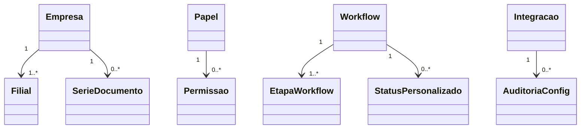

# Modelo de domínio — Módulo Configurações do Sistema

> Entidades específicas do módulo. Tenant referenciada (comum), não duplicada. ADR-0002 (multi-tenancy) governa isolamento; ADR-0006 governa feature flags.

---

## Entidades

### Empresa (config do tenant)

- **Atributos obrigatórios:** id, tenant_id (FK), razao_social, cnpj, ie, endereco, regime_tributario.
- **Atributos opcionais:** im, logo_url (Backblaze), site, telefone.
- **Invariantes:** `INV-TENANT-001`, `INV-036` (CNPJ único por tenant).
- **Ciclo de vida:** criada no onboarding; mutável com auditoria.

### Filial

- **Atributos obrigatórios:** id, empresa_id, cnpj, nome, endereco, eh_matriz (bool).
- **Atributos opcionais:** ie, im, telefone.
- **Invariantes:** `INV-037` (exatamente 1 matriz por empresa).

### SerieDocumento

- **Atributos obrigatórios:** id, tenant_id, filial_id (nullable se global), tipo (os/orcamento/fatura/certificado/recibo/interno — **NFS-e/NF não**, BaaS é dono), prefixo, proximo_numero (ou contador por (serie,ano) se reset anual), formato (template string), padding, `regime_numeracao` (GAP_LESS|BURACOS_ACEITOS — derivado do tipo, ADR-0080).
- **Invariantes:** `INV-028` (proximo_numero nunca diminui; chave `(tenant,filial,tipo,prefixo)`), `INV-CFG-NUM-ATOMICA` (reserva atômica sem duplicata; gap-less p/ fatura/certificado via reserva-TTL ADR-0080, buraco-por-rollback aceito p/ operacionais). *(Era `INV-006` — corrigido P2/TL-01: INV-006 é regra do DPO/LGPD.)*
- **Ciclo de vida:** criada por admin; contador atualizado atomicamente.

### Imposto

- **Atributos obrigatórios:** id, tenant_id, filial_id (nullable), tipo (ICMS/ISS/PIS/COFINS/IRRF/CSLL/INSS), aliquota, vigencia_inicio.
- **Atributos opcionais:** cfop_padrao, ncm_padrao, vigencia_fim, observacoes; **figuras fiscais (P2/ADV-02/03):** `iss_retido_fonte` (bool — LC 116/2003 art. 6º), `tem_st` (bool — substituição tributária do ICMS), `simples_excedeu_sublimite` (bool).
- **Invariantes:** `INV-CFG-IMPOSTO-IMUTAVEL` (TL-04 — trigger bloqueia UPDATE de aliquota/tipo/vigencia_inicio; só vigencia_fim one-shot NULL→data; mudar alíquota = nova linha), `INV-CFG-IMPOSTO-SEM-SOBREPOSICAO` (TL-05 — exclusion constraint btree_gist por tenant+tipo+filial+daterange), `INV-026` (não-retroação fecha no consumidor via snapshot); ADR-0008.

### Papel (Role)

- **Atributos obrigatórios:** id, tenant_id, nome, descricao.
- **Atributos opcionais:** parent_papel_id (herança).
- **Invariantes:** `INV-029` (sempre ≥1 admin ativo no tenant).

### Permissao

- **Atributos obrigatórios:** id, papel_id, modulo, recurso, acao (criar/ler/editar/aprovar/excluir).
- **Invariantes:** `SEC-LEAST-PRIV-001` (menor privilégio).

### Workflow

- **Atributos obrigatórios:** id, tenant_id, entidade (os/orcamento/chamado/etc.), versao, ativo (bool).
- **Atributos opcionais:** descricao.
- **Ciclo de vida:** versionado (mudança gera nova versão; registros antigos seguem versão usada na criação).

### EtapaWorkflow

- **Atributos obrigatórios:** id, workflow_id, ordem, status_destino_id, nome.
- **Atributos opcionais:** automacoes (JSONB), aprovacao_alcada (FK).

### StatusPersonalizado

- **Atributos obrigatórios:** id, tenant_id, entidade, nome, cor, ordem.
- **Atributos opcionais:** descricao, deprecado_em.
- **Invariantes:** `INV-038` (não excluir se em uso; só deprecar).

### CampoObrigatorio

- **Atributos obrigatórios:** id, tenant_id, entidade, campo, obrigatorio_desde.
- **Ciclo de vida:** aplica em mutações pós obrigatorio_desde; registros antigos imunes.

### ModeloPDF

- **Atributos obrigatórios:** id, tenant_id, tipo_documento, nome, template_path, versao, ativo (bool).
- **Atributos opcionais:** preview_url.
- **Invariantes:** `INV-001` (WORM — template usado na emissão faz parte do snapshot imutável; documentos antigos seguem template original).

### ConfigAssinatura

- **Atributos obrigatórios:** id, tenant_id, cert_a3_thumbprint, entidade_emissora, posicao_pagina, posicao_x, posicao_y, pagina.
- **Invariantes:** ADR-0009, `SEC-A3-001` (chave privada nunca trafega).

### Integracao

- **Atributos obrigatórios:** id, tenant_id, tipo (nf/banco/email/whatsapp/sefaz), nome, ativa (bool), credenciais_kms_ref (referência KMS, não valor).
- **Atributos opcionais:** endpoint_url, ultimo_teste_em, ultimo_teste_status.
- **Invariantes:** `SEC-KMS-001` (credenciais criptografadas), `SEC-005` (auditoria).

### Notificacao (config)

- **Atributos obrigatórios:** id, tenant_id, evento_codigo, canal (email/push/sms/whatsapp), ativo (bool), destinatarios (regra: papel/usuário/contato).
- **Invariantes:** canal exige integração ativa correspondente.

### RegraComercial

- **Atributos obrigatórios:** id, tenant_id, tipo (desconto_max/alcada_aprovacao/etc.), parametros (JSONB), vigencia_inicio.
- **Atributos opcionais:** vigencia_fim.

### SLA

- **Atributos obrigatórios:** id, tenant_id, aplicavel_a (tipo_chamado/contrato/cliente), tempo_resposta_min, tempo_resolucao_min.
- **Atributos opcionais:** horario_comercial (config), feriados.

### ConfigEstoque / ConfigFinanceiro / ConfigMetrologia

- **Atributos:** chaves específicas de cada domínio (multi-depósito, plano de contas, padrões metrológicos, etc.).
- **Padrão:** entidade-config com JSONB versionado por tenant.

### ConfigBackup

- **Atributos obrigatórios:** id, tenant_id, frequencia (diaria/semanal/horaria), retencao_dias, destino (B2 bucket).
- **Invariantes:** `SEC-006` (backup imutável), retenção ≥ mínimo legal.

### ConfigRetencao

- **Atributos obrigatórios:** id, tenant_id, entidade, periodo_dias, base_legal (referência a `retencao-matriz.md`).
- **Invariantes:** `INV-039` (não pode ser menor que mínimo legal da matriz).

### FeatureFlagTenant

- **Atributos obrigatórios:** id, tenant_id, feature_codigo, ativa (bool), liberada_no_plano (bool, sincronizada com billing).
- **Invariantes:** `INV-030` (admin tenant não liga feature não liberada pelo plano); ADR-0006.

### AuditoriaConfig

- **Atributos obrigatórios:** id, tenant_id, entidade_config, entidade_id, campo, valor_antes, valor_depois, ator_id, ator_origem (ui/api/sistema), data, ip.
- **Invariantes:** `SEC-005` (imutável, append-only); armazenada em WORM (Backblaze B2).

---

## Agregados (DDD)

| Agregado raiz | Entidades incluídas | Invariantes |
|---|---|---|
| Empresa | Filial | INV-036, INV-037, INV-TENANT-001 |
| SerieDocumento | (própria) | INV-028, INV-006 |
| Papel | Permissao | INV-029, SEC-LEAST-PRIV-001 |
| Workflow | EtapaWorkflow, StatusPersonalizado | INV-038 |
| Integracao | (própria + AuditoriaConfig) | SEC-KMS-001, SEC-005 |
| ConfigBackup + ConfigRetencao | (próprias) | INV-039, SEC-006 |
| FeatureFlagTenant | (própria) | INV-030, ADR-0006 |

---

## Value Objects

> **Emenda 2026-06-09 (P2 da frente configuracoes-sistema — ADV-03/04):** `RegimeTributario`
> completado e reconciliado com a spec (`docs/faseamento/configuracoes-sistema/spec.md` §5);
> `ST_INDICADOR` NÃO é regime (substituição tributária é atributo do `Imposto`: `tem_st`);
> `nf`/`nfse` REMOVIDO de `TipoDocumento` (NFS-e é numerada pelo BaaS/município, não local —
> ADR-0008 + ADR-0080). Figuras fiscais `iss_retido_fonte`/`tem_st`/`simples_excedeu_sublimite`
> são atributos do `Imposto`. Conjunto final de regimes = `[OAB/contador-pré-prod]`.

| VO | Definição | Imutável? |
|---|---|---|
| RegimeTributario | enum: NORMAL / SIMPLES_NACIONAL / MEI / LUCRO_PRESUMIDO / LUCRO_REAL / IMUNE / ISENTO | Sim |
| TipoDocumento | enum: os / orcamento / fatura / certificado / recibo / interno (NFS-e/NF **não** — BaaS é dono) | Sim |
| AcaoPermissao | enum: criar / ler / editar / aprovar / excluir | Sim |
| CanalNotificacao | enum: email / push / sms / whatsapp | Sim |
| TipoIntegracao | enum: nf / banco / email / whatsapp / sefaz | Sim |

---

## Eventos de domínio (publicados)

| Evento | Quando dispara | Payload | Quem consome |
|---|---|---|---|
| `Config.EmpresaAtualizada` | dados empresa mudam | `{tenant_id, campos_alterados}` | módulos fiscais, PDFs |
| `Config.SerieAtualizada` | série criada/editada | `{tenant_id, tipo, prefixo}` | emissores de documento |
| `Config.PapelAtualizado` | papel/permissões mudam | `{tenant_id, papel_id}` | auth (invalida cache RBAC) |
| `Config.WorkflowVersionado` | nova versão de workflow | `{tenant_id, entidade, versao}` | módulo dono da entidade |
| `Config.IntegracaoAtivada` | integração ligada | `{tenant_id, tipo}` | módulo consumidor da integração |
| `Config.IntegracaoDesativada` | integração desligada | `{tenant_id, tipo}` | módulos consumidores |
| `Config.RetencaoAjustada` | retenção mudada | `{tenant_id, entidade, periodo_dias}` | jobs de purge |
| `Config.FeatureLigada` | feature ativada pelo tenant | `{tenant_id, feature_codigo}` | módulo da feature |
| `Config.MudancaSensivelRegistrada` | qualquer mudança sensível | `{tenant_id, evento, ator}` | auditor Aferê + DPO tenant |

---

## Comandos (entradas)

| Comando | Origem | Pré-condição | Pós-condição |
|---|---|---|---|
| `atualizarEmpresa` | UI/API | admin com permissão | empresa atualizada + auditoria + evento |
| `criarSerie` | UI/API | admin | série criada |
| `criarPapel` | UI/API | admin | papel + permissões |
| `versionarWorkflow` | UI/API | admin | nova versão; antiga preservada |
| `ativarIntegracao` | UI/API | credenciais válidas + teste OK | integracao.ativa=true |
| `ajustarRetencao` | UI/API | admin + valor ≥ mínimo legal | retenção atualizada |
| `ligarFeature` | UI/API | feature liberada no plano | flag ativa |

---

## Schema físico

A definir em `../schema-banco.md` pós ADR-0001. Tabelas por tenant via RLS (ADR-0002).

## Diagramas

## Como este modelo evolui

- Entidade nova → governanca-modelo-comum.md decide fronteira.
- Eventos novos → bump CHANGELOG + atualizar `integracoes-inter-modulos.md`.
