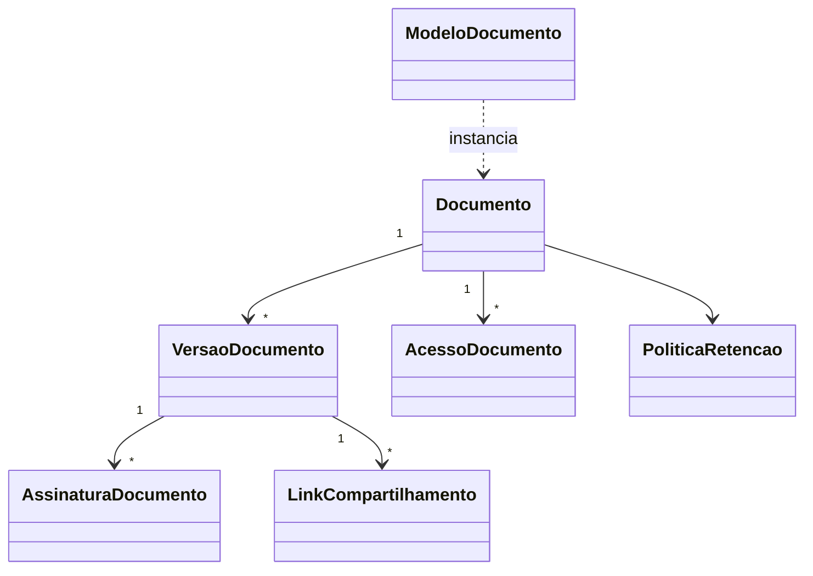

# Modelo de domínio — Módulo Gestão Documental

> Entidades específicas. Hook valida não-duplicação com comum.

---

## Entidades

### Documento

- **Atributos obrigatórios:** `id` (UUID), `tenant_id`, `titulo`, `tipo_documento`, `entidade_tipo` (cliente|equipamento|os|contrato|fornecedor|outro), `entidade_id`, `criado_por`, `criado_em`, `status_atual` (vigente|obsoleto|em_revisao|vencido|descartado), `requer_aprovacao` (bool)
- **Atributos opcionais:** `descricao`, `data_validade`, `responsavel_renovacao`, `politica_retencao_id`, `acl_id`, `tags[]`
- **Invariantes:** `INV-001` (audit trail completo), `INV-TENANT-001` (tenant em toda query)
- **Ciclo de vida:** criado → em_revisao (se aprovação) → vigente → obsoleto (substituído) ou vencido (validade) ou descartado (retenção)

### VersaoDocumento

- **Atributos obrigatórios:** `id`, `tenant_id`, `documento_id`, `numero_versao` (int), `hash_sha256`, `arquivo_storage_key`, `mime_type`, `tamanho_bytes`, `criado_por`, `criado_em`, `motivo_versao`
- **Atributos opcionais:** `texto_extraido_ocr`, `aprovado_por`, `aprovado_em`
- **Invariantes:** versão imutável após criação (`INV-001`); apenas uma versão `vigente` por documento por vez
- **Ciclo de vida:** criada → (opcional aprovação) → vigente → obsoleta quando nova versão vira vigente

### ModeloDocumento

- **Atributos obrigatórios:** `id`, `tenant_id`, `nome`, `categoria`, `arquivo_template_key`, `variaveis_definidas` (JSONB)
- **Atributos opcionais:** `descricao`, `ativo` (bool)

### PoliticaRetencao

- **Atributos obrigatórios:** `id`, `tenant_id`, `nome`, `dias_retencao`, `acao_pos_prazo` (descartar|arquivar_frio|revisao_manual)
- **Atributos opcionais:** `aplicada_a_tipos[]`, `base_legal` (referência LGPD/ISO)

### AssinaturaDocumento

- **Atributos obrigatórios:** `id`, `tenant_id`, `versao_documento_id`, `assinante_tipo` (interno|externo), `assinante_identificador`, `ip`, `user_agent`, `assinado_em`, `tipo_assinatura` (eletronica_simples|eletronica_avancada|a3_delegada)
- **Invariantes:** imutável após gravação (`INV-001`); hash da versão registrado

### LinkCompartilhamento

- **Atributos obrigatórios:** `id`, `tenant_id`, `versao_documento_id`, `token`, `criado_em`, `expira_em`, `criado_por`
- **Atributos opcionais:** `senha_hash`, `max_acessos`, `acessos_atuais`

### AcessoDocumento (trilha)

- **Atributos obrigatórios:** `id`, `tenant_id`, `documento_id`, `versao_id` (opcional), `usuario_id` (ou identificador externo), `acao` (visualizou|baixou|editou_metadados|aprovou|substituiu|compartilhou|tentativa_negada), `timestamp`, `ip`, `user_agent`
- **Invariantes:** append-only, imutável (`INV-001`)

---

## Agregados (DDD)

| Agregado raiz | Entidades incluídas | Invariantes |
|---|---|---|
| Documento | Documento, VersaoDocumento[], AssinaturaDocumento[], AcessoDocumento[] | `INV-001`, `INV-TENANT-001`, apenas 1 versão vigente |
| ModeloDocumento | ModeloDocumento | `INV-TENANT-001` |
| PoliticaRetencao | PoliticaRetencao | `INV-TENANT-001` |
| LinkCompartilhamento | LinkCompartilhamento | `INV-TENANT-001`, expira_em > criado_em |

---

## Value Objects

| VO | Definição | Imutável? |
|---|---|---|
| HashConteudo | SHA-256 do binário | Sim |
| EntidadeReferencia | (tipo, id) referenciando entidade de outro módulo | Sim |
| StatusDocumento | Enum {vigente, obsoleto, em_revisao, vencido, descartado} | Sim |

---

## Eventos de domínio (publicados)

| Evento | Quando dispara | Payload | Quem consome |
|---|---|---|---|
| `documento.criado` | Upload bem-sucedido | `{documento_id, tenant_id, entidade_tipo, entidade_id, versao_id}` | auditoria, busca, notificação |
| `documento.versao_criada` | Nova versão | `{documento_id, versao_anterior, versao_nova}` | auditoria |
| `documento.aprovado` | Workflow conclui aprovação | `{documento_id, versao_id, aprovado_por}` | notificação, auditoria |
| `documento.vencendo` | 30/15/7 dias antes do vencimento | `{documento_id, dias_restantes}` | notificação |
| `documento.vencido` | Data validade ultrapassada | `{documento_id}` | notificação, dashboards |
| `documento.assinado` | Assinatura concluída | `{documento_id, versao_id, assinante}` | auditoria, notificação |
| `documento.acesso_externo` | Link público acessado | `{documento_id, ip, timestamp}` | auditoria |

---

## Comandos

| Comando | Origem | Pré-condição | Pós-condição |
|---|---|---|---|
| `uploadDocumento` | UI / API | usuário autenticado, entidade existe | Documento + Versao gravados, evento `documento.criado` |
| `criarNovaVersao` | UI / API | doc existente, usuário autorizado | Versao nova vigente, anterior obsoleta |
| `aprovarVersao` | UI / API | doc em_revisao, usuário aprovador | Versao vira vigente |
| `definirPoliticaRetencao` | UI | usuário admin | doc associado a política |
| `gerarLinkCompartilhamento` | UI / API | versao vigente | Link criado com TTL |
| `revogarLink` | UI / API | link ativo | Link expira imediatamente |
| `solicitarAssinatura` | UI / API | versao vigente | Convite enviado |
| `reprocessarOCR` | jobs | versao com PDF | texto_extraido_ocr atualizado |

---

## Schema físico

Ver `../schema-banco.md` (a criar) ou `../../../comum/schema-banco.md` para tabelas comuns.

## Diagramas

## Como este modelo evolui

Entidade nova → verificar fronteira comum/módulo. Mudança → migration + CHANGELOG.
