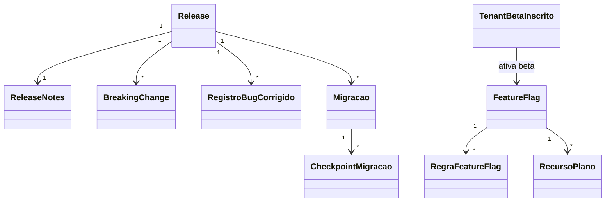

# Modelo de domínio — Módulo Release Management

---

## Entidades

### Release

- **Atributos obrigatórios:** `id`, `versao_semver` (ex: "2.4.1"), `data_publicacao`, `ambiente` (dev|homologacao|producao), `tipo` (major|minor|patch|hotfix), `commit_hash`, `responsavel`, `status` (rascunho|publicada|revertida)
- **Atributos opcionais:** `release_notes_id`, `requer_janela_manutencao` (bool), `comunicado_manutencao_id` (FK pra suporte-saas)
- **Invariantes:** `INV-001` (audit); versão semver única por ambiente; MAJOR exige `lista_breaking_changes` não vazia
- **Ciclo:** rascunho → publicada → (opcional revertida)

### ReleaseNotes

- **Atributos obrigatórios:** `id`, `release_id`, `titulo`, `resumo`, `idioma` (pt-br padrão)
- **Seções:** `adicionado[]`, `modificado[]`, `corrigido[]`, `removido[]`, `breaking_changes[]`
- **Estrutura por item:** `{modulo, descricao, links_us[]}`

### FeatureFlag

> Ver `docs/adr/0006-feature-flags.md` para regras completas.

- **Atributos obrigatórios:** `id`, `chave` (slug único), `descricao`, `tipo` (boolean|percentage|segment), `valor_default`, `criada_em`, `criada_por`, `data_revisao_obrigatoria` (default = criada_em + 90 dias)
- **Atributos opcionais:** `release_alvo_id`, `data_remocao_prevista`, `proprietario_modulo`
- **Ciclo:** ativa → em_cleanup → aposentada
- **Invariantes:** `INV-001` (toda mudança auditada); cleanup obrigatório após 90 dias sem uso (ADR-0006)

### RegraFeatureFlag

- **Atributos obrigatórios:** `id`, `feature_flag_id`, `escopo` (global|tenant|plano|segmento|beta), `escopo_valor` (tenant_id, nome_plano, etc.), `valor` (bool ou %), `prioridade`
- **Avaliação:** ordenada por prioridade; primeira match vence

### TenantBetaInscrito

- **Atributos obrigatórios:** `id`, `tenant_id`, `inscrito_em`, `inscrito_por`
- **Atributos opcionais:** `cancelado_em`

### AmbienteHomologacao

- **Atributos obrigatórios:** `id`, `tenant_id`, `subdominio_sandbox`, `criado_em`, `dados_origem_snapshot_em`, `expira_em`
- **Atributos opcionais:** `release_atual_id`
- **Invariantes:** dados anonimizados (LGPD); TTL renovável

### Migracao

- **Atributos obrigatórios:** `id`, `release_id`, `nome`, `tipo` (aditiva|destrutiva|backfill), `plano_rollback`, `status` (planejada|aprovada|executando|concluida|revertida|falhou), `aprovacao_dupla_por[]` (lista de 2+ aprovadores p/ destrutiva)
- **Invariantes:** destrutiva exige 2 aprovadores diferentes + plano_rollback documentado

### CheckpointMigracao

- **Atributos obrigatórios:** `id`, `migracao_id`, `nome_step`, `executado_em`, `pode_reverter` (bool), `script_rollback`

### BreakingChange

- **Atributos obrigatórios:** `id`, `release_alvo_id`, `titulo`, `descricao`, `anunciado_em`, `efetivo_em`, `endpoints_afetados[]`, `guia_migracao_url`
- **Invariantes:** `efetivo_em - anunciado_em >= 60 dias`

### RegistroBugCorrigido

- **Atributos obrigatórios:** `id`, `release_id`, `ticket_id` (FK suporte-saas), `descricao_curta`, `severidade`

### RecursoPlano

- **Atributos obrigatórios:** `id`, `feature_flag_id`, `planos[]` (free|pro|enterprise), `mensagem_upgrade`
- **Uso:** UI checa antes de exibir feature pra plano abaixo

---

## Agregados (DDD)

| Agregado raiz | Entidades incluídas | Invariantes |
|---|---|---|
| Release | Release, ReleaseNotes, BreakingChange[], RegistroBugCorrigido[] | semver único, MAJOR exige breaking_changes |
| FeatureFlag | FeatureFlag, RegraFeatureFlag[] | ADR-0006, cleanup 90d |
| Migracao | Migracao, CheckpointMigracao[] | destrutiva exige aprovação dupla |
| AmbienteHomologacao | AmbienteHomologacao | dados anonimizados |
| TenantBetaInscrito | TenantBetaInscrito | opt-in explícito |
| RecursoPlano | RecursoPlano | mapeamento feature ↔ planos |

---

## Value Objects

| VO | Definição | Imutável? |
|---|---|---|
| VersaoSemver | `(major, minor, patch, prerelease?)` | Sim |
| EscopoFlag | enum `global\|tenant\|plano\|segmento\|beta` | Sim |
| TipoMigracao | enum `aditiva\|destrutiva\|backfill` | Sim |

---

## Eventos de domínio (publicados)

| Evento | Quando dispara | Payload | Quem consome |
|---|---|---|---|
| `release.publicada` | Status vai pra publicada | `{release_id, versao, ambiente}` | suporte-saas (notificação), métricas |
| `release.revertida` | Rollback acionado | `{release_id, motivo}` | alertas, auditoria |
| `feature_flag.alterada` | Regra criada/mudada/removida | `{flag_id, regra, antes, depois}` | auditoria (`INV-001`), cache invalidação |
| `feature_flag.aposentada` | Cleanup conclui | `{flag_id, motivo}` | métricas |
| `beta.tenant_inscrito` | Tenant entra programa | `{tenant_id}` | flags aplicadas |
| `beta.tenant_cancelado` | Tenant sai | `{tenant_id}` | flags removidas |
| `migracao.iniciada` | Execução começa | `{migracao_id}` | observabilidade |
| `migracao.checkpoint` | Step conclui | `{migracao_id, step}` | observabilidade |
| `migracao.concluida` | Migracao OK | `{migracao_id}` | release.publicada (gatilho) |
| `migracao.falhou` | Erro em step | `{migracao_id, step, erro}` | alertas P0 |
| `breaking_change.anunciado` | Registrado | `{breaking_change_id, efetivo_em}` | comunicação integradores |
| `breaking_change.proximo` | T-30, T-7 do efetivo | `{breaking_change_id, dias_restantes}` | notificação tenants |

---

## Comandos

| Comando | Origem | Pré-condição | Pós-condição |
|---|---|---|---|
| `criarRelease` | UI PM | versão semver válida | Release em rascunho |
| `publicarRelease` | UI PM + aprovação | release com notes completas | Release publicada + evento |
| `reverterRelease` | UI SRE + aprovação | release publicada | Release revertida + alerta |
| `criarFeatureFlag` | UI PM | chave única | FeatureFlag ativa + data_revisao_obrigatoria |
| `atualizarRegraFlag` | UI PM | flag ativa | RegraFeatureFlag + evento + cache invalidado |
| `aposentarFlag` | UI PM ou job auto | sem uso por 90d | Flag aposentada |
| `inscreverBeta` | UI tenant admin | tenant ativo | TenantBetaInscrito |
| `cancelarBeta` | UI tenant admin | inscrição ativa | cancelado_em preenchido |
| `provisionarHomologacao` | UI tenant Enterprise + admin | plano Enterprise | AmbienteHomologacao + dados anonimizados |
| `planejarMigracao` | UI SRE | release alvo definido | Migracao planejada |
| `aprovarMigracaoDestrutiva` | UI 2 aprovadores | migracao planejada destrutiva | status aprovada |
| `executarMigracao` | UI SRE | aprovada | status executando + checkpoints |
| `registrarBreakingChange` | UI PM | release MAJOR + janela 60d | BreakingChange + anúncio |

---

## Schema físico

Ver `../schema-banco.md` (a criar).

## Diagramas

## Como evolui

Entidade nova → fronteira comum/módulo. Política de flags → ADR-0006.
