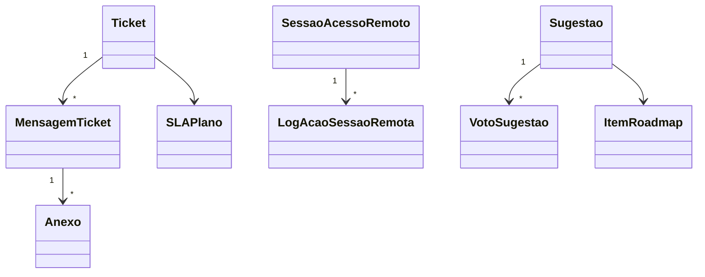

# Modelo de domínio — Módulo Suporte SaaS

---

## Entidades

### Ticket

- **Atributos obrigatórios:** `id`, `tenant_id`, `numero_protocolo`, `aberto_por_usuario_id`, `categoria` (bug|duvida|sugestao|acesso|financeiro_saas), `prioridade` (P1|P2|P3|P4), `titulo`, `descricao`, `status` (aberto|em_analise|aguardando_usuario|resolvido|fechado), `aberto_em`, `sla_deadline`
- **Atributos opcionais:** `atendente_id`, `resolvido_em`, `fechado_em`, `csat_nota`, `csat_comentario`, `tags[]`, `bug_tracker_id`, `sugestao_id`
- **Invariantes:** `INV-TENANT-001` (tenant em toda query — tenant A não vê ticket de tenant B), `INV-001` (audit trail)
- **Ciclo de vida:** aberto → em_analise → aguardando_usuario ↔ em_analise → resolvido → fechado (após 7 dias sem reabertura)

### MensagemTicket

- **Atributos obrigatórios:** `id`, `tenant_id`, `ticket_id`, `autor_tipo` (usuario|atendente_humano|agente_ia|sistema), `autor_id`, `conteudo`, `enviado_em`
- **Atributos opcionais:** `anexos[]`, `interna` (bool — visível só pra atendente)

### Anexo

- **Atributos obrigatórios:** `id`, `tenant_id`, `mensagem_id`, `tipo` (screenshot|video|log|outro), `storage_key`, `tamanho_bytes`, `mime_type`
- **Invariantes:** retenção alinhada ao ticket (60 dias após fechamento default)

### SLAPlano

- **Atributos obrigatórios:** `id`, `nome_plano` (free|pro|enterprise|custom), `prioridade`, `tempo_primeira_resposta_min`, `tempo_resolucao_min`, `horario_atendimento` (24x7|comercial)
- **Imutabilidade:** mudanças geram nova versão histórica (audit)

### ArtigoBaseConhecimento

- **Atributos obrigatórios:** `id`, `titulo`, `corpo_markdown`, `categoria`, `tags[]`, `publicado` (bool), `criado_por`, `atualizado_em`
- **Atributos opcionais:** `videos[]`, `imagens[]`, `relacionados[]`
- **Escopo:** GLOBAL ao produto (não tem tenant_id — visível a todos)
- **Ciclo:** rascunho → revisão → publicado → desatualizado → arquivado

### SessaoAcessoRemoto

- **Atributos obrigatórios:** `id`, `tenant_id`, `solicitada_por_atendente_id`, `autorizada_por_tenant_admin_id`, `iniciada_em`, `expira_em`, `revogada_em` (nullable), `motivo`, `ticket_id`
- **Invariantes:** `INV-001` (toda ação logada com prefixo `IMPERSONATION`); `expira_em` máximo 24h; obrigatório consentimento explícito do tenant admin
- **Ciclo:** solicitada → autorizada → ativa → revogada/expirada

### LogAcaoSessaoRemota

- **Atributos obrigatórios:** `id`, `sessao_id`, `acao`, `recurso_acessado`, `timestamp`
- **Imutável:** append-only (`INV-001`)

### Sugestao

- **Atributos obrigatórios:** `id`, `criada_por_usuario_id`, `tenant_id` (origem), `titulo`, `descricao`, `status` (proposta|em_analise|aprovada|em_construcao|concluida|recusada), `votos_count`
- **Atributos opcionais:** `roadmap_item_id`, `motivo_recusa`

### VotoSugestao

- **Atributos obrigatórios:** `id`, `sugestao_id`, `usuario_id`, `votado_em`
- **Invariante:** UNIQUE (sugestao_id, usuario_id) — um voto por usuário

### ItemRoadmap

- **Atributos obrigatórios:** `id`, `titulo`, `descricao`, `trimestre_alvo`, `status` (planejado|em_construcao|concluido), `visibilidade` (publico|privado_tenant), `tenants_alvo[]` (se privado)
- **Atributos opcionais:** `sugestoes_origem[]`, `release_associado_id`

### ComunicadoManutencao

- **Atributos obrigatórios:** `id`, `titulo`, `descricao`, `inicio`, `fim`, `tipo` (planejada|emergencial|degradacao), `tenants_afetados[]` (vazio = todos), `status` (agendada|em_andamento|concluida|cancelada)
- **Atributos opcionais:** `pos_mortem_link`

### AvaliacaoArtigo

- **Atributos obrigatórios:** `id`, `artigo_id`, `usuario_id`, `util` (bool), `comentario`, `criado_em`

---

## Agregados (DDD)

| Agregado raiz | Entidades incluídas | Invariantes |
|---|---|---|
| Ticket | Ticket, MensagemTicket[], Anexo[] | `INV-TENANT-001`, `INV-001`, SLA respeitado |
| SessaoAcessoRemoto | SessaoAcessoRemoto, LogAcaoSessaoRemota[] | `INV-001`, consentimento + TTL |
| Sugestao | Sugestao, VotoSugestao[] | um voto por usuário |
| ItemRoadmap | ItemRoadmap | visibilidade respeitada |
| ComunicadoManutencao | ComunicadoManutencao | aviso T-24h obrigatório se planejada |
| ArtigoBaseConhecimento | ArtigoBaseConhecimento, AvaliacaoArtigo[] | global, sem tenant |

---

## Value Objects

| VO | Definição | Imutável? |
|---|---|---|
| Prioridade | P1\|P2\|P3\|P4 | Sim |
| StatusTicket | aberto\|em_analise\|aguardando_usuario\|resolvido\|fechado | Sim |
| JanelaManutencao | (inicio, fim, tipo) | Sim |

---

## Eventos de domínio (publicados)

| Evento | Quando dispara | Payload | Quem consome |
|---|---|---|---|
| `ticket.aberto` | Usuário abre | `{ticket_id, tenant_id, categoria, prioridade}` | roteamento, notificação, métricas |
| `ticket.respondido` | Atendente/IA responde | `{ticket_id, autor_tipo}` | notificação usuário |
| `ticket.resolvido` | Status muda pra resolvido | `{ticket_id, tempo_total}` | métricas, CSAT trigger |
| `ticket.sla_violado` | SLA estourado | `{ticket_id, deadline, atraso_min}` | alertas |
| `ticket.csat_recebido` | Usuário avalia | `{ticket_id, nota}` | métricas |
| `sessao_remota.solicitada` | Atendente pede acesso | `{tenant_id, motivo}` | tenant admin (consentimento) |
| `sessao_remota.iniciada` | Tenant aprova | `{sessao_id}` | auditoria |
| `sessao_remota.encerrada` | Expira/revogada | `{sessao_id, motivo}` | auditoria |
| `sugestao.aprovada` | PM aprova | `{sugestao_id, roadmap_item_id}` | notificação criador |
| `manutencao.agendada` | Comunicado publicado | `{comunicado_id, inicio}` | notificação tenants |
| `manutencao.iniciada` | Janela começa | `{comunicado_id}` | banner |
| `manutencao.concluida` | Janela termina | `{comunicado_id}` | banner remove |

---

## Comandos

| Comando | Origem | Pré-condição | Pós-condição |
|---|---|---|---|
| `abrirTicket` | UI/API | usuário autenticado em tenant | Ticket criado + evento |
| `responderTicket` | UI/API | ticket aberto, autor autorizado | MensagemTicket criada |
| `mudarStatus` | UI/API | transição válida | status atualizado + evento |
| `solicitarAcessoRemoto` | UI atendente | ticket aberto | SessaoAcessoRemoto pendente |
| `autorizarAcessoRemoto` | UI tenant admin | sessão pendente | sessão ativa, logs começam |
| `revogarAcessoRemoto` | UI tenant admin | sessão ativa | sessão encerrada |
| `criarSugestao` | UI | usuário autenticado | Sugestao em status proposta |
| `votarSugestao` | UI | usuário não votou ainda | VotoSugestao + counter |
| `aprovarSugestao` | UI PM | sugestao em analise | status aprovada + item roadmap |
| `agendarManutencao` | UI equipe | janela futura + T-24h | ComunicadoManutencao + notificação |

---

## Schema físico

Ver `../schema-banco.md` (a criar).

## Diagramas

## Como evolui

Entidade nova → fronteira comum/módulo. Mudança → migration + CHANGELOG.
